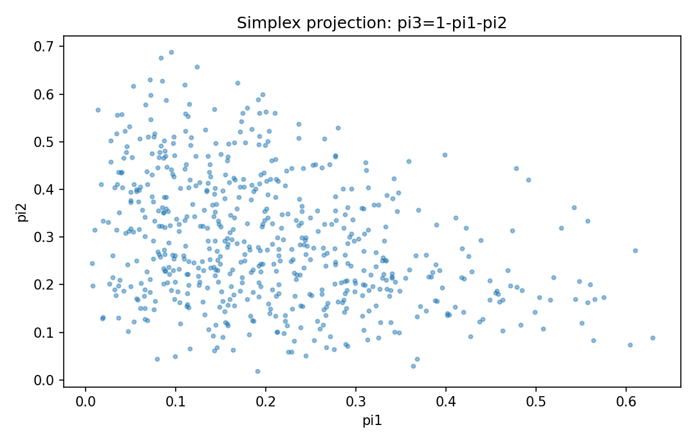

# Dirichlet分布

確率分布

---

## 問い

成分が非負で総和1となる確率ベクトルの不確実性をどう表すか。

---

## 記号とshape

- `$\boldsymbol\pi`: simplex-valued probability vector (K)
- `$\alpha_k`: concentration parameters (positive)
- `$\alpha_0`: sum of concentrations (scalar)

---

## 中心式

$$
p(\boldsymbol\pi)\propto\prod_{k=1}^K\pi_k^{\alpha_k-1},\quad \pi_k\ge0,\ \sum_k\pi_k=1,\quad E[\pi_k]=\frac{\alpha_k}{\alpha_0}
$$

---

## 導出

- independent Gamma variables $G_k\sim\mathrm{Gamma}(\alpha_k,1)$ を考える。
- $\pi_k=G_k/\sum_jG_j$ と正規化するとsimplex上へ移る。
- 総concentration $\alpha_0$ が散らばり、比 $\alpha_k/\alpha_0$ が平均組成を決める。

---

## 図

---

## 小さな例

$\boldsymbol\alpha=(2,3,5)$ なら平均組成は $(0.2,0.3,0.5)$。全alphaを10倍すると平均は同じで分布が狭くなる。

---

## 何がわかるか

mixture weight、categorical probability、composition dataのBayesian prior。

---

## 失敗条件

成分間の独立を仮定してはいけない。総和1の制約により共分散は負になり、Euclidean Gaussianと幾何が違う。

---

## 実装検算

`rng.dirichlet(alpha,N)` の行和が1、sample meanがalpha/alpha.sumに近いことを確認する。

---

## 式の読み方を固定する

Dirichlet分布はsupport・normalization・momentの3点を同時に確認すると理解しやすい。$\boldsymbol\pi$ は simplex-valued probability vector（K）、$\alpha_k$ は concentration parameters（positive）、$\alpha_0$ は sum of concentrations（scalar）。中心式 `p(\boldsymbol\pi)\propto\prod_{k=1}^K\pi_k^{\alpha_k-1},\quad \pi_k\ge0,\ \sum_k\pi_k=1,\quad E[\pi_k]=\frac{\alpha_k}{\alpha_0}` が非負で全support上の総和/積分が1になること、期待値やvarianceがsample simulationと一致することを別々に確認する。分布名だけを覚えず、どの生成機構がこの形を生むかまで結び付ける。

---

## 極限・反例で検算

- 手計算例: $\boldsymbol\alpha=(2,3,5)$ なら平均組成は $(0.2,0.3,0.5)$。全alphaを10倍すると平均は同じで分布が狭くなる。
- 失敗条件: 成分間の独立を仮定してはいけない。総和1の制約により共分散は負になり、Euclidean Gaussianと幾何が違う。
- 実装検算: `rng.dirichlet(alpha,N)` の行和が1、sample meanがalpha/alpha.sumに近いことを確認する。

---

## 工学での位置づけ

mixture weight、categorical probability、composition dataのBayesian prior。

中心式 `p(\boldsymbol\pi)\propto\prod_{k=1}^K\pi_k^{\alpha_k-1},\quad \pi_k\ge0,\ \sum_k\pi_k=1,\quad E[\pi_k]=\frac{\alpha_k}{\alpha_0}` のどの量が観測・未知parameter・weight・frequency成分に対応するかを区別する。

---

## 試験で書けるべきこと

- `Dirichlet分布` の記号とshapeを定義する
- `independent Gamma variables $G_k\sim\mathrm{Gamma}(\alpha_k,1)$ を考える。` から中心式を導く
- `$\boldsymbol\alpha=(2,3,5)$ なら平均組成は $(0.2,0.3,0.5)$。全alphaを10倍すると平均は同じで分布が狭くなる。` を最後まで追う
- `成分間の独立を仮定してはいけない。総和1の制約により共分散は負になり、Euclidean Gaussianと幾何が違う。` がなぜ問題か説明する

---

## 接続

Prerequisites: prob-multivariate-normal-distribution, prob-expectation-variance-moments

[教科書](../../textbook/prob-dirichlet-distribution)
[10問の演習](../../exercises/prob-dirichlet-distribution)
