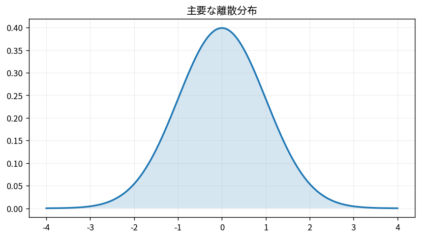

# 主要な離散分布

Course 03｜確率統計｜Topic 09/20

---
layout: center
---

## 今回の問い

## 到達目標

- 定義と代表式を、自分の言葉と記号で説明できる。
- 成立条件を確認し、手計算と結果を検算できる。

## 理解確認

- 定義・条件・計算結果を自分の言葉で説明できるか確認する。

主要な離散分布の代表式は、どの定義・仮定から、なぜその形になるのか。

---

## なぜ今これを学ぶのか

前Topic `prob-covariance-correlation` で得た概念を使い、ここでは 主要な離散分布 へ進む。

---

## 直感

分布は確率変数がどの値をどれくらい取りやすいかをまとめたもの。PMF/PDFとCDFは同じ分布の別表現。

---

## 図解

離散分布の棒と連続分布の曲線、CDFの累積を並べる。 離散なら棒1本が1点の確率、連続なら曲線下の区間面積が確率である。CDFは左端からその位置までの確率を累積するので必ず非減少になる。

---

## 記号と代表式

- $n$：独立Bernoulli試行回数
- $p$：各試行の成功確率
- $X$：成功回数
- $\binom nk$：k回成功する位置の選び方

$$
X\sim\operatorname{Binomial}(n,p)
$$

---

## 導出 1

例えば最初のk回が成功し残りが失敗する特定列は独立性により $p^k(1-p)^{n-k}$。

---

## 導出 2

成功位置をn箇所からk箇所選ぶ方法は $\binom nk$ 通り。各配置は排反なので確率を足し、二項PMFを得る。

---

## 例題

10回の独立試行、p=0.3でちょうど3成功は $\binom{10}{3}0.3^3 0.7^7\approx0.267$。

---

## 条件を変えるとどうなるか

試行ごとに成功確率が変わる、または試行が依存するなら通常のBinomial仮定は壊れる。式だけを適用すると分散などを過小・過大評価し得る。

---

## よくある誤解

主要な離散分布では、式へ数値を代入するだけでは不十分である。試行ごとに成功確率が変わる、または試行が依存するなら通常のBinomial仮定は壊れる。式だけを適用すると分散などを過小・過大評価し得る。 という失敗例が示すように、式を使える条件と結論の範囲を区別する必要がある。

---

## 実装・計算上の注意

scipy等の分布関数ではparameterizationを確認する。simulationではBernoulliをn個足したヒストグラムが理論PMFへ近づくことを確認できる。

---

## 一段先へ

nが大きくpが小さくnp一定ならPoisson近似、nが大きい一般条件では標準化したBinomialが正規に近づく。後者はCLTで理論化する。

---

## 自分で説明できるか

- 「特定の成功配置の確率」を式を見ずに説明できるか
- 「平均と分散をBernoulli和から得る」までの論理を一段ずつ再現できるか
- 主要な離散分布の条件を1つ外した反例を説明できるか

---
layout: center
---

## 教科書と演習

- [教科書](../../textbook/prob-discrete-distributions)
- [10問の演習](../../exercises/prob-discrete-distributions)
