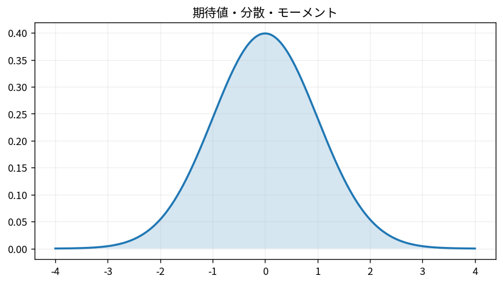

# 期待値・分散・モーメント

Course 03｜確率統計｜Topic 06/20

---
layout: center
---

## 今回の問い

## 到達目標

- 定義と代表式を、自分の言葉と記号で説明できる。
- 成立条件を確認し、手計算と結果を検算できる。

## 理解確認

- 定義・条件・計算結果を自分の言葉で説明できるか確認する。

期待値・分散・モーメントの代表式は、どの定義・仮定から、なぜその形になるのか。

---

## なぜ今これを学ぶのか

前Topic `prob-random-variables-cdf-pmf-pdf` で得た概念を使い、ここでは 期待値・分散・モーメント へ進む。

---

## 直感

期待値は重心、分散は重心からの二乗距離の平均として理解するとよい。

---

## 図解

同じ平均でも分散の異なる2分布を比較する。 中心から離れた点ほど二乗距離が大きくなる。平均は分布の中心、分散はその中心からの二乗距離を確率で重み付けした平均として図の広がりに対応する。

---

## 記号と代表式

- $\mathbb E[X]$：確率重み付き平均
- $\mu=\mathbb E[X]$：平均
- $\operatorname{Var}(X)$：平均との差の二乗平均
- $\mathbb E[X^k]$：k次モーメント

$$
\operatorname{Var}(X)=\mathbb{E}[X^2]-\mathbb{E}[X]^2
$$

---

## 導出 1

$\operatorname{Var}(X)=E[(X-\mu)^2]$ は正負のずれを相殺せず大きさとして測る。

---

## 導出 2

$(X-\mu)^2=X^2-2\mu X+\mu^2$。期待値の線形性から $E[X^2]-2\mu E[X]+\mu^2$。

---

## 例題

公平なBernoulli $X\in\{0,1\}$, $P(X=1)=p$。$E[X]=p$, $E[X^2]=p$（0と1は二乗して同じ）なので分散は $p-p^2=p(1-p)$。

---

## 条件を変えるとどうなるか

$E[X^2]-E[X]^2$ を $E[X^2-E[X]^2]$ と雑に読むと「期待値の中の定数」と「確率変数」を混同する。さらに重い裾では期待値や分散が有限とは限らない。

---

## よくある誤解

期待値・分散・モーメントでは、式へ数値を代入するだけでは不十分である。$E[X^2]-E[X]^2$ を $E[X^2-E[X]^2]$ と雑に読むと「期待値の中の定数」と「確率変数」を混同する。さらに重い裾では期待値や分散が有限とは限らない。 という失敗例が示すように、式を使える条件と結論の範囲を区別する必要がある。

---

## 実装・計算上の注意

大きい平均と小さい分散を $E[X^2]-E[X]^2$ で直接計算すると桁落ちしやすい。標本分散は中心化してから安定なアルゴリズムで計算する。

---

## 一段先へ

一変数の「一緒に揺れる量」を二変数へ拡張すると共分散になる。その前に次Topicで同時分布を定義する。

---

## 自分で説明できるか

- 「平均との差を二乗する」を式を見ずに説明できるか
- 「平均を代入する」までの論理を一段ずつ再現できるか
- 期待値・分散・モーメントの条件を1つ外した反例を説明できるか

---
layout: center
---

## 教科書と演習

- [教科書](../../textbook/prob-expectation-variance-moments)
- [10問の演習](../../exercises/prob-expectation-variance-moments)
