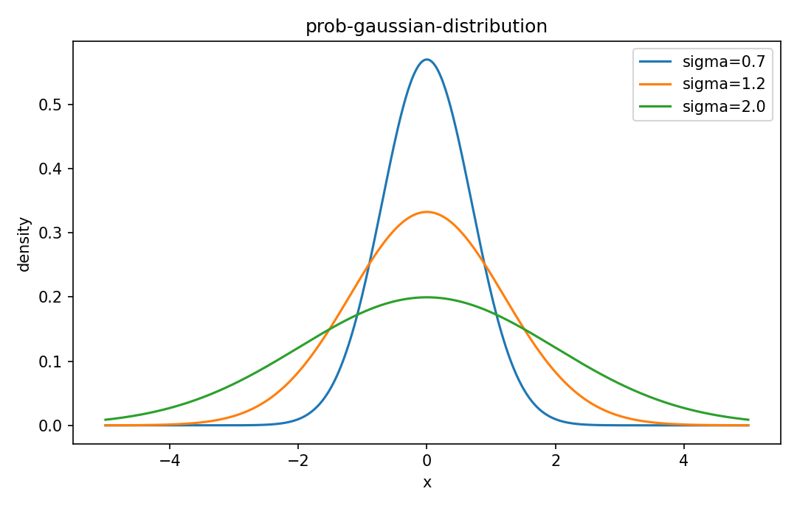

# Gaussian（正規）分布

確率分布

---

## 問い

多数の小さな加法誤差が重なった連続量を、平均と分散でどう記述するか。

---

## 記号とshape

- `$\mu`: mean/location (real)
- `$\sigma^2`: variance (positive)
- `$X`: continuous random variable (real)

---

## 中心式

$$
f(x)=\frac{1}{\sqrt{2\pi\sigma^2}}\exp\!\left[-\frac{(x-\mu)^2}{2\sigma^2}\right]
$$

---

## 導出

- 標準化 $Z=(X-\mu)/\sigma$ によりlocationとscaleを分離する。
- 指数部は平均からの二乗距離をvarianceで正規化した量。
- normalization constantはGaussian integralが1になるよう $1/(\sqrt{2\pi}\sigma)$ に決まる。

---

## 図

---

## 小さな例

$\mu=10,\sigma=2$ なら $X=12$ は標準化してz=1。約68%が8〜12に入る。

---

## 何がわかるか

measurement noise、MLE asymptotics、linear model、Kalman filterの基礎分布。

---

## 失敗条件

heavy tail、skew、count dataではGaussian assumptionが外れる。平均・分散だけ合ってもtail riskは一致しない。

---

## 実装検算

histogramだけでなくQ-Q plotや標準化残差を確認する。

---

## 式の読み方を固定する

Gaussian（正規）分布はsupport・normalization・momentの3点を同時に確認すると理解しやすい。$\mu$ は mean/location（real）、$\sigma^2$ は variance（positive）、$X$ は continuous random variable（real）。中心式 `f(x)=\frac{1}{\sqrt{2\pi\sigma^2}}\exp\!\left[-\frac{(x-\mu)^2}{2\sigma^2}\right]` が非負で全support上の総和/積分が1になること、期待値やvarianceがsample simulationと一致することを別々に確認する。分布名だけを覚えず、どの生成機構がこの形を生むかまで結び付ける。

---

## 極限・反例で検算

- 手計算例: $\mu=10,\sigma=2$ なら $X=12$ は標準化してz=1。約68%が8〜12に入る。
- 失敗条件: heavy tail、skew、count dataではGaussian assumptionが外れる。平均・分散だけ合ってもtail riskは一致しない。
- 実装検算: histogramだけでなくQ-Q plotや標準化残差を確認する。

---

## 工学での位置づけ

measurement noise、MLE asymptotics、linear model、Kalman filterの基礎分布。

中心式 `f(x)=\frac{1}{\sqrt{2\pi\sigma^2}}\exp\!\left[-\frac{(x-\mu)^2}{2\sigma^2}\right]` のどの量が観測・未知parameter・weight・frequency成分に対応するかを区別する。

---

## 試験で書けるべきこと

- `Gaussian（正規）分布` の記号とshapeを定義する
- `標準化 $Z=(X-\mu)/\sigma$ によりlocationとscaleを分離する。` から中心式を導く
- `$\mu=10,\sigma=2$ なら $X=12$ は標準化してz=1。約68%が8〜12に入る。` を最後まで追う
- `heavy tail、skew、count dataではGaussian assumptionが外れる。平均・分散だけ合ってもtail riskは一致しない。` がなぜ問題か説明する

---

## 接続

Prerequisites: prob-continuous-distributions, prob-expectation-variance-moments

[教科書](../../textbook/prob-gaussian-distribution)
[10問の演習](../../exercises/prob-gaussian-distribution)
