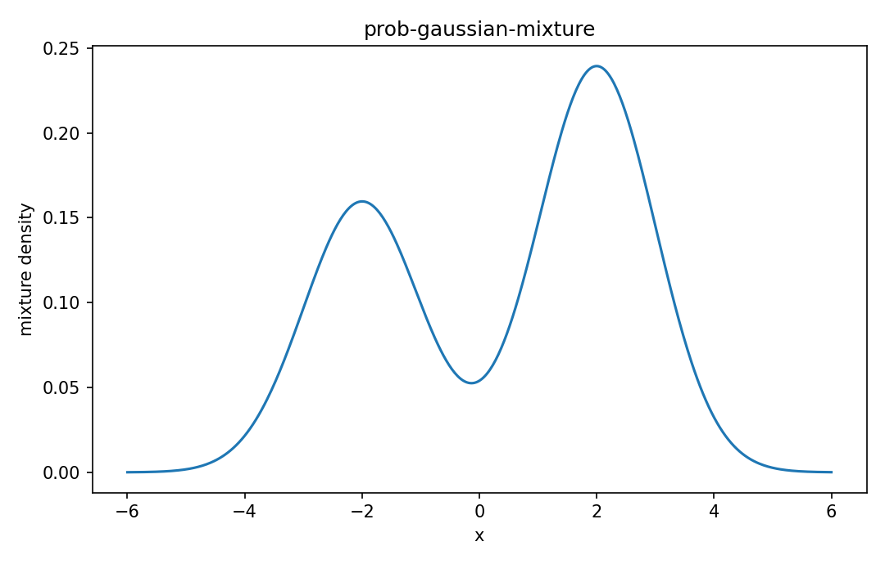

# Gaussian mixture modelの分布

確率分布

---

## 問い

単一Gaussianでは表せない多峰性を、潜在componentの混合でどう表現するか。

---

## 記号とshape

- `$K`: number of components (integer)
- `$\pi_k`: mixing weights (nonnegative)
- `$\boldsymbol\mu_k`: component mean (d)
- `$\mathbf\Sigma_k`: component covariance (d\times d)

---

## 中心式

$$
p(\mathbf x)=\sum_{k=1}^K\pi_k\,\mathcal N(\mathbf x\mid\boldsymbol\mu_k,\mathbf\Sigma_k),\quad \sum_k\pi_k=1
$$

---

## 導出

- latent variable $Z\sim\mathrm{Categorical}(\boldsymbol\pi)$ を導入する。
- $Z=k$ の条件下で $\mathbf X$ はcomponent Gaussianに従う。
- $Z$ を周辺化するとweighted sum densityになる。

---

## 図

---

## 小さな例

1Dでweights=(0.4,0.6)、means=(-2,2)、sigma=1ならdensityは二峰性になる。全体meanは $0.4(-2)+0.6(2)=0.4$。

---

## 何がわかるか

cell population、clustering、heterogeneous measurement distributionのモデル化。

---

## 失敗条件

component labelはpermutationに対して非識別で、局所解やcovariance collapseも起こる。Kを増やせば必ず良いわけではない。

---

## 実装検算

EMでlog-likelihoodが非減少かを追跡し、複数initializationで解の安定性を確認する。

---

## 式の読み方を固定する

Gaussian mixture modelの分布はsupport・normalization・momentの3点を同時に確認すると理解しやすい。$K$ は number of components（integer）、$\pi_k$ は mixing weights（nonnegative）、$\boldsymbol\mu_k$ は component mean（d）、$\mathbf\Sigma_k$ は component covariance（d\times d）。中心式 `p(\mathbf x)=\sum_{k=1}^K\pi_k\,\mathcal N(\mathbf x\mid\boldsymbol\mu_k,\mathbf\Sigma_k),\quad \sum_k\pi_k=1` が非負で全support上の総和/積分が1になること、期待値やvarianceがsample simulationと一致することを別々に確認する。分布名だけを覚えず、どの生成機構がこの形を生むかまで結び付ける。

---

## 極限・反例で検算

- 手計算例: 1Dでweights=(0.4,0.6)、means=(-2,2)、sigma=1ならdensityは二峰性になる。全体meanは $0.4(-2)+0.6(2)=0.4$。
- 失敗条件: component labelはpermutationに対して非識別で、局所解やcovariance collapseも起こる。Kを増やせば必ず良いわけではない。
- 実装検算: EMでlog-likelihoodが非減少かを追跡し、複数initializationで解の安定性を確認する。

---

## 工学での位置づけ

cell population、clustering、heterogeneous measurement distributionのモデル化。

中心式 `p(\mathbf x)=\sum_{k=1}^K\pi_k\,\mathcal N(\mathbf x\mid\boldsymbol\mu_k,\mathbf\Sigma_k),\quad \sum_k\pi_k=1` のどの量が観測・未知parameter・weight・frequency成分に対応するかを区別する。

---

## 試験で書けるべきこと

- `Gaussian mixture modelの分布` の記号とshapeを定義する
- `latent variable $Z\sim\mathrm{Categorical}(\boldsymbol\pi)$ を導入する。` から中心式を導く
- `1Dでweights=(0.4,0.6)、means=(-2,2)、sigma=1ならdensityは二峰性になる。全体meanは $0.4(-2)+0.6(2)=0.4$。` を最後まで追う
- `component labelはpermutationに対して非識別で、局所解やcovariance collapseも起こる。Kを増やせば必ず良いわけではない。` がなぜ問題か説明する

---

## 接続

Prerequisites: prob-gaussian-distribution

[教科書](../../textbook/prob-gaussian-mixture)
[10問の演習](../../exercises/prob-gaussian-mixture)
