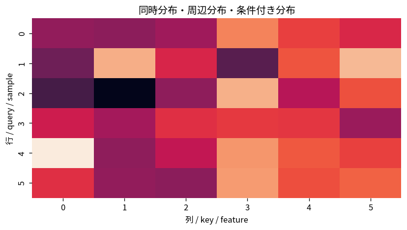

# 同時分布・周辺分布・条件付き分布

Course 03｜確率統計｜Topic 07/20

---
layout: center
---

## 今回の問い

## 到達目標

- 定義と代表式を、自分の言葉と記号で説明できる。
- 成立条件を確認し、手計算と結果を検算できる。

## 理解確認

- 定義・条件・計算結果を自分の言葉で説明できるか確認する。

同時分布・周辺分布・条件付き分布の代表式は、どの定義・仮定から、なぜその形になるのか。

---

## なぜ今これを学ぶのか

前Topic `prob-expectation-variance-moments` で得た概念を使い、ここでは 同時分布・周辺分布・条件付き分布 へ進む。

---

## 直感

同時分布は複数変数の組を一度に扱い、周辺化は不要な軸を足し合わせる操作。

---

## 図解

2次元ヒートマップから行・列方向に足して周辺分布を作る。 2軸は2つの変数、各セルや密度の高さは同時にその値を取る重みを表す。一方の軸方向へ足し上げる・積分すると他方だけの周辺分布が残る。

---

## 記号と代表式

- $X,Y$：2つの確率変数
- $p_{X,Y}(x,y)$：同時PMF
- $p_X(x)$：Xの周辺PMF
- $p_{Y\mid X}(y\mid x)$：X=xで条件付けたYの分布

$$
p_X(x)=\sum_y p_{X,Y}(x,y)
$$

---

## 導出 1

事象 $\{X=x\}$ は互いに排反な $\{X=x,Y=y\}$ の和集合に分けられる。

---

## 導出 2

排反なので確率を足せば $P(X=x)=\sum_yP(X=x,Y=y)$、すなわち周辺化公式。

---

## 例題

二つのBernoulliの同時表が $(0,0):0.4,(0,1):0.1,(1,0):0.2,(1,1):0.3$。$P(X=1)=0.2+0.3=0.5$、$P(Y=1|X=1)=0.3/0.5=0.6$。

---

## 条件を変えるとどうなるか

周辺分布が同じでも同時分布は一意に決まらない。X,Yが同じBernoulliの場合と独立Bernoulliの場合は各周辺が同じでも依存構造が全く違う。

---

## よくある誤解

同時分布・周辺分布・条件付き分布では、式へ数値を代入するだけでは不十分である。周辺分布が同じでも同時分布は一意に決まらない。X,Yが同じBernoulliの場合と独立Bernoulliの場合は各周辺が同じでも依存構造が全く違う。 という失敗例が示すように、式を使える条件と結論の範囲を区別する必要がある。

---

## 実装・計算上の注意

joint tableや2D histogramは全要素の和が1か、周辺化後のshapeが意図通りか確認する。連続では総和を積分へ置換する。

---

## 一段先へ

同時分布から $E[XY]$ を計算すると、二変数の依存を要約する共分散へ進める。

---

## 自分で説明できるか

- 「X=xという事象を分割する」を式を見ずに説明できるか
- 「条件付きへ再正規化する」までの論理を一段ずつ再現できるか
- 同時分布・周辺分布・条件付き分布の条件を1つ外した反例を説明できるか

---
layout: center
---

## 教科書と演習

- [教科書](../../textbook/prob-joint-marginal-conditional-distributions)
- [10問の演習](../../exercises/prob-joint-marginal-conditional-distributions)
