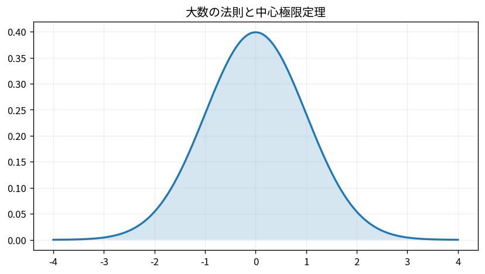
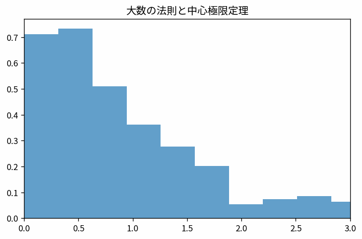

# 大数の法則と中心極限定理

Course 03｜確率統計

---
layout: center
---

## 今回の問い

大数の法則と中心極限定理で、何を入力し、代表式がどの量を出力し、どの成立条件を外すと結果が壊れるのか。

---

## 到達目標

- 大数の法則と中心極限定理の定義と代表式を言葉で説明できる
- 図と式の対応を説明できる
- 小さな例で成立条件と失敗条件を検算できる

---

## 直感

標本数が増えると標本平均の揺れが小さくなり、適切な条件で正規分布へ近づく。

**前提:** prob-expectation-variance-moments, prob-transformations-sums-random-variables

---

## 図解

---

## 図を見るポイント

- 図の軸・点・矢印・領域を数式と対応づける
- 代表式の各項と図の要素を対応づける
- 条件を変えたとき、どこが変化するか予測する

---

## 代表式

$$
\frac{\sqrt{n}(\bar{X}_n-\mu)}{\sigma}\Rightarrow\mathcal{N}(0,1)
$$

左辺の出力 → 右辺の操作 → 入力の型の順で読む。

---

## 式をどう読むか

- **対象:** 大数の法則、中心極限定理
- shape・次元・定義域を先に確定する
- 計算後に符号・大きさ・残差・確率などを図と照合する

---

## 小さな例

非正規な母集団から標本平均を繰り返し取り、nごとの分布を比較する。

小さな例で、手計算と実装の結果を照合する。

---

## 動き／思考実験で確認

- 各frameで、何が固定され何が更新されるかを追う。

---

## 成立条件

- CLTは元データが正規という主張ではない。
- 独立性や有限分散などの条件を確認する。
- 大数の法則と中心極限定理の定義と計算手順を区別し、数値例だけで一般性を判断しない。

---

## よくある誤解

- 大数の法則と中心極限定理の定義と計算手順を同一視する
- 成立条件を確認せず公式を適用する
- 数学上の次元と配列のshapeを混同する

---

## 数値・実装で検算

1. 小さい入力を作る
2. 定義式から期待値を手で求める
3. NumPy等の実装結果と比較する
4. shape・残差・許容誤差・seedを記録する

---

## 後続分野への接続

大数の法則と中心極限定理は、後続の数値計算・データ解析・機械学習で前提となる。

このTopicの量が、後続で入力・目的関数・制約・診断のどれとして使われるか確認する。

---

## 理解確認

- 大数の法則と中心極限定理を図→式→小例の順で説明できるか
- 条件を1つ外した反例を作れるか

[教科書](../../textbook/prob-laws-large-numbers-central-limit-theorem)

[10問の演習](../../exercises/prob-laws-large-numbers-central-limit-theorem)
