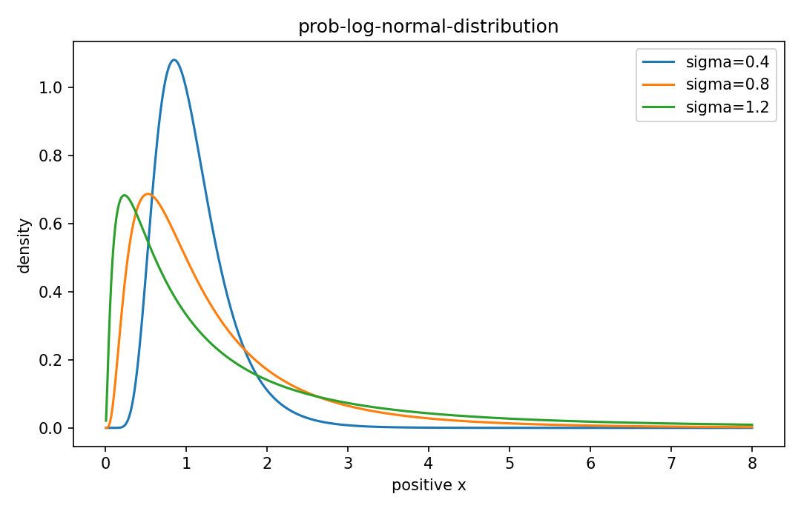

# Log-normal分布

確率分布

---

## 問い

正の量が乗法的に変動するとき、対数をGaussianとするmodelをどう使うか。

---

## 記号とshape

- `$X`: positive random variable (>0)
- `$Y=log X`: Gaussian variable (real)
- `$\mu,\sigma^2`: log-scale parameters (scalar)

---

## 中心式

$$
Y=\log X\sim N(\mu,\sigma^2),\quad E[X]=e^{\mu+\sigma^2/2}
$$

---

## 導出

- $Y\sim N(\mu,\sigma^2)$ と置き $X=e^Y$ で変数変換する。
- Jacobian $|d\log x/dx|=1/x$ がdensityへ掛かる。
- $E[e^Y]$ はGaussianのMGFから $e^{\mu+\sigma^2/2}$。

---

## 図

---

## 小さな例

$\mu=0,\sigma=1$ ならmedianは1だがmeanは $e^{1/2}\approx1.65$。右skewのためmean>median。

---

## 何がわかるか

粒径、濃度、反応時間、multiplicative biological variabilityのmodel。

---

## 失敗条件

0や負値を取り得る量には直接使えない。log変換後のGaussian性も確認する。

---

## 実装検算

`np.log(samples)` のhistogram/Q-Q plotと元scaleのmean/median差を確認する。

---

## 式の読み方を固定する

Log-normal分布はsupport・normalization・momentの3点を同時に確認すると理解しやすい。$X$ は positive random variable（>0）、$Y=log X$ は Gaussian variable（real）、$\mu,\sigma^2$ は log-scale parameters（scalar）。中心式 `Y=\log X\sim N(\mu,\sigma^2),\quad E[X]=e^{\mu+\sigma^2/2}` が非負で全support上の総和/積分が1になること、期待値やvarianceがsample simulationと一致することを別々に確認する。分布名だけを覚えず、どの生成機構がこの形を生むかまで結び付ける。

---

## 極限・反例で検算

- 手計算例: $\mu=0,\sigma=1$ ならmedianは1だがmeanは $e^{1/2}\approx1.65$。右skewのためmean>median。
- 失敗条件: 0や負値を取り得る量には直接使えない。log変換後のGaussian性も確認する。
- 実装検算: `np.log(samples)` のhistogram/Q-Q plotと元scaleのmean/median差を確認する。

---

## 工学での位置づけ

粒径、濃度、反応時間、multiplicative biological variabilityのmodel。

中心式 `Y=\log X\sim N(\mu,\sigma^2),\quad E[X]=e^{\mu+\sigma^2/2}` のどの量が観測・未知parameter・weight・frequency成分に対応するかを区別する。

---

## 試験で書けるべきこと

- `Log-normal分布` の記号とshapeを定義する
- `$Y\sim N(\mu,\sigma^2)$ と置き $X=e^Y$ で変数変換する。` から中心式を導く
- `$\mu=0,\sigma=1$ ならmedianは1だがmeanは $e^{1/2}\approx1.65$。右skewのためmean>median。` を最後まで追う
- `0や負値を取り得る量には直接使えない。log変換後のGaussian性も確認する。` がなぜ問題か説明する

---

## 接続

Prerequisites: prob-gaussian-distribution

[教科書](../../textbook/prob-log-normal-distribution)
[10問の演習](../../exercises/prob-log-normal-distribution)
