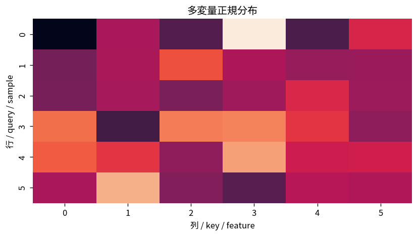

# 多変量正規分布

Course 03｜確率統計｜Topic 13/20

---
layout: center
---

## 今回の問い

## 到達目標

- 定義と代表式を、自分の言葉と記号で説明できる。
- 成立条件を確認し、手計算と結果を検算できる。

## 理解確認

- 定義・条件・計算結果を自分の言葉で説明できるか確認する。

多変量正規分布の代表式は、どの定義・仮定から、なぜその形になるのか。

---

## なぜ今これを学ぶのか

前Topic `prob-laws-large-numbers-central-limit-theorem` で得た概念を使い、ここでは 多変量正規分布 へ進む。

---

## 直感

同時分布は複数変数の組を一度に扱い、周辺化は不要な軸を足し合わせる操作。

---

## 図解

2次元ヒートマップから行・列方向に足して周辺分布を作る。 2軸は2つの変数、各セルや密度の高さは同時にその値を取る重みを表す。一方の軸方向へ足し上げる・積分すると他方だけの周辺分布が残る。

---

## 記号と代表式

- $\mathbf X\in\mathbb R^d$：d次元確率ベクトル
- $\boldsymbol\mu\in\mathbb R^d$：平均ベクトル
- $\mathbf\Sigma\in\mathbb R^{d\times d}$：共分散行列
- $\mathbf\Sigma\succ0$：正定値

$$
\mathbf{X}\sim\mathcal{N}(\boldsymbol{\mu},\mathbf{\Sigma})
$$

---

## 導出 1

$\mathbf Z\sim N(\mathbf0,\mathbf I)$ は球対称。線形変換 $\mathbf X=\boldsymbol\mu+\mathbf L\mathbf Z$ を考える。

---

## 導出 2

$E[\mathbf X]=\boldsymbol\mu$、$Cov(\mathbf X)=\mathbf L\mathbf L^T$。$\mathbf\Sigma=\mathbf L\mathbf L^T$ を満たすLを選べば所望の共分散になる。

---

## 例題

$\Sigma=\begin{pmatrix}4&0\\0&1\end{pmatrix}$ ならx方向標準偏差2、y方向1の軸平行楕円。off-diagonalが正なら楕円が正傾斜へ回転する。

---

## 条件を変えるとどうなるか

共分散行列は任意の対称行列ではなく半正定値でなければならない。負の固有値がある行列を「共分散」として使うと、ある方向の分散が負になる矛盾。

---

## よくある誤解

多変量正規分布では、式へ数値を代入するだけでは不十分である。共分散行列は任意の対称行列ではなく半正定値でなければならない。負の固有値がある行列を「共分散」として使うと、ある方向の分散が負になる矛盾。 という失敗例が示すように、式を使える条件と結論の範囲を区別する必要がある。

---

## 実装・計算上の注意

密度計算で明示逆行列を作るよりCholesky分解を用いて二次形式とlog determinantを計算する方が安定。高次元ではlog-densityを使う。

---

## 一段先へ

Mahalanobis距離、Gaussian discriminant analysis、Kalman filteringなどへつながる。Course07ではwhiteningとPCAを共分散行列の固有構造から扱う。

---

## 自分で説明できるか

- 「独立標準正規から始める」を式を見ずに説明できるか
- 「楕円等密度面を得る」までの論理を一段ずつ再現できるか
- 多変量正規分布の条件を1つ外した反例を説明できるか

---
layout: center
---

## 教科書と演習

- [教科書](../../textbook/prob-multivariate-normal-distribution)
- [10問の演習](../../exercises/prob-multivariate-normal-distribution)
