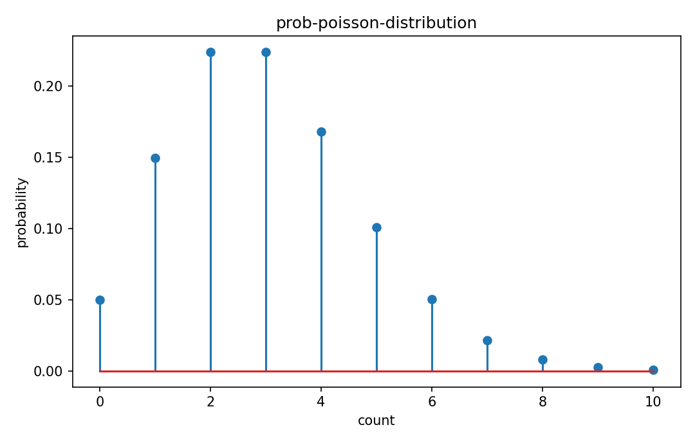

# Poisson分布

確率分布

---

## 問い

一定区間内の稀なcountを、平均rateだけでどうモデル化するか。

---

## 記号とshape

- `$X`: event count (nonnegative integer)
- `$\lambda`: expected count in interval (positive scalar)

---

## 中心式

$$
P(X=k)=e^{-\lambda}\frac{\lambda^k}{k!},\quad k=0,1,\ldots,\quad E[X]=\operatorname{Var}(X)=\lambda
$$

---

## 導出

- Binomialで $n\to\infty,p\to0,np\to\lambda$ の極限を考える。
- $\binom nkp^k(1-p)^{n-k}$ の各因子を極限評価すると $e^{-\lambda}\lambda^k/k!$。
- probability generating functionまたは級数計算から平均と分散はいずれも $\lambda$。

---

## 図

---

## 小さな例

$\lambda=3$ なら $P(X=0)=e^{-3}\approx0.0498$、$P(X=3)=e^{-3}27/6\approx0.224$。

---

## 何がわかるか

photon/electron count、arrival count、rare event countの一次model。spectral cytometryのshot noise理解にも重要。

---

## 失敗条件

overdispersionで標本分散が平均を大きく超える場合、単純Poissonは不足する。rate heterogeneityやcompound Poissonを疑う。

---

## 実装検算

`rng.poisson(lam,N)` で平均≈分散≈λを確認し、低λでGaussian近似が悪いことも可視化する。

---

## 式の読み方を固定する

Poisson分布はsupport・normalization・momentの3点を同時に確認すると理解しやすい。$X$ は event count（nonnegative integer）、$\lambda$ は expected count in interval（positive scalar）。中心式 `P(X=k)=e^{-\lambda}\frac{\lambda^k}{k!},\quad k=0,1,\ldots,\quad E[X]=\operatorname{Var}(X)=\lambda` が非負で全support上の総和/積分が1になること、期待値やvarianceがsample simulationと一致することを別々に確認する。分布名だけを覚えず、どの生成機構がこの形を生むかまで結び付ける。

---

## 極限・反例で検算

- 手計算例: $\lambda=3$ なら $P(X=0)=e^{-3}\approx0.0498$、$P(X=3)=e^{-3}27/6\approx0.224$。
- 失敗条件: overdispersionで標本分散が平均を大きく超える場合、単純Poissonは不足する。rate heterogeneityやcompound Poissonを疑う。
- 実装検算: `rng.poisson(lam,N)` で平均≈分散≈λを確認し、低λでGaussian近似が悪いことも可視化する。

---

## 工学での位置づけ

photon/electron count、arrival count、rare event countの一次model。spectral cytometryのshot noise理解にも重要。

中心式 `P(X=k)=e^{-\lambda}\frac{\lambda^k}{k!},\quad k=0,1,\ldots,\quad E[X]=\operatorname{Var}(X)=\lambda` のどの量が観測・未知parameter・weight・frequency成分に対応するかを区別する。

---

## 試験で書けるべきこと

- `Poisson分布` の記号とshapeを定義する
- `Binomialで $n\to\infty,p\to0,np\to\lambda$ の極限を考える。` から中心式を導く
- `$\lambda=3$ なら $P(X=0)=e^{-3}\approx0.0498$、$P(X=3)=e^{-3}27/6\approx0.224$。` を最後まで追う
- `overdispersionで標本分散が平均を大きく超える場合、単純Poissonは不足する。rate heterogeneityやcompound Poissonを疑う。` がなぜ問題か説明する

---

## 接続

Prerequisites: prob-binomial-distribution, prob-expectation-variance-moments

[教科書](../../textbook/prob-poisson-distribution)
[10問の演習](../../exercises/prob-poisson-distribution)
