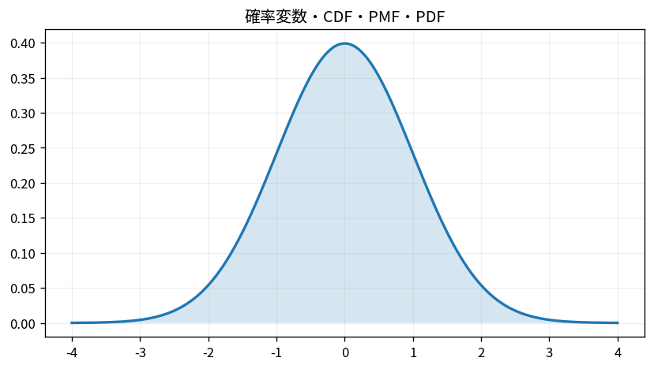

# 確率変数・CDF・PMF・PDF

Course 03｜確率統計｜Topic 05/20

---
layout: center
---

## 今回の問い

## 到達目標

- 定義と代表式を、自分の言葉と記号で説明できる。
- 成立条件を確認し、手計算と結果を検算できる。

## 理解確認

- 定義・条件・計算結果を自分の言葉で説明できるか確認する。

確率変数・CDF・PMF・PDFの代表式は、どの定義・仮定から、なぜその形になるのか。

---

## なぜ今これを学ぶのか

前Topic `prob-bayes-theorem` で得た概念を使い、ここでは 確率変数・CDF・PMF・PDF へ進む。

---

## 直感

分布は確率変数がどの値をどれくらい取りやすいかをまとめたもの。PMF/PDFとCDFは同じ分布の別表現。

---

## 図解

離散分布の棒と連続分布の曲線、CDFの累積を並べる。 離散なら棒1本が1点の確率、連続なら曲線下の区間面積が確率である。CDFは左端からその位置までの確率を累積するので必ず非減少になる。

---

## 記号と代表式

- $X:\Omega\to\mathbb R$：標本結果を数値へ写す確率変数
- $F_X(x)$：累積分布関数（CDF）
- $p_X(x)$：離散確率質量関数（PMF）
- $f_X(x)$：連続確率密度関数（PDF）

$$
F_X(x)=\mathbb{P}(X\le x)
$$

---

## 導出 1

$X\le x$ は標本空間上の事象 $\{\omega:X(\omega)\le x\}$。その確率をxの関数として並べたものがCDF。

---

## 導出 2

$F_X(x)$ は点を通過するたびに $P(X=x)$ だけ増える。したがってPMFを累積すればCDFになる。

---

## 例題

公平なサイコロのX=出目。PMFは1〜6で各1/6。CDFは $x<1$ で0、1〜2の間で1/6、…、$x\ge6$ で1の階段関数。

---

## 条件を変えるとどうなるか

連続PDFの値 $f_X(x)=2$ があり得ても「確率200%」ではない。密度は単位長さあたりの確率であり、積分した面積が確率になる。

---

## よくある誤解

確率変数・CDF・PMF・PDFでは、式へ数値を代入するだけでは不十分である。連続PDFの値 $f_X(x)=2$ があり得ても「確率200%」ではない。密度は単位長さあたりの確率であり、積分した面積が確率になる。 という失敗例が示すように、式を使える条件と結論の範囲を区別する必要がある。

---

## 実装・計算上の注意

離散分布ではprobability massの総和、連続分布では数値積分の面積が1か確認する。CDFは単調非減少・右連続・両端極限0/1も検算条件になる。

---

## 一段先へ

CDFが分かれば分位点や変換後分布を扱える。次に期待値・分散を、分布に対する「関数の平均」として定義する。

---

## 自分で説明できるか

- 「事象を数値の条件へ引き戻す」を式を見ずに説明できるか
- 「連続では密度を積分する」までの論理を一段ずつ再現できるか
- 確率変数・CDF・PMF・PDFの条件を1つ外した反例を説明できるか

---
layout: center
---

## 教科書と演習

- [教科書](../../textbook/prob-random-variables-cdf-pmf-pdf)
- [10問の演習](../../exercises/prob-random-variables-cdf-pmf-pdf)
