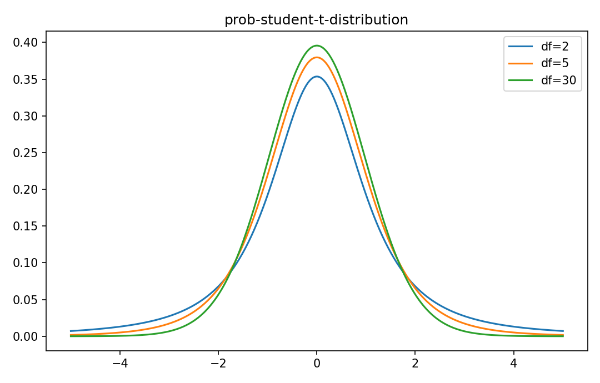

# Student t分布

確率分布

---

## 問い

variance未知のGaussian meanを標準化したとき、有限標本の不確実性をどう表すか。

---

## 記号とshape

- `$T`: t-distributed variable (real)
- `$\nu`: degrees of freedom (positive)
- `$Z`: standard normal (real)
- `$U`: chi-square (positive)

---

## 中心式

$$
T=\frac{Z}{\sqrt{U/\nu}},\quad Z\sim N(0,1),\quad U\sim\chi^2_\nu,\quad Z\perp U
$$

---

## 導出

- 標本平均を真のstandard deviationではなくsample standard deviationで標準化する。
- Gaussian sampleではvariance estimatorがchi-squareに従い、meanと独立。
- その比がt分布を生み、finite dfではGaussianよりtailが厚い。

---

## 図

---

## 小さな例

$\nu=5$ では95%両側critical valueは約2.57で、Gaussianの1.96より大きい。variance推定の不確実性を反映する。

---

## 何がわかるか

small-sample confidence interval、regression coefficient検定、robust heavy-tail model。

---

## 失敗条件

dfが小さいと高次momentが存在しない場合がある。Gaussianと同じvariance公式を無条件に使わない。

---

## 実装検算

`scipy.stats.t.ppf` でdfごとのcritical valueが1.96へ近づく様子を確認する。

---

## 式の読み方を固定する

Student t分布はsupport・normalization・momentの3点を同時に確認すると理解しやすい。$T$ は t-distributed variable（real）、$\nu$ は degrees of freedom（positive）、$Z$ は standard normal（real）、$U$ は chi-square（positive）。中心式 `T=\frac{Z}{\sqrt{U/\nu}},\quad Z\sim N(0,1),\quad U\sim\chi^2_\nu,\quad Z\perp U` が非負で全support上の総和/積分が1になること、期待値やvarianceがsample simulationと一致することを別々に確認する。分布名だけを覚えず、どの生成機構がこの形を生むかまで結び付ける。

---

## 極限・反例で検算

- 手計算例: $\nu=5$ では95%両側critical valueは約2.57で、Gaussianの1.96より大きい。variance推定の不確実性を反映する。
- 失敗条件: dfが小さいと高次momentが存在しない場合がある。Gaussianと同じvariance公式を無条件に使わない。
- 実装検算: `scipy.stats.t.ppf` でdfごとのcritical valueが1.96へ近づく様子を確認する。

---

## 工学での位置づけ

small-sample confidence interval、regression coefficient検定、robust heavy-tail model。

中心式 `T=\frac{Z}{\sqrt{U/\nu}},\quad Z\sim N(0,1),\quad U\sim\chi^2_\nu,\quad Z\perp U` のどの量が観測・未知parameter・weight・frequency成分に対応するかを区別する。

---

## 試験で書けるべきこと

- `Student t分布` の記号とshapeを定義する
- `標本平均を真のstandard deviationではなくsample standard deviationで標準化する。` から中心式を導く
- `$\nu=5$ では95%両側critical valueは約2.57で、Gaussianの1.96より大きい。variance推定の不確実性を反映する。` を最後まで追う
- `dfが小さいと高次momentが存在しない場合がある。Gaussianと同じvariance公式を無条件に使わない。` がなぜ問題か説明する

---

## 接続

Prerequisites: prob-gaussian-distribution, stat-t-chi-square-sampling-distributions

[教科書](../../textbook/prob-student-t-distribution)
[10問の演習](../../exercises/prob-student-t-distribution)
