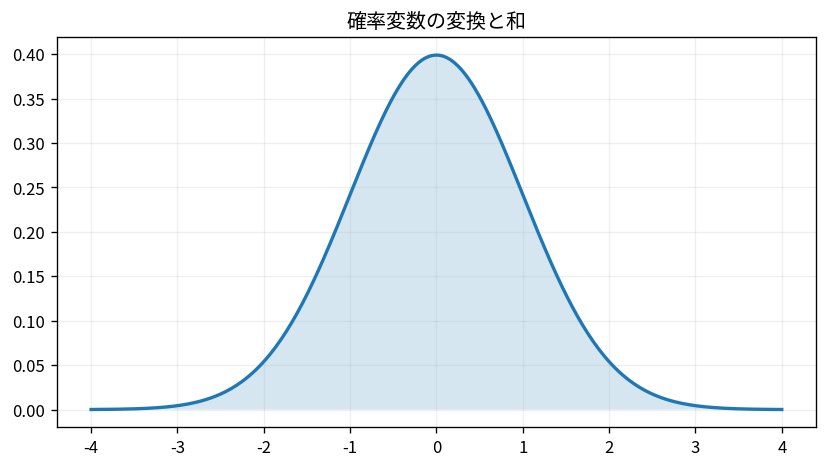

# 確率変数の変換と和

Course 03｜確率統計｜Topic 11/20

---
layout: center
---

## 今回の問い

## 到達目標

- 定義と代表式を、自分の言葉と記号で説明できる。
- 成立条件を確認し、手計算と結果を検算できる。

## 理解確認

- 定義・条件・計算結果を自分の言葉で説明できるか確認する。

確率変数の変換と和の代表式は、どの定義・仮定から、なぜその形になるのか。

---

## なぜ今これを学ぶのか

前Topic `prob-continuous-distributions` で得た概念を使い、ここでは 確率変数の変換と和 へ進む。

---

## 直感

分布は確率変数がどの値をどれくらい取りやすいかをまとめたもの。PMF/PDFとCDFは同じ分布の別表現。

---

## 図解

離散分布の棒と連続分布の曲線、CDFの累積を並べる。 離散なら棒1本が1点の確率、連続なら曲線下の区間面積が確率である。CDFは左端からその位置までの確率を累積するので必ず非減少になる。

---

## 記号と代表式

- $Y=g(X)$：確率変数の変換
- $a,b$：定数
- $X_1,\ldots,X_n$：複数の確率変数
- $S=\sum_iX_i$：和

$$
\operatorname{Var}(aX+b)=a^2\operatorname{Var}(X)
$$

---

## 導出 1

$E[aX+b]=aE[X]+b$ は期待値の和・定数倍に対する線形性から従い、独立性は不要。

---

## 導出 2

$aX+b-E[aX+b]=a(X-E[X])$。二乗して平均すると $a^2Var(X)$。

---

## 例題

$X$ の平均3、分散4なら $Y=2X-5$ は平均1、分散16。標準偏差は4で、係数2に比例する。

---

## 条件を変えるとどうなるか

独立でないX,Yについて $Var(X+Y)=Var(X)+Var(Y)$ とすると誤る。例えばY=Xなら本当は4Var(X)だが誤式は2Var(X)。

---

## よくある誤解

確率変数の変換と和では、式へ数値を代入するだけでは不十分である。独立でないX,Yについて $Var(X+Y)=Var(X)+Var(Y)$ とすると誤る。例えばY=Xなら本当は4Var(X)だが誤式は2Var(X)。 という失敗例が示すように、式を使える条件と結論の範囲を区別する必要がある。

---

## 実装・計算上の注意

vectorized simulationで変換前後の標本平均・分散を比較できる。非線形変換ではJacobianを用いた密度変換やMonte Carloが必要になる。

---

## 一段先へ

多くの独立変数の和を標準化したときの極限形が中心極限定理。次Topicで標本平均の分布へ接続する。

---

## 自分で説明できるか

- 「平均の線形性」を式を見ずに説明できるか
- 「和の分散を展開する」までの論理を一段ずつ再現できるか
- 確率変数の変換と和の条件を1つ外した反例を説明できるか

---
layout: center
---

## 教科書と演習

- [教科書](../../textbook/prob-transformations-sums-random-variables)
- [10問の演習](../../exercises/prob-transformations-sums-random-variables)
