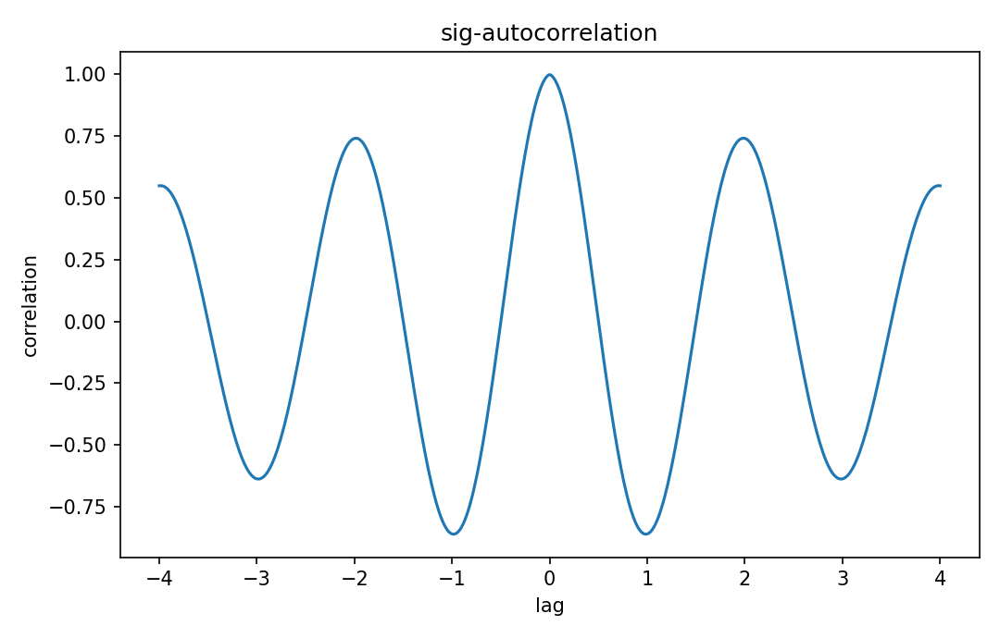

# Autocorrelation

Fourier・信号

---

## 問い

1信号自身の時間構造・周期性をlagごとの自己類似度としてどう読むか。

---

## 記号とshape

- `$R_xx`: autocorrelation (lag function)
- `$\tau`: lag (time)

---

## 中心式

$$
R_{xx}(\tau)=E[x(t)x^*(t+\tau)]\quad\text{or time-average analogue}
$$

---

## 導出

- signalとshifted copyのcorrelationを取る。
- wide-sense stationary processではabsolute timeに依らずlagだけの関数になる。
- τ=0ではmean-square valueとなり、正定値関数になる。

---

## 図

---

## 小さな例

$x(t)=\cos(2\pi f_0t)$ の時間平均autocorrelationは $\frac12\cos(2\pi f_0\tau)$。同じ周期がlag domainに現れる。

---

## 何がわかるか

period detection、noise color診断、power spectral densityとのWiener–Khinchin関係。

---

## 失敗条件

有限windowのsample autocorrelationには大きなestimation varianceがある。normalization法によって値も変わる。

---

## 実装検算

white noiseとAR-like signalのsample autocorrelationを比較する。

---

## 式の読み方を固定する

Autocorrelationでは、time-domain quantityとfrequency/operator-domain quantityの対応を固定する。$R_xx$ は autocorrelation（lag function）、$\tau$ は lag（time）。中心式 `R_{xx}(\tau)=E[x(t)x^*(t+\tau)]\quad\text{or time-average analogue}` のnormalization、sample interval、complex conjugate、周波数単位を一つずつ確認する。signal processingでは式が正しくてもwindowingやsampling条件で観測spectrumが変わるため、数学的変換と測定条件を分離して考える。

---

## 極限・反例で検算

- 手計算例: $x(t)=\cos(2\pi f_0t)$ の時間平均autocorrelationは $\frac12\cos(2\pi f_0\tau)$。同じ周期がlag domainに現れる。
- 失敗条件: 有限windowのsample autocorrelationには大きなestimation varianceがある。normalization法によって値も変わる。
- 実装検算: white noiseとAR-like signalのsample autocorrelationを比較する。

---

## 工学での位置づけ

period detection、noise color診断、power spectral densityとのWiener–Khinchin関係。

中心式 `R_{xx}(\tau)=E[x(t)x^*(t+\tau)]\quad\text{or time-average analogue}` のどの量が観測・未知parameter・weight・frequency成分に対応するかを区別する。

---

## 試験で書けるべきこと

- `Autocorrelation` の記号とshapeを定義する
- `signalとshifted copyのcorrelationを取る。` から中心式を導く
- `$x(t)=\cos(2\pi f_0t)$ の時間平均autocorrelationは $\frac12\cos(2\pi f_0\tau)$。同じ周期がlag domainに現れる。` を最後まで追う
- `有限windowのsample autocorrelationには大きなestimation varianceがある。normalization法によって値も変わる。` がなぜ問題か説明する

---

## 接続

Prerequisites: sig-correlation, prob-stationarity-autocorrelation

[教科書](../../textbook/sig-autocorrelation)
[10問の演習](../../exercises/sig-autocorrelation)
