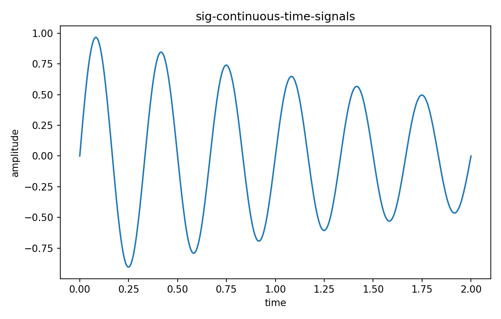

# 連続時間信号

Fourier・信号

---

## 問い

時間を連続変数とするsignalを、amplitude・energy・periodicityの観点でどう記述するか。

---

## 記号とshape

- `$t`: continuous time (real)
- `$x(t)`: signal amplitude (real/complex)
- `$E_x`: signal energy (nonnegative)

---

## 中心式

$$
x:\mathbb R\to\mathbb C,\qquad E_x=\int_{-\infty}^{\infty}|x(t)|^2dt
$$

---

## 導出

- signalを実数時間からamplitudeへの関数として定義する。
- energyは $L^2$ normの二乗で、有限energy signalを区別する。
- periodicなら $x(t+T)=x(t)$ を満たす最小正Tをfundamental periodとする。

---

## 図

---

## 小さな例

$x(t)=e^{-t}u(t)$ ならenergyは $\int_0^\infty e^{-2t}dt=1/2$。

---

## 何がわかるか

analog sensor waveform、voltage pulse、optical signalの数学的入口。

---

## 失敗条件

ideal sinusoidは無限時間energyが無限で、energy signalではなくpower signalとして扱う。

---

## 実装検算

sample grid上で数値積分し、window長を伸ばしたenergy収束を確認する。

---

## 式の読み方を固定する

連続時間信号では、time-domain quantityとfrequency/operator-domain quantityの対応を固定する。$t$ は continuous time（real）、$x(t)$ は signal amplitude（real/complex）、$E_x$ は signal energy（nonnegative）。中心式 `x:\mathbb R\to\mathbb C,\qquad E_x=\int_{-\infty}^{\infty}|x(t)|^2dt` のnormalization、sample interval、complex conjugate、周波数単位を一つずつ確認する。signal processingでは式が正しくてもwindowingやsampling条件で観測spectrumが変わるため、数学的変換と測定条件を分離して考える。

---

## 極限・反例で検算

- 手計算例: $x(t)=e^{-t}u(t)$ ならenergyは $\int_0^\infty e^{-2t}dt=1/2$。
- 失敗条件: ideal sinusoidは無限時間energyが無限で、energy signalではなくpower signalとして扱う。
- 実装検算: sample grid上で数値積分し、window長を伸ばしたenergy収束を確認する。

---

## 工学での位置づけ

analog sensor waveform、voltage pulse、optical signalの数学的入口。

中心式 `x:\mathbb R\to\mathbb C,\qquad E_x=\int_{-\infty}^{\infty}|x(t)|^2dt` のどの量が観測・未知parameter・weight・frequency成分に対応するかを区別する。

---

## 試験で書けるべきこと

- `連続時間信号` の記号とshapeを定義する
- `signalを実数時間からamplitudeへの関数として定義する。` から中心式を導く
- `$x(t)=e^{-t}u(t)$ ならenergyは $\int_0^\infty e^{-2t}dt=1/2$。` を最後まで追う
- `ideal sinusoidは無限時間energyが無限で、energy signalではなくpower signalとして扱う。` がなぜ問題か説明する

---

## 接続

Prerequisites: calc-functions-limits-continuity

[教科書](../../textbook/sig-continuous-time-signals)
[10問の演習](../../exercises/sig-continuous-time-signals)
