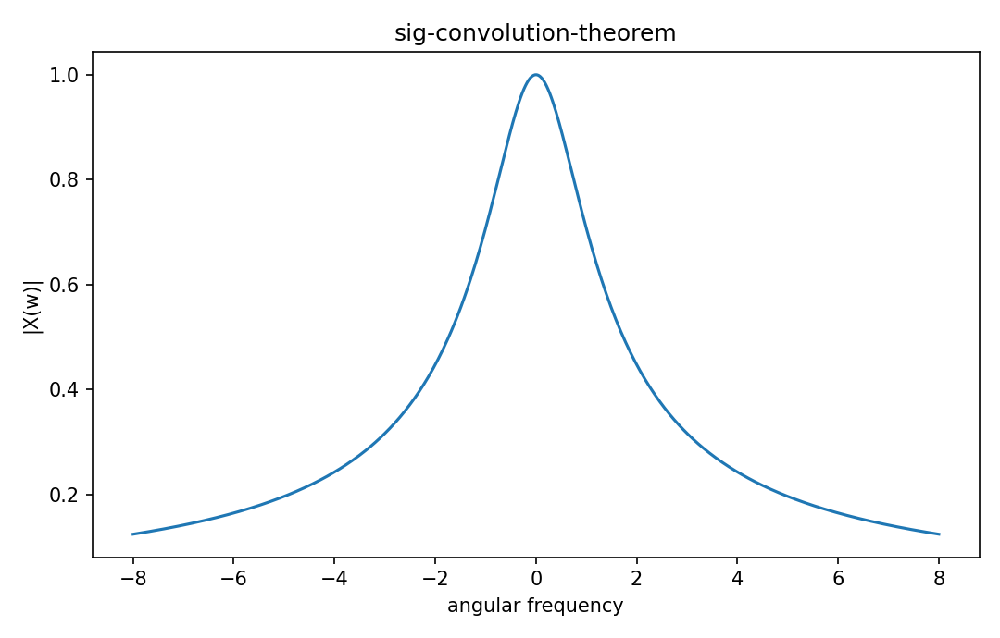

# Convolution theorem

Fourier・信号

---

## 問い

time-domain convolutionがfrequency-domain multiplicationへ変わる理由は何か。

---

## 記号とshape

- `$x*h`: time convolution (signal)
- `$X,H`: Fourier transforms (frequency functions)

---

## 中心式

$$
\mathcal F\{x*h\}(\omega)=X(\omega)H(\omega)
$$

---

## 導出

- convolution integralをFourier transform定義へ代入する。
- integration orderを交換し、変数変換 $u=t-\tau$ を行う。
- τに依るfactorがX、uに依るfactorがHへ分離して積になる。

---

## 図

---

## 小さな例

Gaussian同士のconvolutionはvarianceが加算されたGaussian。frequency domainでは各Gaussian spectrumの積として同じ結果を得る。

---

## 何がわかるか

高速filtering、deconvolution、LTI frequency response。

---

## 失敗条件

DFTではcircular convolutionになる。zero-paddingなしでlinear convolutionと同一視するとwrap-around誤差が出る。

---

## 実装検算

direct convolutionとFFT multiplication+inverse FFTをzero-padding条件込みで比較する。

---

## 式の読み方を固定する

Convolution theoremでは、time-domain quantityとfrequency/operator-domain quantityの対応を固定する。$x*h$ は time convolution（signal）、$X,H$ は Fourier transforms（frequency functions）。中心式 `\mathcal F\{x*h\}(\omega)=X(\omega)H(\omega)` のnormalization、sample interval、complex conjugate、周波数単位を一つずつ確認する。signal processingでは式が正しくてもwindowingやsampling条件で観測spectrumが変わるため、数学的変換と測定条件を分離して考える。

---

## 極限・反例で検算

- 手計算例: Gaussian同士のconvolutionはvarianceが加算されたGaussian。frequency domainでは各Gaussian spectrumの積として同じ結果を得る。
- 失敗条件: DFTではcircular convolutionになる。zero-paddingなしでlinear convolutionと同一視するとwrap-around誤差が出る。
- 実装検算: direct convolutionとFFT multiplication+inverse FFTをzero-padding条件込みで比較する。

---

## 工学での位置づけ

高速filtering、deconvolution、LTI frequency response。

中心式 `\mathcal F\{x*h\}(\omega)=X(\omega)H(\omega)` のどの量が観測・未知parameter・weight・frequency成分に対応するかを区別する。

---

## 試験で書けるべきこと

- `Convolution theorem` の記号とshapeを定義する
- `convolution integralをFourier transform定義へ代入する。` から中心式を導く
- `Gaussian同士のconvolutionはvarianceが加算されたGaussian。frequency domainでは各Gaussian spectrumの積として同じ結果を得る。` を最後まで追う
- `DFTではcircular convolutionになる。zero-paddingなしでlinear convolutionと同一視するとwrap-around誤差が出る。` がなぜ問題か説明する

---

## 接続

Prerequisites: sig-fourier-transform, sig-convolution

[教科書](../../textbook/sig-convolution-theorem)
[10問の演習](../../exercises/sig-convolution-theorem)
