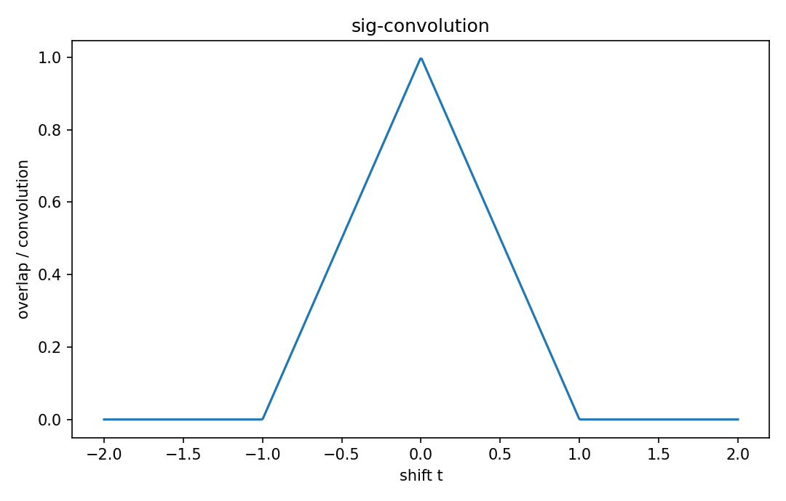

# Convolution

Fourier・信号

---

## 問い

入力とimpulse responseの重なりを、shift-and-weightとしてどう計算するか。

---

## 記号とshape

- `$x,h`: signals (functions)
- `$t`: output time (real)
- `$\tau`: integration dummy variable (real)

---

## 中心式

$$
(x*h)(t)=\int_{-\infty}^{\infty}x(\tau)h(t-\tau)d\tau
$$

---

## 導出

- hを反転shiftした $h(t-\tau)$ を作る。
- x(τ)とのpointwise productを全τで積分する。
- tを動かすことで重なり面積がoutput waveformになる。

---

## 図

---

## 小さな例

2つのunit-width rectangular pulseをconvolveすると、overlap lengthが0→1→0と変わる三角波になる。

---

## 何がわかるか

LTI filtering、probability densityの和、Green function solution。

---

## 失敗条件

correlationと違い、convolutionではkernelを反転する。discrete indexingのoff-by-oneにも注意する。

---

## 実装検算

`np.convolve` のmodeとsampling interval factorを確認し、direct sumと比較する。

---

## 式の読み方を固定する

Convolutionでは、time-domain quantityとfrequency/operator-domain quantityの対応を固定する。$x,h$ は signals（functions）、$t$ は output time（real）、$\tau$ は integration dummy variable（real）。中心式 `(x*h)(t)=\int_{-\infty}^{\infty}x(\tau)h(t-\tau)d\tau` のnormalization、sample interval、complex conjugate、周波数単位を一つずつ確認する。signal processingでは式が正しくてもwindowingやsampling条件で観測spectrumが変わるため、数学的変換と測定条件を分離して考える。

---

## 極限・反例で検算

- 手計算例: 2つのunit-width rectangular pulseをconvolveすると、overlap lengthが0→1→0と変わる三角波になる。
- 失敗条件: correlationと違い、convolutionではkernelを反転する。discrete indexingのoff-by-oneにも注意する。
- 実装検算: `np.convolve` のmodeとsampling interval factorを確認し、direct sumと比較する。

---

## 工学での位置づけ

LTI filtering、probability densityの和、Green function solution。

中心式 `(x*h)(t)=\int_{-\infty}^{\infty}x(\tau)h(t-\tau)d\tau` のどの量が観測・未知parameter・weight・frequency成分に対応するかを区別する。

---

## 試験で書けるべきこと

- `Convolution` の記号とshapeを定義する
- `hを反転shiftした $h(t-\tau)$ を作る。` から中心式を導く
- `2つのunit-width rectangular pulseをconvolveすると、overlap lengthが0→1→0と変わる三角波になる。` を最後まで追う
- `correlationと違い、convolutionではkernelを反転する。discrete indexingのoff-by-oneにも注意する。` がなぜ問題か説明する

---

## 接続

Prerequisites: sig-impulse-response

[教科書](../../textbook/sig-convolution)
[10問の演習](../../exercises/sig-convolution)
