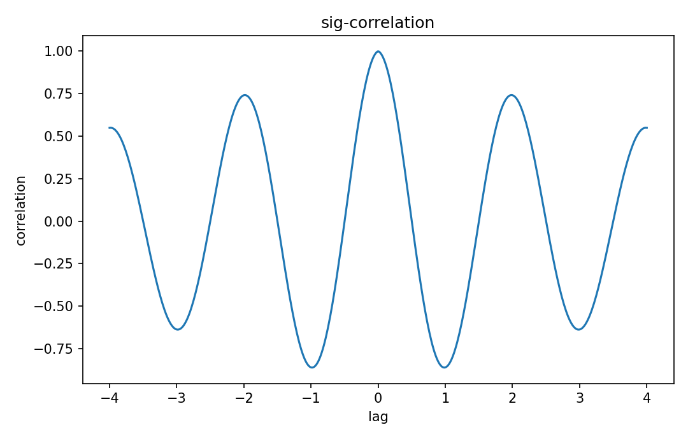

# Correlation

Fourier・信号

---

## 問い

2信号のshiftに対する類似度を、内積としてどう測るか。

---

## 記号とshape

- `$R_xy`: cross-correlation (function of lag)
- `$\tau`: lag (time)
- `$*`: complex conjugate (operation)

---

## 中心式

$$
R_{xy}(\tau)=\int x^*(t)y(t+\tau)dt
$$

---

## 導出

- yをlag τだけshiftする。
- xとのcomplex inner productを取る。
- peak lagがalignment候補を示し、normで割ればscaleに依存しないsimilarityへできる。

---

## 図

---

## 小さな例

$y(t)=x(t-2)$ ならcross-correlationは概ねlag=2付近でpeakを持つ。

---

## 何がわかるか

delay estimation、template matching、synchronization、signal alignment。

---

## 失敗条件

周期信号では複数peakが生じlagが一意でない。mean offsetも大きなcorrelationを作るので必要に応じcenteringする。

---

## 実装検算

`scipy.signal.correlate` のlag符号規約をsynthetic shiftで検証する。

---

## 式の読み方を固定する

Correlationでは、time-domain quantityとfrequency/operator-domain quantityの対応を固定する。$R_xy$ は cross-correlation（function of lag）、$\tau$ は lag（time）、$*$ は complex conjugate（operation）。中心式 `R_{xy}(\tau)=\int x^*(t)y(t+\tau)dt` のnormalization、sample interval、complex conjugate、周波数単位を一つずつ確認する。signal processingでは式が正しくてもwindowingやsampling条件で観測spectrumが変わるため、数学的変換と測定条件を分離して考える。

---

## 極限・反例で検算

- 手計算例: $y(t)=x(t-2)$ ならcross-correlationは概ねlag=2付近でpeakを持つ。
- 失敗条件: 周期信号では複数peakが生じlagが一意でない。mean offsetも大きなcorrelationを作るので必要に応じcenteringする。
- 実装検算: `scipy.signal.correlate` のlag符号規約をsynthetic shiftで検証する。

---

## 工学での位置づけ

delay estimation、template matching、synchronization、signal alignment。

中心式 `R_{xy}(\tau)=\int x^*(t)y(t+\tau)dt` のどの量が観測・未知parameter・weight・frequency成分に対応するかを区別する。

---

## 試験で書けるべきこと

- `Correlation` の記号とshapeを定義する
- `yをlag τだけshiftする。` から中心式を導く
- `$y(t)=x(t-2)$ ならcross-correlationは概ねlag=2付近でpeakを持つ。` を最後まで追う
- `周期信号では複数peakが生じlagが一意でない。mean offsetも大きなcorrelationを作るので必要に応じcenteringする。` がなぜ問題か説明する

---

## 接続

Prerequisites: sig-convolution, prob-covariance-correlation

[教科書](../../textbook/sig-correlation)
[10問の演習](../../exercises/sig-correlation)
