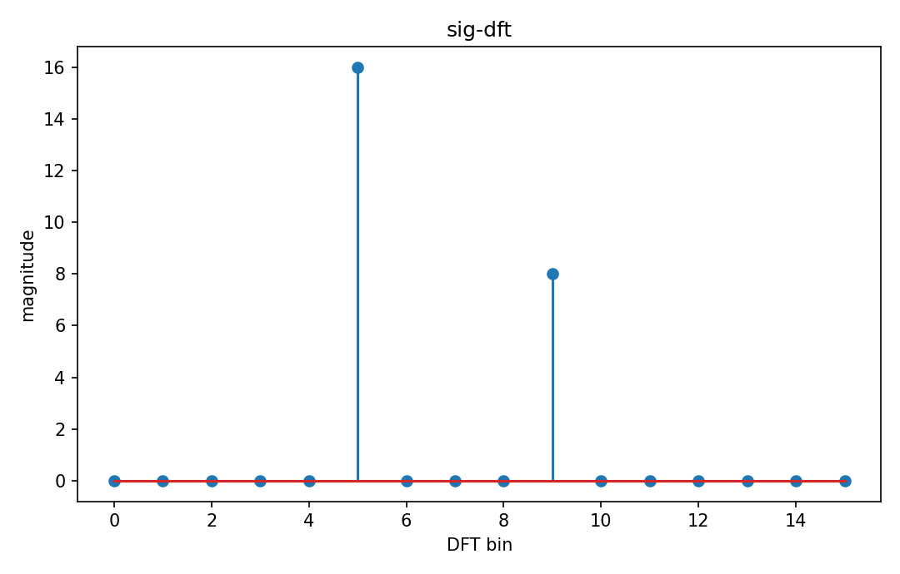

# Discrete Fourier transform

Fourier・信号

---

## 問い

有限長N sequenceをN個の離散frequency coefficientへどう変換するか。

---

## 記号とshape

- `$N`: sequence length (integer)
- `$x[n]`: samples (N)
- `$X[k]`: DFT coefficients (N)

---

## 中心式

$$
X[k]=\sum_{n=0}^{N-1}x[n]e^{-i2\pi kn/N},\qquad k=0,\ldots,N-1
$$

---

## 導出

- N個のcomplex sinusoid basisを有限-dimensional vector spaceのbasisとして置く。
- 各basisとのcomplex inner productでcoefficient X[k]を得る。
- inverse DFTでは1/N factorを付けてbasis合成し元sequenceを復元する。

---

## 図

---

## 小さな例

$x=[1,1,1,1]$ なら $X[0]=4$、他のbinは0。constant signalはDC binだけに存在する。

---

## 何がわかるか

digital spectral analysis、FFT、frequency-domain filtering。

---

## 失敗条件

DFTは有限sequenceの周期延長を暗黙に仮定する。端点不連続はspectral leakageを生む。

---

## 実装検算

`np.fft.fft` と定義式二重loopを小Nで比較し、inverse reconstructionも確認する。

---

## 式の読み方を固定する

Discrete Fourier transformでは、time-domain quantityとfrequency/operator-domain quantityの対応を固定する。$N$ は sequence length（integer）、$x[n]$ は samples（N）、$X[k]$ は DFT coefficients（N）。中心式 `X[k]=\sum_{n=0}^{N-1}x[n]e^{-i2\pi kn/N},\qquad k=0,\ldots,N-1` のnormalization、sample interval、complex conjugate、周波数単位を一つずつ確認する。signal processingでは式が正しくてもwindowingやsampling条件で観測spectrumが変わるため、数学的変換と測定条件を分離して考える。

---

## 極限・反例で検算

- 手計算例: $x=[1,1,1,1]$ なら $X[0]=4$、他のbinは0。constant signalはDC binだけに存在する。
- 失敗条件: DFTは有限sequenceの周期延長を暗黙に仮定する。端点不連続はspectral leakageを生む。
- 実装検算: `np.fft.fft` と定義式二重loopを小Nで比較し、inverse reconstructionも確認する。

---

## 工学での位置づけ

digital spectral analysis、FFT、frequency-domain filtering。

中心式 `X[k]=\sum_{n=0}^{N-1}x[n]e^{-i2\pi kn/N},\qquad k=0,\ldots,N-1` のどの量が観測・未知parameter・weight・frequency成分に対応するかを区別する。

---

## 試験で書けるべきこと

- `Discrete Fourier transform` の記号とshapeを定義する
- `N個のcomplex sinusoid basisを有限-dimensional vector spaceのbasisとして置く。` から中心式を導く
- `$x=[1,1,1,1]$ なら $X[0]=4$、他のbinは0。constant signalはDC binだけに存在する。` を最後まで追う
- `DFTは有限sequenceの周期延長を暗黙に仮定する。端点不連続はspectral leakageを生む。` がなぜ問題か説明する

---

## 接続

Prerequisites: sig-fourier-series, sig-discrete-time-signals

[教科書](../../textbook/sig-dft)
[10問の演習](../../exercises/sig-dft)
