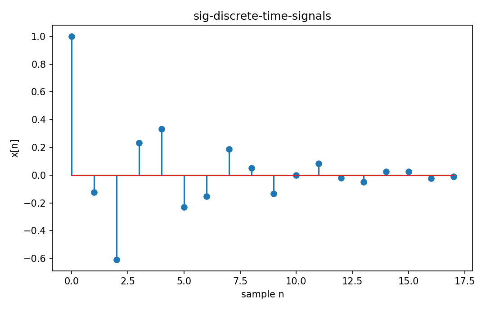

# 離散時間信号

Fourier・信号

---

## 問い

sampleされたsequenceを、continuous-time signalと区別してどう表すか。

---

## 記号とshape

- `$n`: integer sample index (integer)
- `$x[n]`: sample value (real/complex)

---

## 中心式

$$
x:\mathbb Z\to\mathbb C,\qquad E_x=\sum_{n=-\infty}^{\infty}|x[n]|^2
$$

---

## 導出

- discrete-time signalはinteger index上のsequenceとして定義する。
- continuous integralの代わりにsumでenergyを定義する。
- sampling interval $T_s$ が物理timeとの対応を与え、sample rateは $f_s=1/T_s$。

---

## 図

---

## 小さな例

$x[n]=(1/2)^n u[n]$ のenergyは幾何級数 $\sum_{n=0}^\infty(1/4)^n=4/3$。

---

## 何がわかるか

ADC後のwaveform、digital filters、FFT入力sequence。

---

## 失敗条件

index nとphysical time nTsを混同するとfrequency unitがcycles/sampleかHzか不明になる。

---

## 実装検算

同一analog sinusoidを複数sample rateで生成してsequenceの見え方を比較する。

---

## 式の読み方を固定する

離散時間信号では、time-domain quantityとfrequency/operator-domain quantityの対応を固定する。$n$ は integer sample index（integer）、$x[n]$ は sample value（real/complex）。中心式 `x:\mathbb Z\to\mathbb C,\qquad E_x=\sum_{n=-\infty}^{\infty}|x[n]|^2` のnormalization、sample interval、complex conjugate、周波数単位を一つずつ確認する。signal processingでは式が正しくてもwindowingやsampling条件で観測spectrumが変わるため、数学的変換と測定条件を分離して考える。

---

## 極限・反例で検算

- 手計算例: $x[n]=(1/2)^n u[n]$ のenergyは幾何級数 $\sum_{n=0}^\infty(1/4)^n=4/3$。
- 失敗条件: index nとphysical time nTsを混同するとfrequency unitがcycles/sampleかHzか不明になる。
- 実装検算: 同一analog sinusoidを複数sample rateで生成してsequenceの見え方を比較する。

---

## 工学での位置づけ

ADC後のwaveform、digital filters、FFT入力sequence。

中心式 `x:\mathbb Z\to\mathbb C,\qquad E_x=\sum_{n=-\infty}^{\infty}|x[n]|^2` のどの量が観測・未知parameter・weight・frequency成分に対応するかを区別する。

---

## 試験で書けるべきこと

- `離散時間信号` の記号とshapeを定義する
- `discrete-time signalはinteger index上のsequenceとして定義する。` から中心式を導く
- `$x[n]=(1/2)^n u[n]$ のenergyは幾何級数 $\sum_{n=0}^\infty(1/4)^n=4/3$。` を最後まで追う
- `index nとphysical time nTsを混同するとfrequency unitがcycles/sampleかHzか不明になる。` がなぜ問題か説明する

---

## 接続

Prerequisites: sig-continuous-time-signals

[教科書](../../textbook/sig-discrete-time-signals)
[10問の演習](../../exercises/sig-discrete-time-signals)
