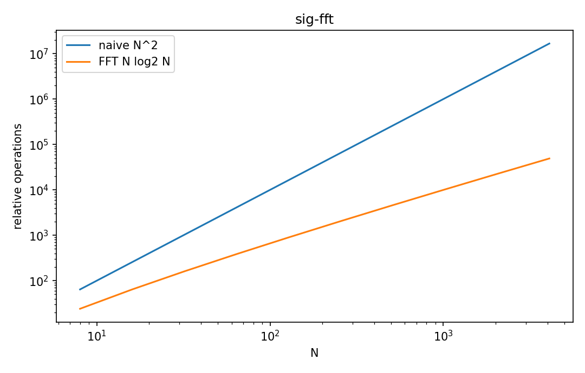

# Fast Fourier transform

Fourier・信号

---

## 問い

DFTの数学的結果を変えず、計算量をO(N²)からO(N log N)へ減らすには。

---

## 記号とshape

- `$W_N`: root of unity $e^{-i2\pi/N}$ (complex)
- `$N`: length, radix-2ではpower of 2 (integer)

---

## 中心式

$$
X[k]=\sum_{r=0}^{N/2-1}x[2r]W_N^{2rk}+W_N^k\sum_{r=0}^{N/2-1}x[2r+1]W_N^{2rk}
$$

---

## 導出

- DFT sumをeven indexとodd indexへ分割する。
- $W_N^{2}=W_{N/2}$ を使い、2つのN/2 DFTへ再利用する。
- recursionごとにproblem sizeが半分なのでdepth log2N、各level O(N)。

---

## 図

---

## 小さな例

N=8なら8-point DFTを2つの4-point、さらに4つの2-pointへ分解するbutterfly構造になる。

---

## 何がわかるか

real-time spectrum、large convolution、image processing。

---

## 失敗条件

FFTは別transformではない。DFTの高速algorithmなので、leakage/aliasingなどDFT自体の性質は消えない。

---

## 実装検算

naive DFTとFFTのruntimeをN増加で比較し、出力誤差がfloating tolerance内か確認する。

---

## 式の読み方を固定する

Fast Fourier transformでは、time-domain quantityとfrequency/operator-domain quantityの対応を固定する。$W_N$ は root of unity $e^{-i2\pi/N}$（complex）、$N$ は length, radix-2ではpower of 2（integer）。中心式 `X[k]=\sum_{r=0}^{N/2-1}x[2r]W_N^{2rk}+W_N^k\sum_{r=0}^{N/2-1}x[2r+1]W_N^{2rk}` のnormalization、sample interval、complex conjugate、周波数単位を一つずつ確認する。signal processingでは式が正しくてもwindowingやsampling条件で観測spectrumが変わるため、数学的変換と測定条件を分離して考える。

---

## 極限・反例で検算

- 手計算例: N=8なら8-point DFTを2つの4-point、さらに4つの2-pointへ分解するbutterfly構造になる。
- 失敗条件: FFTは別transformではない。DFTの高速algorithmなので、leakage/aliasingなどDFT自体の性質は消えない。
- 実装検算: naive DFTとFFTのruntimeをN増加で比較し、出力誤差がfloating tolerance内か確認する。

---

## 工学での位置づけ

real-time spectrum、large convolution、image processing。

中心式 `X[k]=\sum_{r=0}^{N/2-1}x[2r]W_N^{2rk}+W_N^k\sum_{r=0}^{N/2-1}x[2r+1]W_N^{2rk}` のどの量が観測・未知parameter・weight・frequency成分に対応するかを区別する。

---

## 試験で書けるべきこと

- `Fast Fourier transform` の記号とshapeを定義する
- `DFT sumをeven indexとodd indexへ分割する。` から中心式を導く
- `N=8なら8-point DFTを2つの4-point、さらに4つの2-pointへ分解するbutterfly構造になる。` を最後まで追う
- `FFTは別transformではない。DFTの高速algorithmなので、leakage/aliasingなどDFT自体の性質は消えない。` がなぜ問題か説明する

---

## 接続

Prerequisites: sig-dft

[教科書](../../textbook/sig-fft)
[10問の演習](../../exercises/sig-fft)
