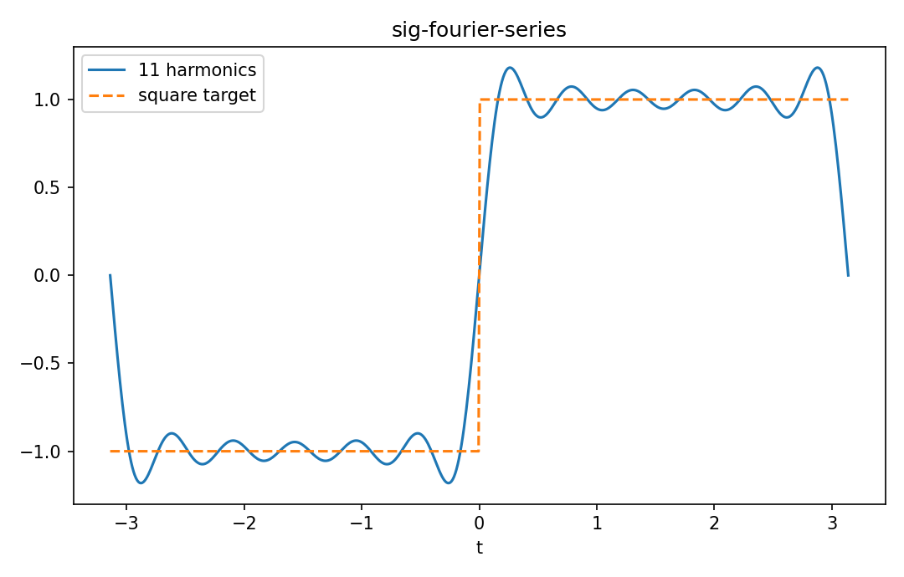

# Fourier series

Fourier・信号

---

## 問い

周期信号をorthogonalなcomplex sinusoid basisへどう分解するか。

---

## 記号とshape

- `$T`: period (positive)
- `$\omega_0=2\pi/T`: fundamental angular frequency (rad/time)
- `$c_k`: Fourier coefficient (complex)

---

## 中心式

$$
x(t)=\sum_{k=-\infty}^{\infty}c_ke^{ik\omega_0t},\qquad c_k=\frac1T\int_Tx(t)e^{-ik\omega_0t}dt
$$

---

## 導出

- $e^{ik\omega_0t}$ が1周期上でorthogonalであることを内積で示す。
- 展開式へbasis conjugateを掛け1周期積分する。
- orthogonalityにより目的index以外が0となり係数公式が得られる。

---

## 図

---

## 小さな例

$x(t)=\cos\omega_0t$ なら $c_{1}=c_{-1}=1/2$、他0。2本のcomplex exponentialが1本のcosineを作る。

---

## 何がわかるか

periodic vibration、AC waveform、harmonic analysis、PDE eigenfunction expansion。

---

## 失敗条件

discontinuityではpointwise convergenceにGibbs phenomenonが現れる。finite truncationを元signalそのものと同一視しない。

---

## 実装検算

square waveの係数を数値積分し、term数とovershootの関係を描く。

---

## 式の読み方を固定する

Fourier seriesでは、time-domain quantityとfrequency/operator-domain quantityの対応を固定する。$T$ は period（positive）、$\omega_0=2\pi/T$ は fundamental angular frequency（rad/time）、$c_k$ は Fourier coefficient（complex）。中心式 `x(t)=\sum_{k=-\infty}^{\infty}c_ke^{ik\omega_0t},\qquad c_k=\frac1T\int_Tx(t)e^{-ik\omega_0t}dt` のnormalization、sample interval、complex conjugate、周波数単位を一つずつ確認する。signal processingでは式が正しくてもwindowingやsampling条件で観測spectrumが変わるため、数学的変換と測定条件を分離して考える。

---

## 極限・反例で検算

- 手計算例: $x(t)=\cos\omega_0t$ なら $c_{1}=c_{-1}=1/2$、他0。2本のcomplex exponentialが1本のcosineを作る。
- 失敗条件: discontinuityではpointwise convergenceにGibbs phenomenonが現れる。finite truncationを元signalそのものと同一視しない。
- 実装検算: square waveの係数を数値積分し、term数とovershootの関係を描く。

---

## 工学での位置づけ

periodic vibration、AC waveform、harmonic analysis、PDE eigenfunction expansion。

中心式 `x(t)=\sum_{k=-\infty}^{\infty}c_ke^{ik\omega_0t},\qquad c_k=\frac1T\int_Tx(t)e^{-ik\omega_0t}dt` のどの量が観測・未知parameter・weight・frequency成分に対応するかを区別する。

---

## 試験で書けるべきこと

- `Fourier series` の記号とshapeを定義する
- `$e^{ik\omega_0t}$ が1周期上でorthogonalであることを内積で示す。` から中心式を導く
- `$x(t)=\cos\omega_0t$ なら $c_{1}=c_{-1}=1/2$、他0。2本のcomplex exponentialが1本のcosineを作る。` を最後まで追う
- `discontinuityではpointwise convergenceにGibbs phenomenonが現れる。finite truncationを元signalそのものと同一視しない。` がなぜ問題か説明する

---

## 接続

Prerequisites: calc-integrals-fundamental-theorem, la-inner-products-norms-angles, prep-complex-numbers-euler-form

[教科書](../../textbook/sig-fourier-series)
[10問の演習](../../exercises/sig-fourier-series)
