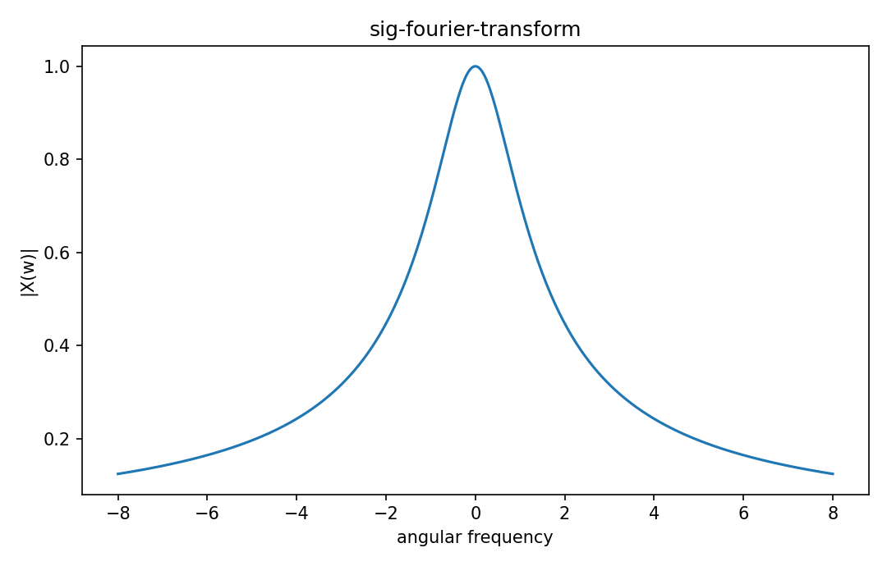

# Continuous Fourier transform

Fourier・信号

---

## 問い

非周期信号を連続frequency spectrumへどう写すか。

---

## 記号とshape

- `$x(t)`: time-domain signal (function)
- `$X(\omega)`: frequency-domain representation (function)
- `$\omega`: angular frequency (rad/time)

---

## 中心式

$$
X(\omega)=\int_{-\infty}^{\infty}x(t)e^{-i\omega t}dt,\qquad x(t)=\frac1{2\pi}\int_{-\infty}^{\infty}X(\omega)e^{i\omega t}d\omega
$$

---

## 導出

- Fourier seriesのperiod Tを大きくし、frequency spacing $2\pi/T$ を0へ近づける。
- discrete harmonic sumがRiemann sumを経てfrequency integralになる。
- 係数scaleを整理するとtransform/inverse pairが得られる。

---

## 図

---

## 小さな例

$x(t)=e^{-at}u(t),a>0$ なら $X(\omega)=1/(a+i\omega)$。低frequencyほどmagnitudeが大きいlow-pass型spectrum。

---

## 何がわかるか

filter design、spectroscopy、frequency-domain solution、noise analysisの中心変換。

---

## 失敗条件

積分が通常意味で収束しないsignalもdistributionとして扱う場合がある。frequencyをHzとrad/sで混同しない。

---

## 実装検算

FFT approximationではwindow長・sample rate・normalizationを明示し、analytic transformと比較する。

---

## 式の読み方を固定する

Continuous Fourier transformでは、time-domain quantityとfrequency/operator-domain quantityの対応を固定する。$x(t)$ は time-domain signal（function）、$X(\omega)$ は frequency-domain representation（function）、$\omega$ は angular frequency（rad/time）。中心式 `X(\omega)=\int_{-\infty}^{\infty}x(t)e^{-i\omega t}dt,\qquad x(t)=\frac1{2\pi}\int_{-\infty}^{\infty}X(\omega)e^{i\omega t}d\omega` のnormalization、sample interval、complex conjugate、周波数単位を一つずつ確認する。signal processingでは式が正しくてもwindowingやsampling条件で観測spectrumが変わるため、数学的変換と測定条件を分離して考える。

---

## 極限・反例で検算

- 手計算例: $x(t)=e^{-at}u(t),a>0$ なら $X(\omega)=1/(a+i\omega)$。低frequencyほどmagnitudeが大きいlow-pass型spectrum。
- 失敗条件: 積分が通常意味で収束しないsignalもdistributionとして扱う場合がある。frequencyをHzとrad/sで混同しない。
- 実装検算: FFT approximationではwindow長・sample rate・normalizationを明示し、analytic transformと比較する。

---

## 工学での位置づけ

filter design、spectroscopy、frequency-domain solution、noise analysisの中心変換。

中心式 `X(\omega)=\int_{-\infty}^{\infty}x(t)e^{-i\omega t}dt,\qquad x(t)=\frac1{2\pi}\int_{-\infty}^{\infty}X(\omega)e^{i\omega t}d\omega` のどの量が観測・未知parameter・weight・frequency成分に対応するかを区別する。

---

## 試験で書けるべきこと

- `Continuous Fourier transform` の記号とshapeを定義する
- `Fourier seriesのperiod Tを大きくし、frequency spacing $2\pi/T$ を0へ近づける。` から中心式を導く
- `$x(t)=e^{-at}u(t),a>0$ なら $X(\omega)=1/(a+i\omega)$。低frequencyほどmagnitudeが大きいlow-pass型spectrum。` を最後まで追う
- `積分が通常意味で収束しないsignalもdistributionとして扱う場合がある。frequencyをHzとrad/sで混同しない。` がなぜ問題か説明する

---

## 接続

Prerequisites: sig-fourier-series, sig-continuous-time-signals

[教科書](../../textbook/sig-fourier-transform)
[10問の演習](../../exercises/sig-fourier-transform)
