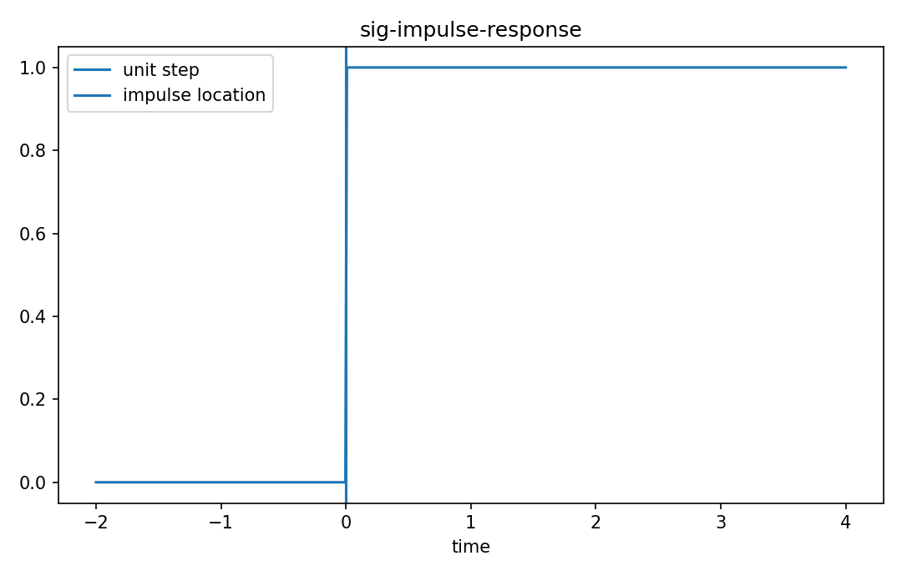

# Impulse response

Fourier・信号

---

## 問い

LTI systemを1本のfunction hだけで完全に特徴づける理由は何か。

---

## 記号とshape

- `$h(t)`: impulse response (signal)
- `$x(t)`: input (signal)
- `$y(t)`: output (signal)

---

## 中心式

$$
h(t)=T\{\delta(t)\},\qquad y(t)=\int x(\tau)h(t-\tau)d\tau
$$

---

## 導出

- 入力を $x(t)=\int x(\tau)\delta(t-\tau)d\tau$ と分解する。
- linearityでintegralの外へTを分配する。
- time invarianceにより shifted impulseの応答は $h(t-\tau)$ となる。

---

## 図

---

## 小さな例

$h(t)=e^{-t}u(t)$、input δ(t)ならoutputはhそのもの。step inputならstep responseは $\int_0^t e^{-s}ds=1-e^{-t}$。

---

## 何がわかるか

filter kernel、instrument response、blur point-spread functionの同じ概念。

---

## 失敗条件

nonlinear/time-varying systemでは1つのimpulse responseだけでは全入力応答を決められない。

---

## 実装検算

known input/outputからdeconvolutionでhを推定し、別inputでpredictionを検証する。

---

## 式の読み方を固定する

Impulse responseでは、time-domain quantityとfrequency/operator-domain quantityの対応を固定する。$h(t)$ は impulse response（signal）、$x(t)$ は input（signal）、$y(t)$ は output（signal）。中心式 `h(t)=T\{\delta(t)\},\qquad y(t)=\int x(\tau)h(t-\tau)d\tau` のnormalization、sample interval、complex conjugate、周波数単位を一つずつ確認する。signal processingでは式が正しくてもwindowingやsampling条件で観測spectrumが変わるため、数学的変換と測定条件を分離して考える。

---

## 極限・反例で検算

- 手計算例: $h(t)=e^{-t}u(t)$、input δ(t)ならoutputはhそのもの。step inputならstep responseは $\int_0^t e^{-s}ds=1-e^{-t}$。
- 失敗条件: nonlinear/time-varying systemでは1つのimpulse responseだけでは全入力応答を決められない。
- 実装検算: known input/outputからdeconvolutionでhを推定し、別inputでpredictionを検証する。

---

## 工学での位置づけ

filter kernel、instrument response、blur point-spread functionの同じ概念。

中心式 `h(t)=T\{\delta(t)\},\qquad y(t)=\int x(\tau)h(t-\tau)d\tau` のどの量が観測・未知parameter・weight・frequency成分に対応するかを区別する。

---

## 試験で書けるべきこと

- `Impulse response` の記号とshapeを定義する
- `入力を $x(t)=\int x(\tau)\delta(t-\tau)d\tau$ と分解する。` から中心式を導く
- `$h(t)=e^{-t}u(t)$、input δ(t)ならoutputはhそのもの。step inputならstep responseは $\int_0^t e^{-s}ds=1-e^{-t}$。` を最後まで追う
- `nonlinear/time-varying systemでは1つのimpulse responseだけでは全入力応答を決められない。` がなぜ問題か説明する

---

## 接続

Prerequisites: sig-lti-systems

[教科書](../../textbook/sig-impulse-response)
[10問の演習](../../exercises/sig-impulse-response)
