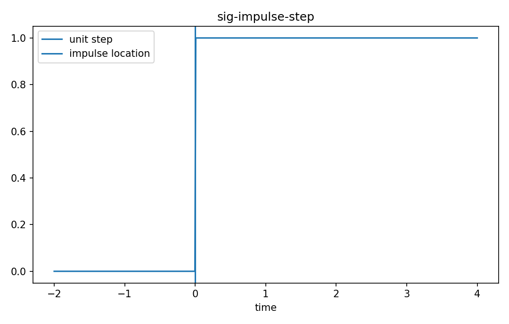

# Impulseとstep信号

Fourier・信号

---

## 問い

systemをprobeする理想入力としてimpulseとstepをどう定義するか。

---

## 記号とshape

- `$\delta(t)`: Dirac impulse (distribution)
- `$u(t)`: unit step (piecewise signal)
- `$\phi`: test function (smooth)

---

## 中心式

$$
\int_{-\infty}^{\infty}\delta(t)\phi(t)dt=\phi(0),\qquad u(t)=\int_{-\infty}^{t}\delta(\tau)d\tau
$$

---

## 導出

- Dirac deltaは通常関数ではなくsampling propertyで定義するdistribution。
- stepのdistributional derivativeがdeltaになる。
- discrete timeでは $\delta[n]$ はn=0で1、他0の通常sequence。

---

## 図

---

## 小さな例

convolution $x*\delta=x$。離散列 [2,3,4] にunit impulseをconvolveしても同じ列が返る。

---

## 何がわかるか

impulse response測定、step response、Green function、LTI system characterization。

---

## 失敗条件

continuous Dirac deltaを高さ無限の「細い矩形関数」と同一視しない。近似列の極限として理解する。

---

## 実装検算

narrow pulseでdeltaを近似し、areaを1に保ったまま幅を狭めたconvolutionの収束を見る。

---

## 式の読み方を固定する

Impulseとstep信号では、time-domain quantityとfrequency/operator-domain quantityの対応を固定する。$\delta(t)$ は Dirac impulse（distribution）、$u(t)$ は unit step（piecewise signal）、$\phi$ は test function（smooth）。中心式 `\int_{-\infty}^{\infty}\delta(t)\phi(t)dt=\phi(0),\qquad u(t)=\int_{-\infty}^{t}\delta(\tau)d\tau` のnormalization、sample interval、complex conjugate、周波数単位を一つずつ確認する。signal processingでは式が正しくてもwindowingやsampling条件で観測spectrumが変わるため、数学的変換と測定条件を分離して考える。

---

## 極限・反例で検算

- 手計算例: convolution $x*\delta=x$。離散列 [2,3,4] にunit impulseをconvolveしても同じ列が返る。
- 失敗条件: continuous Dirac deltaを高さ無限の「細い矩形関数」と同一視しない。近似列の極限として理解する。
- 実装検算: narrow pulseでdeltaを近似し、areaを1に保ったまま幅を狭めたconvolutionの収束を見る。

---

## 工学での位置づけ

impulse response測定、step response、Green function、LTI system characterization。

中心式 `\int_{-\infty}^{\infty}\delta(t)\phi(t)dt=\phi(0),\qquad u(t)=\int_{-\infty}^{t}\delta(\tau)d\tau` のどの量が観測・未知parameter・weight・frequency成分に対応するかを区別する。

---

## 試験で書けるべきこと

- `Impulseとstep信号` の記号とshapeを定義する
- `Dirac deltaは通常関数ではなくsampling propertyで定義するdistribution。` から中心式を導く
- `convolution $x*\delta=x$。離散列 [2,3,4] にunit impulseをconvolveしても同じ列が返る。` を最後まで追う
- `continuous Dirac deltaを高さ無限の「細い矩形関数」と同一視しない。近似列の極限として理解する。` がなぜ問題か説明する

---

## 接続

Prerequisites: sig-continuous-time-signals, sig-discrete-time-signals

[教科書](../../textbook/sig-impulse-step)
[10問の演習](../../exercises/sig-impulse-step)
