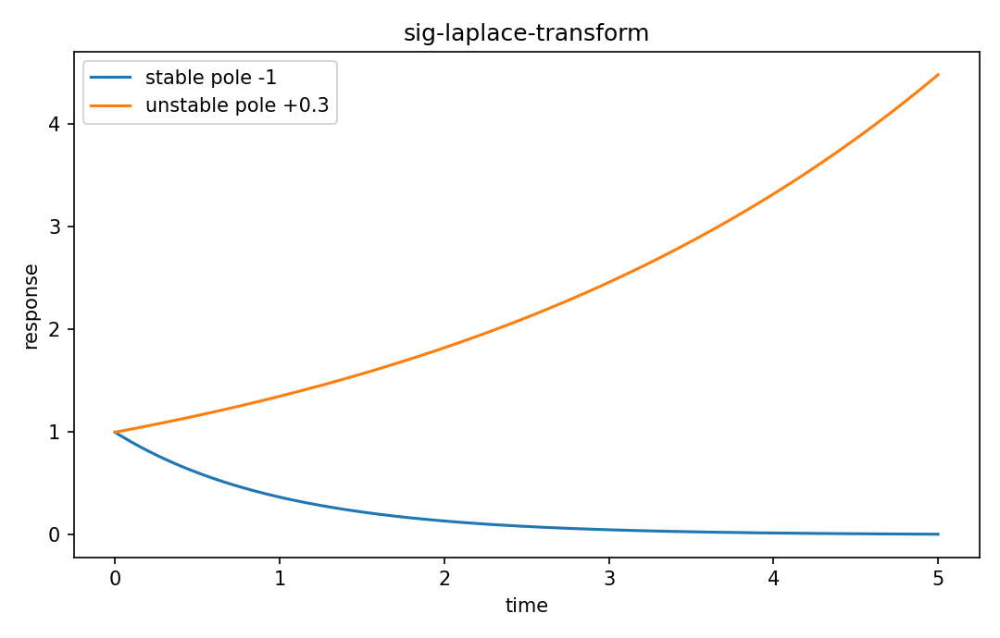

# Laplace transform

Fourier・信号

---

## 問い

Fourierより広い収束領域を持つ複素周波数変換で、differential equationとsystem stabilityをどう扱うか。

---

## 記号とshape

- `$s`: complex frequency (complex)
- `$\sigma`: exponential damping coordinate (real)
- `$\omega`: angular frequency (real)

---

## 中心式

$$
X(s)=\int_0^{\infty}x(t)e^{-st}dt,\qquad s=\sigma+i\omega
$$

---

## 導出

- Fourier kernelへ実指数damping $e^{-\sigma t}$ を追加する。
- derivative transform $\mathcal L\{x\prime\}=sX(s)-x(0)$ によりODEがalgebraic equationへ変わる。
- 収束するsの集合ROCもtransformの一部として扱う。

---

## 図

---

## 小さな例

$x(t)=e^{-at}u(t)$ なら $X(s)=1/(s+a)$、ROCはRe(s)>-a。poleはs=-a。

---

## 何がわかるか

control、circuit transient、ODE solution、transfer function。

---

## 失敗条件

式だけ同じでもROCが違えばtime signalが違うことがある。pole-zero plotだけでtwo-sided signalを一意に決めない。

---

## 実装検算

simple rational transfer functionでpole位置とtime responseのdecay/growthを数値確認する。

---

## 式の読み方を固定する

Laplace transformでは、time-domain quantityとfrequency/operator-domain quantityの対応を固定する。$s$ は complex frequency（complex）、$\sigma$ は exponential damping coordinate（real）、$\omega$ は angular frequency（real）。中心式 `X(s)=\int_0^{\infty}x(t)e^{-st}dt,\qquad s=\sigma+i\omega` のnormalization、sample interval、complex conjugate、周波数単位を一つずつ確認する。signal processingでは式が正しくてもwindowingやsampling条件で観測spectrumが変わるため、数学的変換と測定条件を分離して考える。

---

## 極限・反例で検算

- 手計算例: $x(t)=e^{-at}u(t)$ なら $X(s)=1/(s+a)$、ROCはRe(s)>-a。poleはs=-a。
- 失敗条件: 式だけ同じでもROCが違えばtime signalが違うことがある。pole-zero plotだけでtwo-sided signalを一意に決めない。
- 実装検算: simple rational transfer functionでpole位置とtime responseのdecay/growthを数値確認する。

---

## 工学での位置づけ

control、circuit transient、ODE solution、transfer function。

中心式 `X(s)=\int_0^{\infty}x(t)e^{-st}dt,\qquad s=\sigma+i\omega` のどの量が観測・未知parameter・weight・frequency成分に対応するかを区別する。

---

## 試験で書けるべきこと

- `Laplace transform` の記号とshapeを定義する
- `Fourier kernelへ実指数damping $e^{-\sigma t}$ を追加する。` から中心式を導く
- `$x(t)=e^{-at}u(t)$ なら $X(s)=1/(s+a)$、ROCはRe(s)>-a。poleはs=-a。` を最後まで追う
- `式だけ同じでもROCが違えばtime signalが違うことがある。pole-zero plotだけでtwo-sided signalを一意に決めない。` がなぜ問題か説明する

---

## 接続

Prerequisites: calc-integrals-fundamental-theorem, sig-continuous-time-signals

[教科書](../../textbook/sig-laplace-transform)
[10問の演習](../../exercises/sig-laplace-transform)
