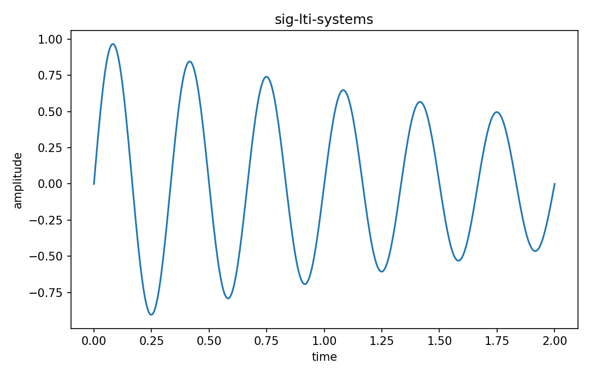

# LTI system

Fourier・信号

---

## 問い

linearityとtime invarianceだけからsystem応答をどこまで決められるか。

---

## 記号とshape

- `$T`: system/operator (signal to signal)
- `$x`: input signal (function)
- `$y=T{x}`: output signal (function)

---

## 中心式

$$
T\{a x_1+b x_2\}=aT\{x_1\}+bT\{x_2\},\qquad T\{x(t-t_0)\}=y(t-t_0)
$$

---

## 導出

- linearityはsuperpositionを保証する。
- time invarianceは入力shiftと同じだけ出力がshiftすることを要求する。
- 任意入力をshifted impulsesの重ね合わせとして表すと、応答はimpulse responseとのconvolutionに決まる。

---

## 図

---

## 小さな例

$y(t)=2x(t)$ はLTI。$y(t)=t x(t)$ はlinearだがtime varyingなのでLTIではない。

---

## 何がわかるか

filters、circuits、mechanical small-signal model、imaging blurの基本枠組み。

---

## 失敗条件

linearとtime invariantは別条件。どちらか片方だけでconvolution表現を使ってはいけない。

---

## 実装検算

候補operatorにshifted inputを入れ、linearity/time invarianceをnumerically testする。

---

## 式の読み方を固定する

LTI systemでは、time-domain quantityとfrequency/operator-domain quantityの対応を固定する。$T$ は system/operator（signal to signal）、$x$ は input signal（function）、$y=T{x}$ は output signal（function）。中心式 `T\{a x_1+b x_2\}=aT\{x_1\}+bT\{x_2\},\qquad T\{x(t-t_0)\}=y(t-t_0)` のnormalization、sample interval、complex conjugate、周波数単位を一つずつ確認する。signal processingでは式が正しくてもwindowingやsampling条件で観測spectrumが変わるため、数学的変換と測定条件を分離して考える。

---

## 極限・反例で検算

- 手計算例: $y(t)=2x(t)$ はLTI。$y(t)=t x(t)$ はlinearだがtime varyingなのでLTIではない。
- 失敗条件: linearとtime invariantは別条件。どちらか片方だけでconvolution表現を使ってはいけない。
- 実装検算: 候補operatorにshifted inputを入れ、linearity/time invarianceをnumerically testする。

---

## 工学での位置づけ

filters、circuits、mechanical small-signal model、imaging blurの基本枠組み。

中心式 `T\{a x_1+b x_2\}=aT\{x_1\}+bT\{x_2\},\qquad T\{x(t-t_0)\}=y(t-t_0)` のどの量が観測・未知parameter・weight・frequency成分に対応するかを区別する。

---

## 試験で書けるべきこと

- `LTI system` の記号とshapeを定義する
- `linearityはsuperpositionを保証する。` から中心式を導く
- `$y(t)=2x(t)$ はLTI。$y(t)=t x(t)$ はlinearだがtime varyingなのでLTIではない。` を最後まで追う
- `linearとtime invariantは別条件。どちらか片方だけでconvolution表現を使ってはいけない。` がなぜ問題か説明する

---

## 接続

Prerequisites: sig-impulse-step

[教科書](../../textbook/sig-lti-systems)
[10問の演習](../../exercises/sig-lti-systems)
