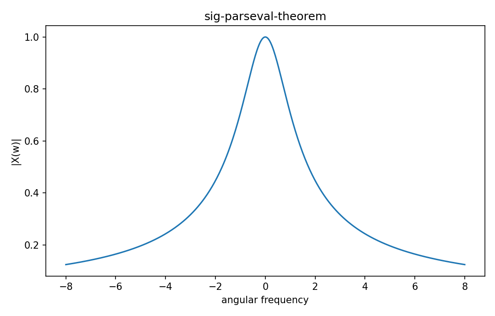

# Parseval theorem

Fourier・信号

---

## 問い

signal energyがtime domainとfrequency domainで保存されることをどう表すか。

---

## 記号とshape

- `$x(t)`: time signal (function)
- `$X(\omega)`: Fourier transform (function)

---

## 中心式

$$
\int|x(t)|^2dt=\frac1{2\pi}\int|X(\omega)|^2d\omega
$$

---

## 導出

- inner product $\langle x,x\rangle$ をFourier inverseで表す。
- exponential basisのorthogonality/delta関係でcross-frequency termsを消す。
- normalization conventionに応じたfactor 1/(2π)を残す。

---

## 図

---

## 小さな例

$x(t)=e^{-t}u(t)$ はtime energy1/2。$|X|^2=1/(1+\omega^2)$ のintegralもfactor込みで1/2。

---

## 何がわかるか

spectral energy、filter power、frequency-band contributionの定量化。

---

## 失敗条件

Fourier conventionで2π factorが変わる。公式を暗記するよりtransform pairのnormalizationを先に確認する。

---

## 実装検算

離散近似でtime-domain sumとFFT magnitude squared sumのnormalizationを合わせる。

---

## 式の読み方を固定する

Parseval theoremでは、time-domain quantityとfrequency/operator-domain quantityの対応を固定する。$x(t)$ は time signal（function）、$X(\omega)$ は Fourier transform（function）。中心式 `\int|x(t)|^2dt=\frac1{2\pi}\int|X(\omega)|^2d\omega` のnormalization、sample interval、complex conjugate、周波数単位を一つずつ確認する。signal processingでは式が正しくてもwindowingやsampling条件で観測spectrumが変わるため、数学的変換と測定条件を分離して考える。

---

## 極限・反例で検算

- 手計算例: $x(t)=e^{-t}u(t)$ はtime energy1/2。$|X|^2=1/(1+\omega^2)$ のintegralもfactor込みで1/2。
- 失敗条件: Fourier conventionで2π factorが変わる。公式を暗記するよりtransform pairのnormalizationを先に確認する。
- 実装検算: 離散近似でtime-domain sumとFFT magnitude squared sumのnormalizationを合わせる。

---

## 工学での位置づけ

spectral energy、filter power、frequency-band contributionの定量化。

中心式 `\int|x(t)|^2dt=\frac1{2\pi}\int|X(\omega)|^2d\omega` のどの量が観測・未知parameter・weight・frequency成分に対応するかを区別する。

---

## 試験で書けるべきこと

- `Parseval theorem` の記号とshapeを定義する
- `inner product $\langle x,x\rangle$ をFourier inverseで表す。` から中心式を導く
- `$x(t)=e^{-t}u(t)$ はtime energy1/2。$|X|^2=1/(1+\omega^2)$ のintegralもfactor込みで1/2。` を最後まで追う
- `Fourier conventionで2π factorが変わる。公式を暗記するよりtransform pairのnormalizationを先に確認する。` がなぜ問題か説明する

---

## 接続

Prerequisites: sig-fourier-series, la-inner-products-norms-angles

[教科書](../../textbook/sig-parseval-theorem)
[10問の演習](../../exercises/sig-parseval-theorem)
