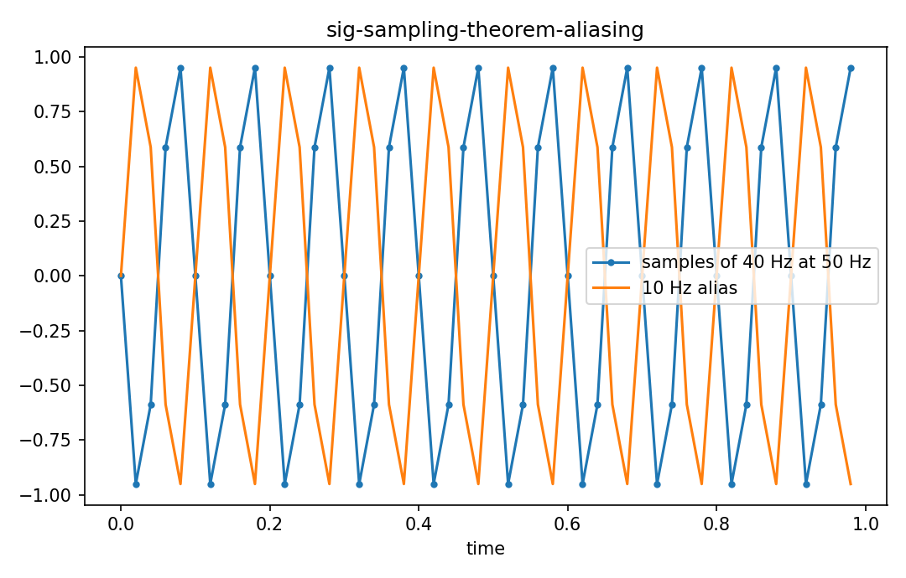

# Sampling theoremとaliasing

Fourier・信号

---

## 問い

band-limited continuous signalをsampleから一意復元するために必要なsample rateは。

---

## 記号とshape

- `$f_s`: sampling frequency (Hz)
- `$f_max`: highest signal frequency (Hz)
- `$T_s=1/f_s`: sampling interval (time)

---

## 中心式

$$
f_s>2f_{\max}\quad\Longrightarrow\quad x(t)=\sum_{n=-\infty}^{\infty}x[n]\,\operatorname{sinc}\!\left(\frac{t-nT_s}{T_s}\right)
$$

---

## 導出

- time samplingはsignalとimpulse trainの積とみなす。
- Fourier domainではspectrumがf_s間隔で複製される。
- 複製が重ならなければideal low-passで元spectrumを切り出せる。条件がNyquist rate。

---

## 図

---

## 小さな例

900 Hz sinusoidを1000 Hzでsampleすると、discrete samplesは100 Hz sinusoidと区別できずalias frequency100 Hzとして見える。

---

## 何がわかるか

ADC設計、spectrometer digitization、sensor acquisition rateの決定。

---

## 失敗条件

Nyquistを満たしてもanti-alias filter、finite aperture、clock jitterなど実機要因は残る。

---

## 実装検算

同じsinusoidを複数fsでsampleし、FFT peakがfoldする様子を確認する。

---

## 式の読み方を固定する

Sampling theoremとaliasingでは、time-domain quantityとfrequency/operator-domain quantityの対応を固定する。$f_s$ は sampling frequency（Hz）、$f_max$ は highest signal frequency（Hz）、$T_s=1/f_s$ は sampling interval（time）。中心式 `f_s>2f_{\max}\quad\Longrightarrow\quad x(t)=\sum_{n=-\infty}^{\infty}x[n]\,\operatorname{sinc}\!\left(\frac{t-nT_s}{T_s}\right)` のnormalization、sample interval、complex conjugate、周波数単位を一つずつ確認する。signal processingでは式が正しくてもwindowingやsampling条件で観測spectrumが変わるため、数学的変換と測定条件を分離して考える。

---

## 極限・反例で検算

- 手計算例: 900 Hz sinusoidを1000 Hzでsampleすると、discrete samplesは100 Hz sinusoidと区別できずalias frequency100 Hzとして見える。
- 失敗条件: Nyquistを満たしてもanti-alias filter、finite aperture、clock jitterなど実機要因は残る。
- 実装検算: 同じsinusoidを複数fsでsampleし、FFT peakがfoldする様子を確認する。

---

## 工学での位置づけ

ADC設計、spectrometer digitization、sensor acquisition rateの決定。

中心式 `f_s>2f_{\max}\quad\Longrightarrow\quad x(t)=\sum_{n=-\infty}^{\infty}x[n]\,\operatorname{sinc}\!\left(\frac{t-nT_s}{T_s}\right)` のどの量が観測・未知parameter・weight・frequency成分に対応するかを区別する。

---

## 試験で書けるべきこと

- `Sampling theoremとaliasing` の記号とshapeを定義する
- `time samplingはsignalとimpulse trainの積とみなす。` から中心式を導く
- `900 Hz sinusoidを1000 Hzでsampleすると、discrete samplesは100 Hz sinusoidと区別できずalias frequency100 Hzとして見える。` を最後まで追う
- `Nyquistを満たしてもanti-alias filter、finite aperture、clock jitterなど実機要因は残る。` がなぜ問題か説明する

---

## 接続

Prerequisites: sig-fourier-transform, sig-dft

[教科書](../../textbook/sig-sampling-theorem-aliasing)
[10問の演習](../../exercises/sig-sampling-theorem-aliasing)
