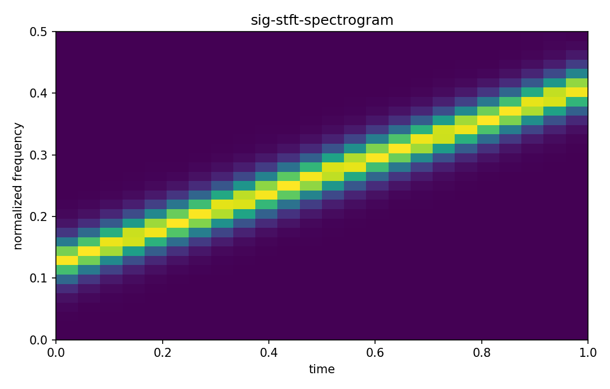

# STFTとspectrogram

Fourier・信号

---

## 問い

frequency成分が時間で変化する非定常signalを、局所spectrumとしてどう可視化するか。

---

## 記号とshape

- `$w`: window function (localized)
- `$\tau`: window center time (time)
- `$\omega`: frequency (rad/time)
- `$S`: spectrogram (nonnegative)

---

## 中心式

$$
X(\tau,\omega)=\int x(t)w(t-\tau)e^{-i\omega t}dt,\qquad S(\tau,\omega)=|X(\tau,\omega)|^2
$$

---

## 導出

- signalへcenter τのwindowを掛け局所区間を切り出す。
- その区間へFourier transformを適用する。
- τをscanしてtime-frequency planeを作り、magnitude squaredをspectrogramとする。

---

## 図

---

## 小さな例

100→300 Hzへ線形に上がるchirpはspectrogram上で右上がりridgeになる。windowを短くするとtime分解能は上がるがfrequency ridgeが太くなる。

---

## 何がわかるか

vibration transient、audio、pulse waveform、dynamic spectroscopy。

---

## 失敗条件

time resolutionとfrequency resolutionは同時に無限にはできない。window lengthを目的に合わせて選ぶ。

---

## 実装検算

`scipy.signal.stft` でwindow長を変え、chirp ridgeのtime/frequency blur trade-offを比較する。

---

## 式の読み方を固定する

STFTとspectrogramでは、time-domain quantityとfrequency/operator-domain quantityの対応を固定する。$w$ は window function（localized）、$\tau$ は window center time（time）、$\omega$ は frequency（rad/time）、$S$ は spectrogram（nonnegative）。中心式 `X(\tau,\omega)=\int x(t)w(t-\tau)e^{-i\omega t}dt,\qquad S(\tau,\omega)=|X(\tau,\omega)|^2` のnormalization、sample interval、complex conjugate、周波数単位を一つずつ確認する。signal processingでは式が正しくてもwindowingやsampling条件で観測spectrumが変わるため、数学的変換と測定条件を分離して考える。

---

## 極限・反例で検算

- 手計算例: 100→300 Hzへ線形に上がるchirpはspectrogram上で右上がりridgeになる。windowを短くするとtime分解能は上がるがfrequency ridgeが太くなる。
- 失敗条件: time resolutionとfrequency resolutionは同時に無限にはできない。window lengthを目的に合わせて選ぶ。
- 実装検算: `scipy.signal.stft` でwindow長を変え、chirp ridgeのtime/frequency blur trade-offを比較する。

---

## 工学での位置づけ

vibration transient、audio、pulse waveform、dynamic spectroscopy。

中心式 `X(\tau,\omega)=\int x(t)w(t-\tau)e^{-i\omega t}dt,\qquad S(\tau,\omega)=|X(\tau,\omega)|^2` のどの量が観測・未知parameter・weight・frequency成分に対応するかを区別する。

---

## 試験で書けるべきこと

- `STFTとspectrogram` の記号とshapeを定義する
- `signalへcenter τのwindowを掛け局所区間を切り出す。` から中心式を導く
- `100→300 Hzへ線形に上がるchirpはspectrogram上で右上がりridgeになる。windowを短くするとtime分解能は上がるがfrequency ridgeが太くなる。` を最後まで追う
- `time resolutionとfrequency resolutionは同時に無限にはできない。window lengthを目的に合わせて選ぶ。` がなぜ問題か説明する

---

## 接続

Prerequisites: sig-fourier-transform, sig-sampling-theorem-aliasing

[教科書](../../textbook/sig-stft-spectrogram)
[10問の演習](../../exercises/sig-stft-spectrogram)
