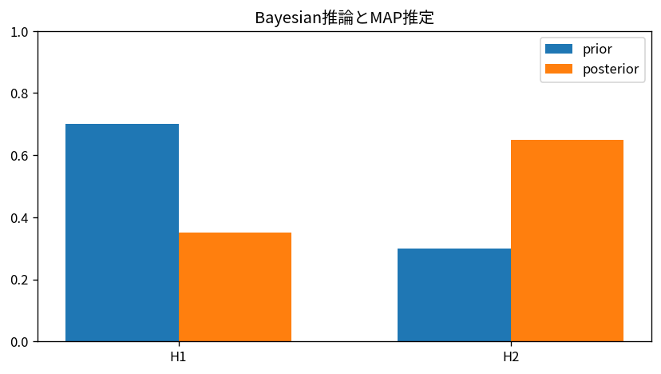

# Bayesian推論とMAP推定

Course 03｜確率統計｜Topic 16/20

---
layout: center
---

## 今回の問い

## 到達目標

- 定義と代表式を、自分の言葉と記号で説明できる。
- 成立条件を確認し、手計算と結果を検算できる。

## 理解確認

- 定義・条件・計算結果を自分の言葉で説明できるか確認する。

Bayesian推論とMAP推定の代表式は、どの定義・仮定から、なぜその形になるのか。

---

## なぜ今これを学ぶのか

前Topic `stat-likelihood-maximum-likelihood` で得た概念を使い、ここでは Bayesian推論とMAP推定 へ進む。

---

## 直感

Bayes更新は、事前の信念に観測の尤もらしさを掛け、全体で正規化して事後分布を得る。

---

## 図解

2つの仮説の事前確率が1回の観測でどう更新されるかを棒グラフで追う。 左の高さが観測前の仮説の重み、観測による尤度の倍率を掛けた中間量を正規化したものが右の事後確率である。観測と整合する仮説ほど棒が相対的に高くなる。

---

## 記号と代表式

- $\theta$：未知母数
- $p(\theta)$：事前分布
- $p(\mathbf x\mid\theta)$：尤度
- $p(\theta\mid\mathbf x)$：事後分布
- $\hat\theta_{MAP}$：事後密度を最大化する値

$$
p(\theta\mid\mathbf{x})\propto p(\mathbf{x}\mid\theta)p(\theta)
$$

---

## 導出 1

$p(\theta|x)=p(x|\theta)p(\theta)/p(x)$。分母 $p(x)=\int p(x|\theta)p(\theta)d\theta$ はθに依らない正規化定数。

---

## 導出 2

argmaxだけなら分母は無視でき、$\hat\theta_{MAP}=\arg\max[p(x|\theta)p(\theta)]$。logを取ればlog尤度+log事前。

---

## 例題

Bernoulli pにBeta(a,b)事前。k成功ならposteriorはBeta(a+k,b+n-k)。MAPは条件を満たせば $(a+k-1)/(a+b+n-2)$。観測数が増えるとデータの影響が強くなる。

---

## 条件を変えるとどうなるか

MAPだけを見るとposteriorの幅や多峰性を失う。同じmodeでも不確実性が全く違うposteriorがあり得るため、Bayesian推論=MAPではない。

---

## よくある誤解

Bayesian推論とMAP推定では、式へ数値を代入するだけでは不十分である。MAPだけを見るとposteriorの幅や多峰性を失う。同じmodeでも不確実性が全く違うposteriorがあり得るため、Bayesian推論=MAPではない。 という失敗例が示すように、式を使える条件と結論の範囲を区別する必要がある。

---

## 実装・計算上の注意

共役事前なら解析式、一般にはMCMC・変分推論等が必要になる。log posteriorを使い、正規化定数が必要な量と不要な最適化を区別する。

---

## 一段先へ

posteriorからcredible intervalを作れる。次の頻度論的confidence intervalとは「未知母数をランダムとみなすか」「反復標本の被覆率か」で解釈が異なる。

---

## 自分で説明できるか

- 「Bayes則を密度へ一般化する」を式を見ずに説明できるか
- 「MLEとの関係」までの論理を一段ずつ再現できるか
- Bayesian推論とMAP推定の条件を1つ外した反例を説明できるか

---
layout: center
---

## 教科書と演習

- [教科書](../../textbook/stat-bayesian-inference-map)
- [10問の演習](../../exercises/stat-bayesian-inference-map)
