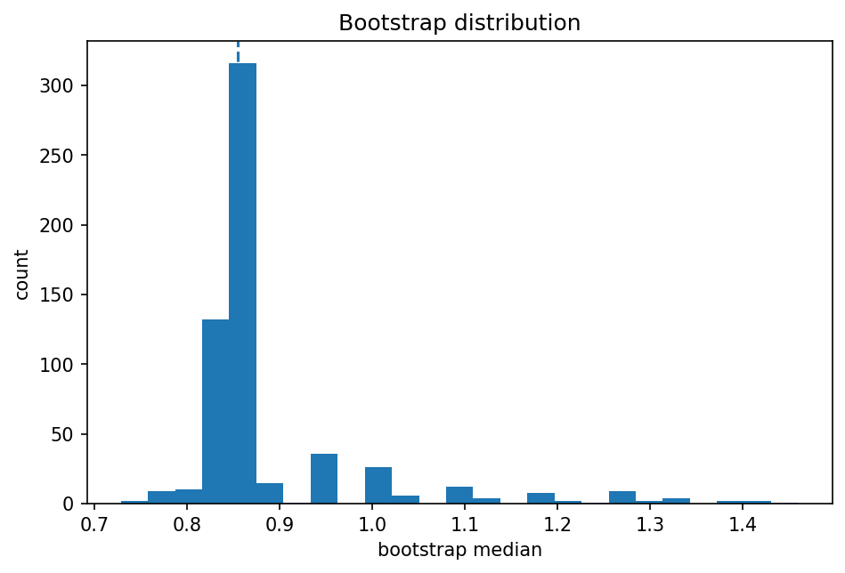
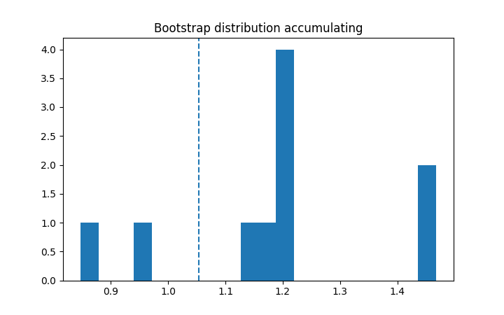

# bootstrap・permutation・再標本化

Course 03｜確率統計

---

## 今回の問い

解析的な標本分布が難しい統計量の不確実性を、データからどう近似するか。

---

## 直感

bootstrapは観測された経験分布を「仮の母集団」として復元抽出し、統計量を何度も計算する。permutation testは帰無仮説下で交換可能なラベルを並べ替えて帰無分布を作る。

---

## 図解

---

## 動きで確認

---

## 中心式

$$
\widehat{SE}_{boot}=\sqrt{\frac{1}{B-1}\sum_{b=1}^B(T_b^*-\bar T^*)^2}
$$

---

## 導出

1. 経験分布 $\hat F_n$ を作る。
2. $\hat F_n$ からサイズnの標本を復元抽出する。
3. 各標本でT*を計算し、その分布を未知のsampling distributionの近似に使う。

---

## 小さい例

中央値の標準誤差は閉形式が扱いにくいことがある。bootstrapで中央値をB回計算し、その標準偏差をSEとして使う。

---

## 条件を外すと

- 時系列やcluster dataをiid bootstrapしない。
- bootstrap回数を増やしても元標本のbiasが自動で消えるわけではない。

---

## 理解確認

- 式の各記号を定義できるか。
- 導出を1段ずつ再現できるか。
- 反例を1つ作れるか。

---

## 教科書と演習

[教科書](../../textbook/stat-bootstrap-permutation-resampling)

[10問の演習](../../exercises/stat-bootstrap-permutation-resampling)
