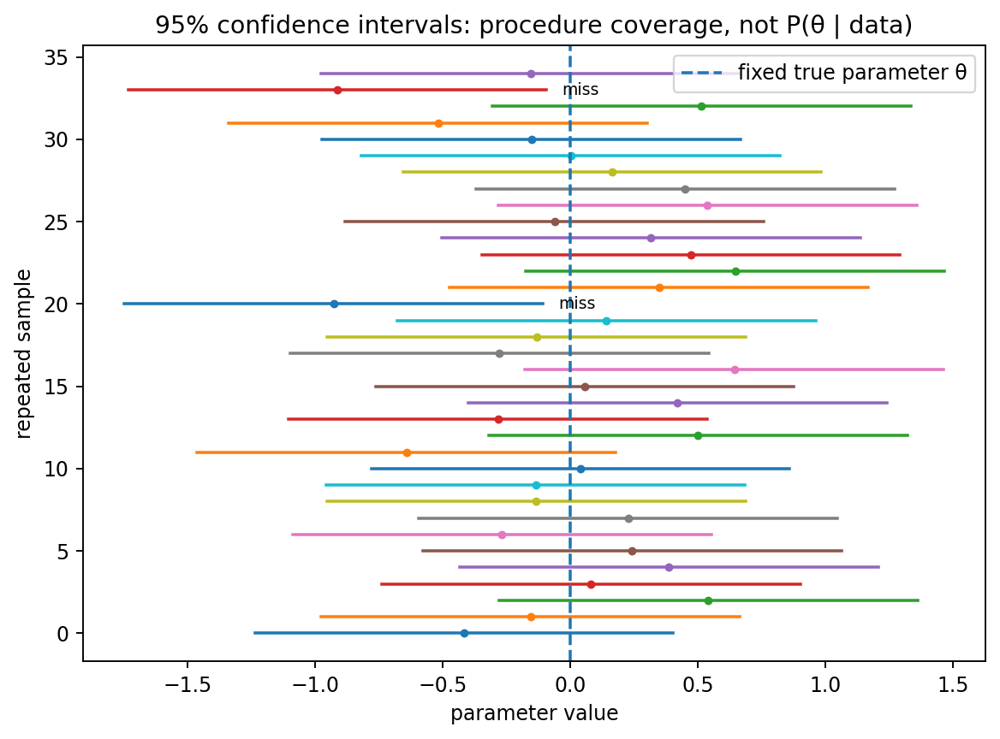
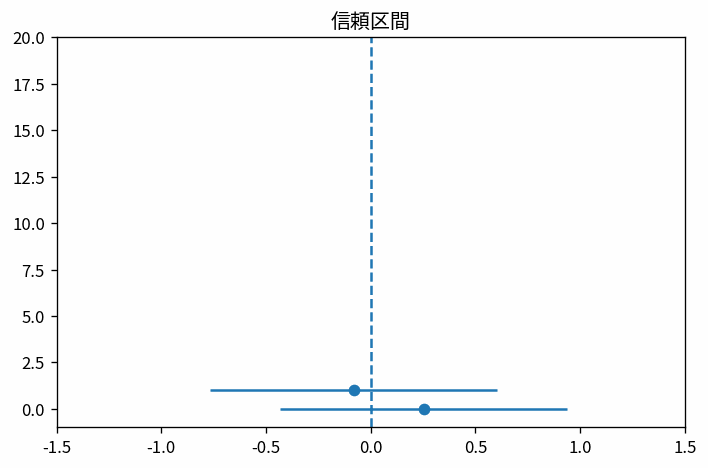

# 信頼区間

Course 03｜確率統計

---
layout: center
---

## 今回の問い

信頼区間で、何を入力し、代表式がどの量を出力し、どの成立条件を外すと結果が壊れるのか。

---

## 到達目標

- 信頼区間の定義と代表式を言葉で説明できる
- 図と式の対応を説明できる
- 小さな例で成立条件と失敗条件を検算できる

---

## 直感

信頼区間は同じ手続きを繰り返したときの被覆率についての主張。

**前提:** stat-estimators-bias-variance-mse, prob-laws-large-numbers-central-limit-theorem, stat-likelihood-maximum-likelihood

---

## 図解

---

## stat-confidence-intervalsの図と式の読み方

- 軸・node・矢印・領域が何を表すか確認する
- このTopicの代表式の各項を、図中の対応する量と結び付ける
- このTopicのパラメータを一つ変えたときの変化を図の量で予測する

---

## 代表式

$$
\hat{\theta}\pm z_{1-\alpha/2}\operatorname{SE}(\hat{\theta})
$$

左辺の出力 → 右辺の操作 → 入力の型の順で読む。

---

## 式をどう読むか

- **対象:** 信頼区間
- shape・次元・定義域を先に確定する
- 計算後に符号・大きさ・残差・確率などを図と照合する

---

## 小さな例

多数の標本から区間を作り、真値を含む区間と外す区間を並べる。

小さな具体例で、手計算と実装を照合する。

---

## 動き／思考実験で確認

- 各frameで、何が固定され何が更新されるかを追う。

---

## 成立条件

- 得られた区間に真値が95%の確率で入る、とは頻度論では言わない。
- 標準誤差と標準偏差を区別する。
- 信頼区間の定義と計算手順を区別し、数値例だけで一般性を判断しない。

---

## よくある誤解

- 信頼区間の定義と計算手順を同一視する
- 成立条件を確認せず公式を適用する
- 数学上の次元と配列のshapeを混同する

---

## 数値・実装で検算

1. 小さい入力を作る
2. 定義式から期待値を手で求める
3. NumPy等の実装結果と比較する
4. shape・残差・許容誤差・seedを記録する

---

## 後続分野への接続

信頼区間は、後続の数値計算・データ解析・機械学習で前提となる。

このTopicの量が、後続で入力・目的関数・制約・診断のどれとして使われるか確認する。

---

## 理解確認

- 信頼区間を図→式→小例の順で説明できるか
- 条件を1つ外した反例を作れるか

[教科書](../../textbook/stat-confidence-intervals)

[10問の演習](../../exercises/stat-confidence-intervals)
