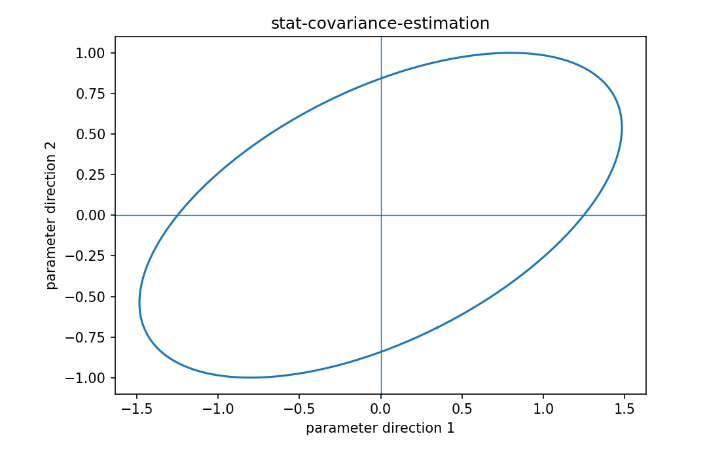

# Covariance estimation

Fisher情報・統計推定

---

## 問い

未知covariance matrixを有限sampleからどう推定し、PSD性と高次元不安定性を扱うか。

---

## 記号とshape

- `$n`: sample size (integer)
- `$p`: dimension (integer)
- `$\widehat{\mathbf\Sigma}`: sample covariance (p\times p)

---

## 中心式

$$
\widehat{\mathbf\Sigma}=\frac{1}{n-1}\sum_{i=1}^n(\mathbf x_i-\bar{\mathbf x})(\mathbf x_i-\bar{\mathbf x})^{\mathsf T}
$$

---

## 導出

- sample meanを引いたresidual vectorを作る。
- outer productを全sampleで平均し、mean推定分の自由度補正でn-1を使う。
- pがnに近い/大きいとrank不足・高varianceになるのでshrinkageが必要になる。

---

## 図

---

## 小さな例

2D data (1,0),(2,1),(3,2) は完全直線上なのでsample covarianceはrank1になる。

---

## 何がわかるか

noise covariance、Mahalanobis distance、GLS、Fisher information weighting。

---

## 失敗条件

sample covarianceのinverseを高次元で無条件に使うと非常に不安定。eigen spectrumとconditionを確認する。

---

## 実装検算

`np.cov` のbias/ddof設定を確認し、eigenvaluesとshrinkage estimatorを比較する。

---

## 式の読み方を固定する

Covariance estimationでは、likelihoodまたはestimating equationから得られる局所曲率・感度と、推定量のばらつきを区別する。$n$ は sample size（integer）、$p$ は dimension（integer）、$\widehat{\mathbf\Sigma}$ は sample covariance（p\times p）。中心式 `\widehat{\mathbf\Sigma}=\frac{1}{n-1}\sum_{i=1}^n(\mathbf x_i-\bar{\mathbf x})(\mathbf x_i-\bar{\mathbf x})^{\mathsf T}` の行列が大きい/小さいとはどのparameter方向についての話かをeigenvectorまで含めて読む。対角要素だけを見るとparameter間のtrade-offを失う。

---

## 極限・反例で検算

- 手計算例: 2D data (1,0),(2,1),(3,2) は完全直線上なのでsample covarianceはrank1になる。
- 失敗条件: sample covarianceのinverseを高次元で無条件に使うと非常に不安定。eigen spectrumとconditionを確認する。
- 実装検算: `np.cov` のbias/ddof設定を確認し、eigenvaluesとshrinkage estimatorを比較する。

---

## 工学での位置づけ

noise covariance、Mahalanobis distance、GLS、Fisher information weighting。

中心式 `\widehat{\mathbf\Sigma}=\frac{1}{n-1}\sum_{i=1}^n(\mathbf x_i-\bar{\mathbf x})(\mathbf x_i-\bar{\mathbf x})^{\mathsf T}` のどの量が観測・未知parameter・weight・frequency成分に対応するかを区別する。

---

## 試験で書けるべきこと

- `Covariance estimation` の記号とshapeを定義する
- `sample meanを引いたresidual vectorを作る。` から中心式を導く
- `2D data (1,0),(2,1),(3,2) は完全直線上なのでsample covarianceはrank1になる。` を最後まで追う
- `sample covarianceのinverseを高次元で無条件に使うと非常に不安定。eigen spectrumとconditionを確認する。` がなぜ問題か説明する

---

## 接続

Prerequisites: prob-covariance-correlation, stat-estimator-covariance

[教科書](../../textbook/stat-covariance-estimation)
[10問の演習](../../exercises/stat-covariance-estimation)
