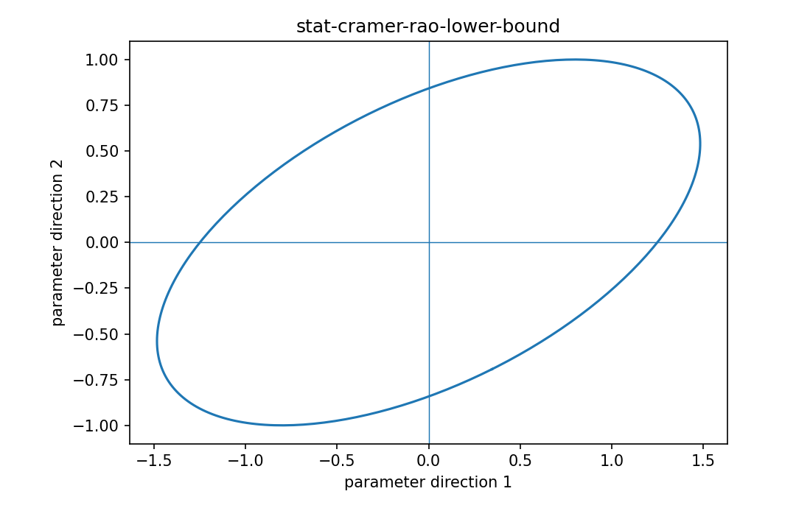

# Cramér–Rao下界

Fisher情報・統計推定

---

## 問い

unbiased estimatorのvarianceに、data情報量からどんな理論的下限が課されるか。

---

## 記号とshape

- `$\mathbf I`: Fisher information (p\times p)
- `$\succeq`: positive-semidefinite ordering (matrix relation)

---

## 中心式

$$
\operatorname{Cov}(\hat{\boldsymbol\theta})\succeq\mathbf I(\boldsymbol\theta)^{-1}
$$

---

## 導出

- unbiasednessから $E[\hat\theta]=\theta$ をparameterで微分する。
- estimation errorとscoreのcovariance関係を得る。
- Cauchy–Schwarzのmatrix版を適用するとcovariance minus inverse FisherがPSDになる。

---

## 図

---

## 小さな例

Bernoulli n sampleのp推定では $I(p)=n/[p(1-p)]$ なのでvariance下限は $p(1-p)/n$。sample meanがこれを達成する。

---

## 何がわかるか

sensor design、parameter precisionの理論限界、algorithm比較のbenchmark。

---

## 失敗条件

biased estimator、boundary parameter、nonregular modelでは通常形をそのまま適用できない。下限達成可能性も別問題。

---

## 実装検算

simulationでefficient estimatorのsample varianceとCRLBを比較し、有限標本差も見る。

---

## 式の読み方を固定する

Cramér–Rao下界では、likelihoodまたはestimating equationから得られる局所曲率・感度と、推定量のばらつきを区別する。$\mathbf I$ は Fisher information（p\times p）、$\succeq$ は positive-semidefinite ordering（matrix relation）。中心式 `\operatorname{Cov}(\hat{\boldsymbol\theta})\succeq\mathbf I(\boldsymbol\theta)^{-1}` の行列が大きい/小さいとはどのparameter方向についての話かをeigenvectorまで含めて読む。対角要素だけを見るとparameter間のtrade-offを失う。

---

## 極限・反例で検算

- 手計算例: Bernoulli n sampleのp推定では $I(p)=n/[p(1-p)]$ なのでvariance下限は $p(1-p)/n$。sample meanがこれを達成する。
- 失敗条件: biased estimator、boundary parameter、nonregular modelでは通常形をそのまま適用できない。下限達成可能性も別問題。
- 実装検算: simulationでefficient estimatorのsample varianceとCRLBを比較し、有限標本差も見る。

---

## 工学での位置づけ

sensor design、parameter precisionの理論限界、algorithm比較のbenchmark。

中心式 `\operatorname{Cov}(\hat{\boldsymbol\theta})\succeq\mathbf I(\boldsymbol\theta)^{-1}` のどの量が観測・未知parameter・weight・frequency成分に対応するかを区別する。

---

## 試験で書けるべきこと

- `Cramér–Rao下界` の記号とshapeを定義する
- `unbiasednessから $E[\hat\theta]=\theta$ をparameterで微分する。` から中心式を導く
- `Bernoulli n sampleのp推定では $I(p)=n/[p(1-p)]$ なのでvariance下限は $p(1-p)/n$。sample meanがこれを達成する。` を最後まで追う
- `biased estimator、boundary parameter、nonregular modelでは通常形をそのまま適用できない。下限達成可能性も別問題。` がなぜ問題か説明する

---

## 接続

Prerequisites: stat-fisher-information-matrix, stat-estimator-covariance

[教科書](../../textbook/stat-cramer-rao-lower-bound)
[10問の演習](../../exercises/stat-cramer-rao-lower-bound)
