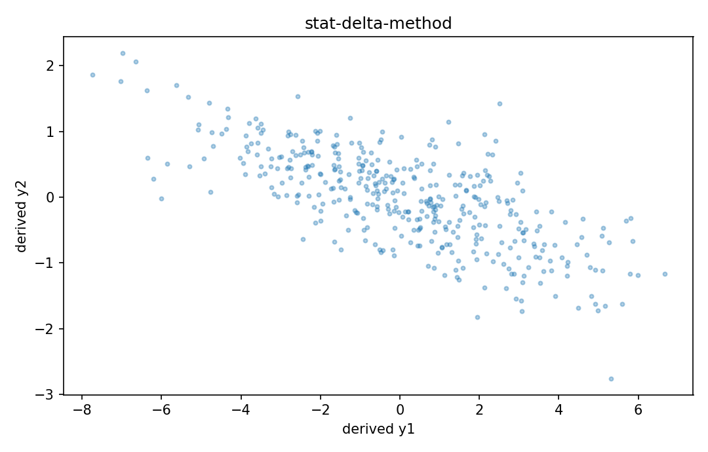

# Delta method

Fisher情報・統計推定

---

## 問い

推定量を非線形変換した後のvarianceを、一次Taylor展開でどう近似するか。

---

## 記号とshape

- `$g`: smooth transformation (p\to q)
- `$\mathbf J_g`: Jacobian of g (q\times p)
- `$\mathbf\Sigma`: asymptotic covariance (p\times p)

---

## 中心式

$$
\sqrt n(\hat{\boldsymbol\theta}-\boldsymbol\theta)\Rightarrow N(0,\mathbf\Sigma)\ \Longrightarrow\ \sqrt n(g(\hat{\boldsymbol\theta})-g(\boldsymbol\theta))\Rightarrow N(0,\mathbf J_g\mathbf\Sigma\mathbf J_g^{\mathsf T})
$$

---

## 導出

- $g(\hat\theta)$ を真値 $\theta$ の周りで一次Taylor展開する。
- $g(\hat\theta)-g(\theta)\approx\mathbf J_g(\hat\theta-\theta)$。
- linear transformationのcovariance則から $\mathbf J_g\Sigma\mathbf J_g^{\mathsf T}$。

---

## 図

---

## 小さな例

$g(\theta)=\log\theta$、$\operatorname{Var}(\hat\theta)=0.04$、$\theta=2$ ならvariance近似は $(1/2)^2 0.04=0.01$。

---

## 何がわかるか

ratio/log transform、calibration uncertainty、derived biomarkerのerror bar。

---

## 失敗条件

gradientが0、強いnonlinearity、boundary近傍では一次近似が悪い。second-order deltaやbootstrapを検討する。

---

## 実装検算

Monte Carloでθhatをsamplingし、g(θhat)のempirical covarianceとdelta近似を比較する。

---

## 式の読み方を固定する

Delta methodでは、likelihoodまたはestimating equationから得られる局所曲率・感度と、推定量のばらつきを区別する。$g$ は smooth transformation（p\to q）、$\mathbf J_g$ は Jacobian of g（q\times p）、$\mathbf\Sigma$ は asymptotic covariance（p\times p）。中心式 `\sqrt n(\hat{\boldsymbol\theta}-\boldsymbol\theta)\Rightarrow N(0,\mathbf\Sigma)\ \Longrightarrow\ \sqrt n(g(\hat{\boldsymbol\theta})-g(\boldsymbol\theta))\Rightarrow N(0,\mathbf J_g\mathbf\Sigma\mathbf J_g^{\mathsf T})` の行列が大きい/小さいとはどのparameter方向についての話かをeigenvectorまで含めて読む。対角要素だけを見るとparameter間のtrade-offを失う。

---

## 極限・反例で検算

- 手計算例: $g(\theta)=\log\theta$、$\operatorname{Var}(\hat\theta)=0.04$、$\theta=2$ ならvariance近似は $(1/2)^2 0.04=0.01$。
- 失敗条件: gradientが0、強いnonlinearity、boundary近傍では一次近似が悪い。second-order deltaやbootstrapを検討する。
- 実装検算: Monte Carloでθhatをsamplingし、g(θhat)のempirical covarianceとdelta近似を比較する。

---

## 工学での位置づけ

ratio/log transform、calibration uncertainty、derived biomarkerのerror bar。

中心式 `\sqrt n(\hat{\boldsymbol\theta}-\boldsymbol\theta)\Rightarrow N(0,\mathbf\Sigma)\ \Longrightarrow\ \sqrt n(g(\hat{\boldsymbol\theta})-g(\boldsymbol\theta))\Rightarrow N(0,\mathbf J_g\mathbf\Sigma\mathbf J_g^{\mathsf T})` のどの量が観測・未知parameter・weight・frequency成分に対応するかを区別する。

---

## 試験で書けるべきこと

- `Delta method` の記号とshapeを定義する
- `$g(\hat\theta)$ を真値 $\theta$ の周りで一次Taylor展開する。` から中心式を導く
- `$g(\theta)=\log\theta$、$\operatorname{Var}(\hat\theta)=0.04$、$\theta=2$ ならvariance近似は $(1/2)^2 0.04=0.01$。` を最後まで追う
- `gradientが0、強いnonlinearity、boundary近傍では一次近似が悪い。second-order deltaやbootstrapを検討する。` がなぜ問題か説明する

---

## 接続

Prerequisites: calc-multivariable-functions-partial-derivatives, stat-estimator-covariance

[教科書](../../textbook/stat-delta-method)
[10問の演習](../../exercises/stat-delta-method)
