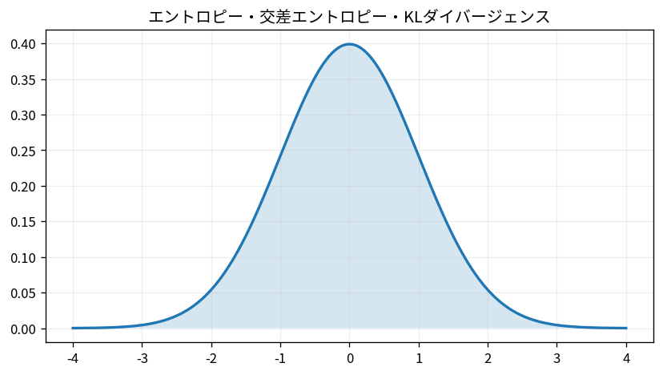

# エントロピー・交差エントロピー・KLダイバージェンス

Course 03｜確率統計｜Topic 20/20

---
layout: center
---

## 今回の問い

## 到達目標

- 定義と代表式を、自分の言葉と記号で説明できる。
- 成立条件を確認し、手計算と結果を検算できる。

## 理解確認

- 定義・条件・計算結果を自分の言葉で説明できるか確認する。

エントロピー・交差エントロピー・KLダイバージェンスの代表式は、どの定義・仮定から、なぜその形になるのか。

---

## なぜ今これを学ぶのか

前Topic `stat-linear-regression-probabilistic-model` で得た概念を使い、ここでは エントロピー・交差エントロピー・KLダイバージェンス へ進む。

---

## 直感

エントロピーは不確実性、交差エントロピーは別分布で符号化したコスト、KLは分布間の非対称な差を測る。

---

## 図解

2つの離散分布を並べ、KLが一致時に0になる様子を見る。 2つの分布が一致すれば各点で対数比が0になり、KL divergenceは0になる。質量が異なる場所ほど対数比が大きくなり、期待値として差が蓄積する。

---

## 記号と代表式

- $P,Q$：同じ標本空間上の確率分布
- $p(x),q(x)$：各確率質量/密度
- $H(P)=-E_P[\log p(X)]$：entropy
- $H(P,Q)=-E_P[\log q(X)]$：cross entropy
- $D_{KL}(P\|Q)$：KL divergence

$$
D_{\mathrm{KL}}(P\|Q)=\sum_x p(x)\log\frac{p(x)}{q(x)}
$$

---

## 導出 1

$D_{KL}=\sum_x p(x)\log[p(x)/q(x)]$。Pが実際の重みを与え、各点でQがPをどれだけ過小・過大に置くかをlog比で測る。

---

## 導出 2

$\log(p/q)=\log p-\log q$ なので $D_{KL}=\sum p\log p-\sum p\log q=-H(P)+H(P,Q)$。

---

## 例題

真のBernoulli p=0.8をQのq=0.5で予測すると、cross entropyは $-0.8\log0.5-0.2\log0.5=\log2$。Qを0.8へ合わせるとcross entropyはentropyまで下がる。

---

## 条件を変えるとどうなるか

Q(x)=0 なのにP(x)>0の点があると $D_{KL}(P\|Q)=\infty$。予測分布が実際に起こり得る事象へゼロ確率を置くことはlog-lossで致命的。

---

## よくある誤解

エントロピー・交差エントロピー・KLダイバージェンスでは、式へ数値を代入するだけでは不十分である。Q(x)=0 なのにP(x)>0の点があると $D_{KL}(P\|Q)=\infty$。予測分布が実際に起こり得る事象へゼロ確率を置くことはlog-lossで致命的。 という失敗例が示すように、式を使える条件と結論の範囲を区別する必要がある。

---

## 実装・計算上の注意

softmax+cross entropyはlog-sum-expを使って数値安定に計算する。確率0付近でlogを直接取る実装はinf/NaNを生む。

---

## 一段先へ

最尤推定は経験分布とmodel分布のcross entropy最小化、ひいては定数項を除いてKL最小化として読める。Course08/09のclassification lossへ直結する。

---

## 自分で説明できるか

- 「log比の期待値として定義する」を式を見ずに説明できるか
- 「なぜ0以上か」までの論理を一段ずつ再現できるか
- エントロピー・交差エントロピー・KLダイバージェンスの条件を1つ外した反例を説明できるか

---
layout: center
---

## 教科書と演習

- [教科書](../../textbook/stat-entropy-cross-entropy-kl-divergence)
- [10問の演習](../../exercises/stat-entropy-cross-entropy-kl-divergence)
