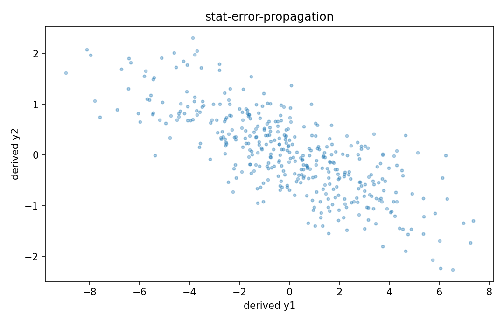

# 誤差伝播

Fisher情報・統計推定

---

## 問い

入力measurementのcovarianceが、derived quantityへどう伝播するか。

---

## 記号とshape

- `$\mathbf\Sigma_x`: input covariance (n\times n)
- `$\mathbf J_f`: sensitivity Jacobian (m\times n)
- `$\mathbf\Sigma_y`: output covariance (m\times m)

---

## 中心式

$$
\mathbf\Sigma_y\approx\mathbf J_f\mathbf\Sigma_x\mathbf J_f^{\mathsf T}
$$

---

## 導出

- $f(\mathbf x)$ をmean付近でlinearizeする。
- $d\mathbf y\approx\mathbf J_fd\mathbf x$。
- covariance of linear transformの公式を適用する。

---

## 図

---

## 小さな例

$y=x_1+2x_2$、independent variances 1と4なら $\operatorname{Var}(y)=1^2\cdot1+2^2\cdot4=17$。

---

## 何がわかるか

sensor fusion、calibration、unmixing後spreadの一次評価。

---

## 失敗条件

input correlationを無視するとcross termを失う。大きなuncertaintyではlinearization自体も不十分。

---

## 実装検算

correlated Gaussian inputsをMonte Carloで流し、Jacobian covariance近似と比較する。

---

## 式の読み方を固定する

誤差伝播では、likelihoodまたはestimating equationから得られる局所曲率・感度と、推定量のばらつきを区別する。$\mathbf\Sigma_x$ は input covariance（n\times n）、$\mathbf J_f$ は sensitivity Jacobian（m\times n）、$\mathbf\Sigma_y$ は output covariance（m\times m）。中心式 `\mathbf\Sigma_y\approx\mathbf J_f\mathbf\Sigma_x\mathbf J_f^{\mathsf T}` の行列が大きい/小さいとはどのparameter方向についての話かをeigenvectorまで含めて読む。対角要素だけを見るとparameter間のtrade-offを失う。

---

## 極限・反例で検算

- 手計算例: $y=x_1+2x_2$、independent variances 1と4なら $\operatorname{Var}(y)=1^2\cdot1+2^2\cdot4=17$。
- 失敗条件: input correlationを無視するとcross termを失う。大きなuncertaintyではlinearization自体も不十分。
- 実装検算: correlated Gaussian inputsをMonte Carloで流し、Jacobian covariance近似と比較する。

---

## 工学での位置づけ

sensor fusion、calibration、unmixing後spreadの一次評価。

中心式 `\mathbf\Sigma_y\approx\mathbf J_f\mathbf\Sigma_x\mathbf J_f^{\mathsf T}` のどの量が観測・未知parameter・weight・frequency成分に対応するかを区別する。

---

## 試験で書けるべきこと

- `誤差伝播` の記号とshapeを定義する
- `$f(\mathbf x)$ をmean付近でlinearizeする。` から中心式を導く
- `$y=x_1+2x_2$、independent variances 1と4なら $\operatorname{Var}(y)=1^2\cdot1+2^2\cdot4=17$。` を最後まで追う
- `input correlationを無視するとcross termを失う。大きなuncertaintyではlinearization自体も不十分。` がなぜ問題か説明する

---

## 接続

Prerequisites: stat-delta-method, prob-covariance-correlation

[教科書](../../textbook/stat-error-propagation)
[10問の演習](../../exercises/stat-error-propagation)
