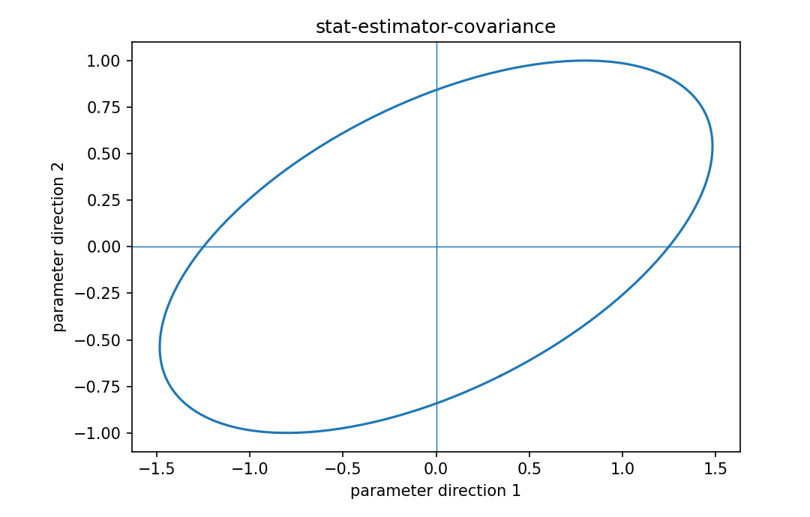

# 推定量の共分散

Fisher情報・統計推定

---

## 問い

parameter推定値のばらつきと相互依存を、1つのcovariance matrixでどう読むか。

---

## 記号とshape

- `$\hat{\boldsymbol\theta}`: estimator vector (p)
- `$\mathbf C`: estimator covariance (p\times p)

---

## 中心式

$$
\operatorname{Cov}(\hat{\boldsymbol\theta})=E[(\hat{\boldsymbol\theta}-E\hat{\boldsymbol\theta})(\hat{\boldsymbol\theta}-E\hat{\boldsymbol\theta})^{\mathsf T}]
$$

---

## 導出

- 各parameter errorをvector $\mathbf e=\hat{\boldsymbol\theta}-E\hat{\boldsymbol\theta}$ にまとめる。
- $E[\mathbf e\mathbf e^{\mathsf T}]$ の対角がvariance、非対角がco-fluctuation。
- asymptotic MLEでは $\mathbf C\approx\mathbf I(\boldsymbol\theta)^{-1}$。

---

## 図

---

## 小さな例

$\mathbf C=\begin{bmatrix}4&1.5\\1.5&1\end{bmatrix}$ ならparameter1のSD=2、parameter2のSD=1、正の共分散により誤差ellipseが傾く。

---

## 何がわかるか

confidence ellipse、uncertainty propagation、panel designのspread評価。

---

## 失敗条件

対角だけを見るとparameter間trade-offを見落とす。singular covarianceではellipseが低次元へ潰れる。

---

## 実装検算

bootstrap推定値のsample covarianceと理論的inverse Fisherを比較する。

---

## 式の読み方を固定する

推定量の共分散では、likelihoodまたはestimating equationから得られる局所曲率・感度と、推定量のばらつきを区別する。$\hat{\boldsymbol\theta}$ は estimator vector（p）、$\mathbf C$ は estimator covariance（p\times p）。中心式 `\operatorname{Cov}(\hat{\boldsymbol\theta})=E[(\hat{\boldsymbol\theta}-E\hat{\boldsymbol\theta})(\hat{\boldsymbol\theta}-E\hat{\boldsymbol\theta})^{\mathsf T}]` の行列が大きい/小さいとはどのparameter方向についての話かをeigenvectorまで含めて読む。対角要素だけを見るとparameter間のtrade-offを失う。

---

## 極限・反例で検算

- 手計算例: $\mathbf C=\begin{bmatrix}4&1.5\\1.5&1\end{bmatrix}$ ならparameter1のSD=2、parameter2のSD=1、正の共分散により誤差ellipseが傾く。
- 失敗条件: 対角だけを見るとparameter間trade-offを見落とす。singular covarianceではellipseが低次元へ潰れる。
- 実装検算: bootstrap推定値のsample covarianceと理論的inverse Fisherを比較する。

---

## 工学での位置づけ

confidence ellipse、uncertainty propagation、panel designのspread評価。

中心式 `\operatorname{Cov}(\hat{\boldsymbol\theta})=E[(\hat{\boldsymbol\theta}-E\hat{\boldsymbol\theta})(\hat{\boldsymbol\theta}-E\hat{\boldsymbol\theta})^{\mathsf T}]` のどの量が観測・未知parameter・weight・frequency成分に対応するかを区別する。

---

## 試験で書けるべきこと

- `推定量の共分散` の記号とshapeを定義する
- `各parameter errorをvector $\mathbf e=\hat{\boldsymbol\theta}-E\hat{\boldsymbol\theta}$ にまとめる。` から中心式を導く
- `$\mathbf C=\begin{bmatrix}4&1.5\\1.5&1\end{bmatrix}$ ならparameter1のSD=2、parameter2のSD=1、正の共分散により誤差ellipseが傾く。` を最後まで追う
- `対角だけを見るとparameter間trade-offを見落とす。singular covarianceではellipseが低次元へ潰れる。` がなぜ問題か説明する

---

## 接続

Prerequisites: stat-fisher-information-matrix, prob-covariance-correlation

[教科書](../../textbook/stat-estimator-covariance)
[10問の演習](../../exercises/stat-estimator-covariance)
