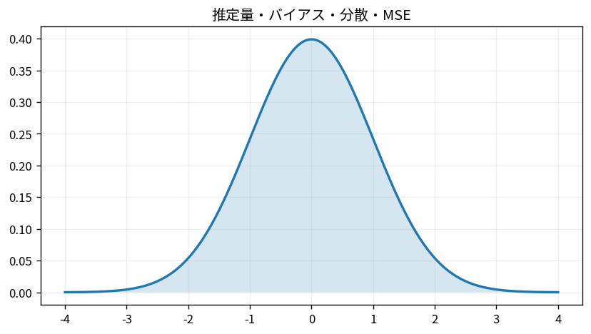

# 推定量・バイアス・分散・MSE

Course 03｜確率統計｜Topic 14/20

---
layout: center
---

## 今回の問い

## 到達目標

- 定義と代表式を、自分の言葉と記号で説明できる。
- 成立条件を確認し、手計算と結果を検算できる。

## 理解確認

- 定義・条件・計算結果を自分の言葉で説明できるか確認する。

推定量・バイアス・分散・MSEの代表式は、どの定義・仮定から、なぜその形になるのか。

---

## なぜ今これを学ぶのか

前Topic `prob-multivariate-normal-distribution` で得た概念を使い、ここでは 推定量・バイアス・分散・MSE へ進む。

---

## 直感

推定量はデータから未知パラメータを返す規則で、バイアスと分散の両方で性能を見る。

---

## 図解

同じ母集団から反復標本を取り、推定値の中心とばらつきを可視化する。 横軸上の推定量の分布に対し、真値からの系統的なずれがbias、分布の広がりがvarianceである。MSEはこの2種類の誤差を二乗誤差としてまとめる。

---

## 記号と代表式

- $\theta$：未知の母数
- $\hat\theta=T(X_1,\ldots,X_n)$：データから計算する推定量
- $\operatorname{Bias}(\hat\theta)=E[\hat\theta]-\theta$
- $\operatorname{MSE}=E[(\hat\theta-\theta)^2]$

$$
\operatorname{MSE}(\hat{\theta})=\mathbb{E}[(\hat{\theta}-\theta)^2]
$$

---

## 導出 1

$\hat\theta-\theta=(\hat\theta-E\hat\theta)+(E\hat\theta-\theta)$。第一項は平均0のランダム変動、第二項は定数bias。

---

## 導出 2

二乗すると分散項、bias二乗、交差項が出る。交差項の期待値は $2Bias\,E[\hat\theta-E\hat\theta]=0$。

---

## 例題

$X_i\sim(\mu,\sigma^2)$ の標本平均は不偏で $Var(\bar X)=\sigma^2/n$、MSEも同じ。標本数4倍でMSEは1/4。

---

## 条件を変えるとどうなるか

「不偏推定量なら常に最良」は誤り。不偏性は平均的中心だけを評価し、ばらつきは無視する。MSEや目的に応じた損失で比較する必要がある。

---

## よくある誤解

推定量・バイアス・分散・MSEでは、式へ数値を代入するだけでは不十分である。「不偏推定量なら常に最良」は誤り。不偏性は平均的中心だけを評価し、ばらつきは無視する。MSEや目的に応じた損失で比較する必要がある。 という失敗例が示すように、式を使える条件と結論の範囲を区別する必要がある。

---

## 実装・計算上の注意

simulationで同じ母数から多数datasetを生成し、推定量のsampling distributionを観察するとbiasとvarianceを分離できる。1つのdataset内の標本分散とは別物。

---

## 一段先へ

推定量をどう選ぶかの代表原理が尤度最大化。次Topicでは観測データを最も説明する母数としてMLEを導入する。

---

## 自分で説明できるか

- 「誤差を平均周りに分ける」を式を見ずに説明できるか
- 「MSE分解」までの論理を一段ずつ再現できるか
- 推定量・バイアス・分散・MSEの条件を1つ外した反例を説明できるか

---
layout: center
---

## 教科書と演習

- [教科書](../../textbook/stat-estimators-bias-variance-mse)
- [10問の演習](../../exercises/stat-estimators-bias-variance-mse)
