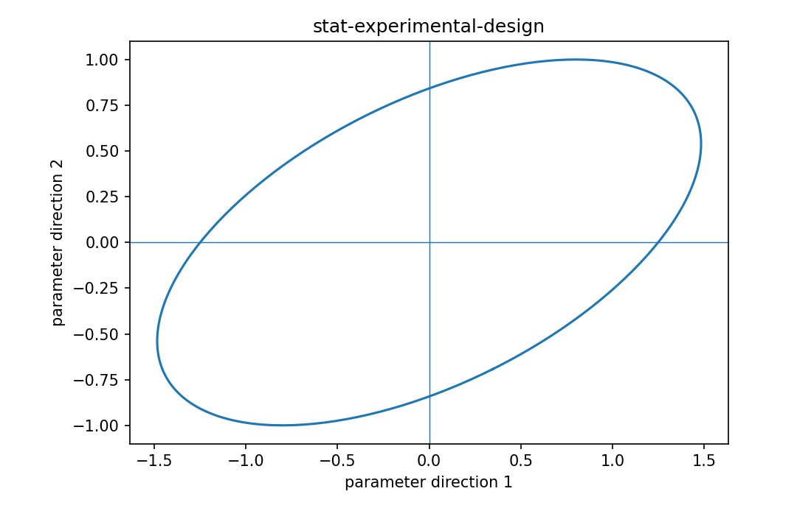

# Experimental design

Fisher情報・統計推定

---

## 問い

parameterを精密に推定するため、どの入力条件でmeasurementを取るべきか。

---

## 記号とshape

- `$\xi`: design: inputs/times/sensor settings (design object)
- `$\mathbf I`: design-dependent Fisher information (p\times p)

---

## 中心式

$$
\text{choose design }\xi\ \text{to improve }\mathbf I(\boldsymbol\theta;\xi)
$$

---

## 導出

- measurement condition ξがlikelihoodを通じinformation matrixを変える。
- parameter方向ごとの情報をeigenvalue/varianceとして評価する。
- costやsample数制約のもとで情報が弱い方向を補うdesignを選ぶ。

---

## 図

---

## 小さな例

直線 $y=β_0+β_1x+ε$ でslopeを精密に測るには、xを狭い範囲に集めるより両端へ広げる方が $X^TX$ のslope情報が増える。

---

## 何がわかるか

sensor placement、calibration、dose/time-point設計、fluorochrome panel evaluation。

---

## 失敗条件

nominal parameterだけでdesignするとmodel uncertaintyに弱い。robust/Bayesian designが必要な場合がある。

---

## 実装検算

candidate designごとにFisher eigenvaluesとpredicted covarianceを計算して比較する。

---

## 式の読み方を固定する

Experimental designでは、likelihoodまたはestimating equationから得られる局所曲率・感度と、推定量のばらつきを区別する。$\xi$ は design: inputs/times/sensor settings（design object）、$\mathbf I$ は design-dependent Fisher information（p\times p）。中心式 `\text{choose design }\xi\ \text{to improve }\mathbf I(\boldsymbol\theta;\xi)` の行列が大きい/小さいとはどのparameter方向についての話かをeigenvectorまで含めて読む。対角要素だけを見るとparameter間のtrade-offを失う。

---

## 極限・反例で検算

- 手計算例: 直線 $y=β_0+β_1x+ε$ でslopeを精密に測るには、xを狭い範囲に集めるより両端へ広げる方が $X^TX$ のslope情報が増える。
- 失敗条件: nominal parameterだけでdesignするとmodel uncertaintyに弱い。robust/Bayesian designが必要な場合がある。
- 実装検算: candidate designごとにFisher eigenvaluesとpredicted covarianceを計算して比較する。

---

## 工学での位置づけ

sensor placement、calibration、dose/time-point設計、fluorochrome panel evaluation。

中心式 `\text{choose design }\xi\ \text{to improve }\mathbf I(\boldsymbol\theta;\xi)` のどの量が観測・未知parameter・weight・frequency成分に対応するかを区別する。

---

## 試験で書けるべきこと

- `Experimental design` の記号とshapeを定義する
- `measurement condition ξがlikelihoodを通じinformation matrixを変える。` から中心式を導く
- `直線 $y=β_0+β_1x+ε$ でslopeを精密に測るには、xを狭い範囲に集めるより両端へ広げる方が $X^TX$ のslope情報が増える。` を最後まで追う
- `nominal parameterだけでdesignするとmodel uncertaintyに弱い。robust/Bayesian designが必要な場合がある。` がなぜ問題か説明する

---

## 接続

Prerequisites: stat-estimator-covariance, stat-identifiability

[教科書](../../textbook/stat-experimental-design)
[10問の演習](../../exercises/stat-experimental-design)
