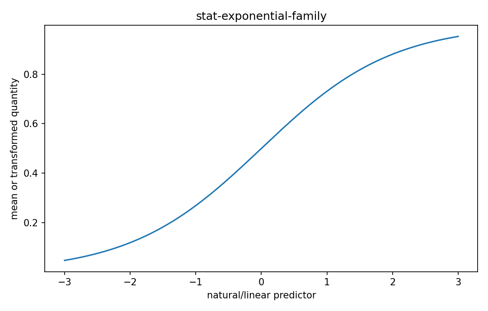

# 指数型分布族

Fisher情報・統計推定

---

## 問い

多くの分布を共通のnatural parameterと十分統計量の形でどう統一するか。

---

## 記号とshape

- `$\boldsymbol\eta`: natural parameter (p)
- `$\mathbf T(x)`: sufficient statistic (p)
- `$A`: log-partition function (scalar)

---

## 中心式

$$
p(x\mid\boldsymbol\eta)=h(x)\exp\!\left(\boldsymbol\eta^{\mathsf T}\mathbf T(x)-A(\boldsymbol\eta)\right)
$$

---

## 導出

- BernoulliやPoissonなどのpmf/pdfをlogへ移しparameter-dependent termsを分離する。
- 係数をnatural parameter η、data functionをT(x)として集める。
- normalizationを保証する項がlog-partition A(η)で、微分するとmomentsが得られる。

---

## 図

---

## 小さな例

Poissonでは η=logλ、T(x)=x、A(η)=e^η。$A'(η)=e^η=λ=E[X]$。

---

## 何がわかるか

GLM、maximum entropy、conjugate prior、Fisher geometryの共通形式。

---

## 失敗条件

supportがparameterに依存する分布は標準regular exponential familyの性質が使えない場合がある。

---

## 実装検算

複数分布をnatural parameter形へ書き換え、Aの数値微分とsample momentを比較する。

---

## 式の読み方を固定する

指数型分布族では、likelihoodまたはestimating equationから得られる局所曲率・感度と、推定量のばらつきを区別する。$\boldsymbol\eta$ は natural parameter（p）、$\mathbf T(x)$ は sufficient statistic（p）、$A$ は log-partition function（scalar）。中心式 `p(x\mid\boldsymbol\eta)=h(x)\exp\!\left(\boldsymbol\eta^{\mathsf T}\mathbf T(x)-A(\boldsymbol\eta)\right)` の行列が大きい/小さいとはどのparameter方向についての話かをeigenvectorまで含めて読む。対角要素だけを見るとparameter間のtrade-offを失う。

---

## 極限・反例で検算

- 手計算例: Poissonでは η=logλ、T(x)=x、A(η)=e^η。$A'(η)=e^η=λ=E[X]$。
- 失敗条件: supportがparameterに依存する分布は標準regular exponential familyの性質が使えない場合がある。
- 実装検算: 複数分布をnatural parameter形へ書き換え、Aの数値微分とsample momentを比較する。

---

## 工学での位置づけ

GLM、maximum entropy、conjugate prior、Fisher geometryの共通形式。

中心式 `p(x\mid\boldsymbol\eta)=h(x)\exp\!\left(\boldsymbol\eta^{\mathsf T}\mathbf T(x)-A(\boldsymbol\eta)\right)` のどの量が観測・未知parameter・weight・frequency成分に対応するかを区別する。

---

## 試験で書けるべきこと

- `指数型分布族` の記号とshapeを定義する
- `BernoulliやPoissonなどのpmf/pdfをlogへ移しparameter-dependent termsを分離する。` から中心式を導く
- `Poissonでは η=logλ、T(x)=x、A(η)=e^η。$A'(η)=e^η=λ=E[X]$。` を最後まで追う
- `supportがparameterに依存する分布は標準regular exponential familyの性質が使えない場合がある。` がなぜ問題か説明する

---

## 接続

Prerequisites: stat-sufficient-statistics, stat-likelihood-maximum-likelihood

[教科書](../../textbook/stat-exponential-family)
[10問の演習](../../exercises/stat-exponential-family)
