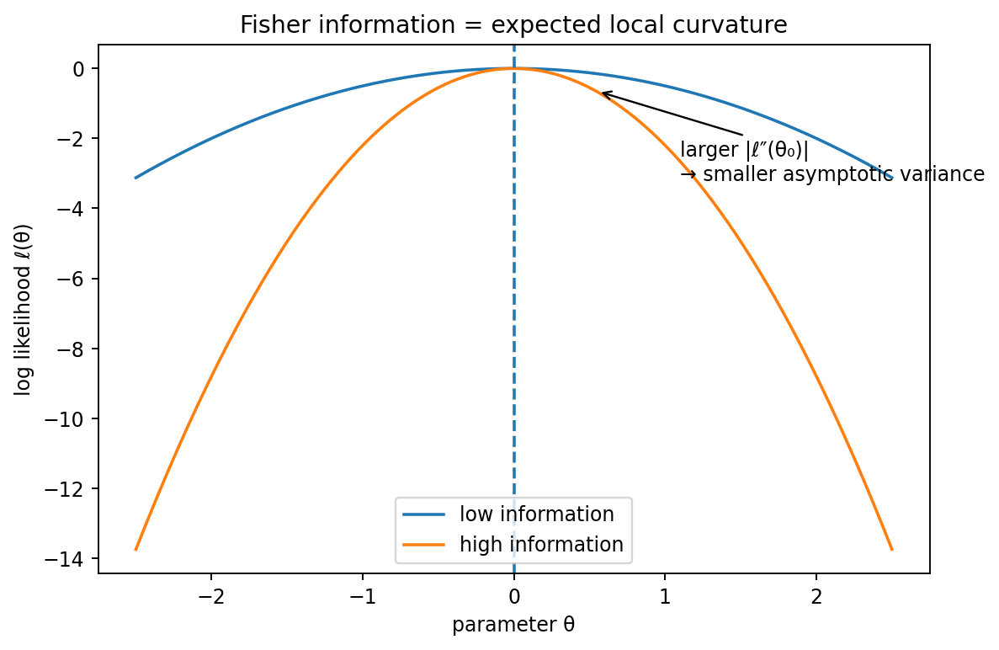

# Fisher情報量とMLEの漸近分布

Course 03｜確率統計

---

## 何を解決するか

尤度の「尖り具合」が、推定量の精度とどう結びつくか。

真のパラメータ付近でlog-likelihoodが急に曲がるほど、少しパラメータをずらしたときデータ分布が大きく変わる。これを平均曲率として測るのがFisher情報量。

---

## 図の意味

横軸がパラメータ $\theta$、縦軸がlog-likelihood。幅広い曲線と尖った曲線を同じ最大点付近で比較し、尖った方ほど二階微分の絶対値が大きい。Fisher情報量はこの局所曲率を平均的に測るため、尖った尤度ほどMLEの漸近分散 $1/[nI(\theta_0)]$ が小さくなる。

---

## 記号

| 記号 | 意味 |
|---|---|
| $ℓ(θ)$ | log-likelihood |
| $I(θ)$ | Fisher情報量 |
| $θ̂_MLE$ | 最尤推定量 |

- $\theta_0$：真のparameter。
- $\hat\theta$：MLE。
- $n$：iid標本数。
- $I(\theta_0)$：1標本あたりFisher情報量。
- $\xrightarrow{d}$：分布収束。

---

## 中心式

$$
\sqrt n(\hat\theta-\theta_0)\xrightarrow{d}N(0,I(\theta_0)^{-1})
$$

---

## 導出

1. score $s(θ)=\partialℓ/\partialθ$ を真値周りでTaylor展開する。
2. MLEではscore=0なので、$0\approx s(θ_0)+(θ̂-θ_0)ℓ\prime\prime(θ_0)$。
3. scoreのCLTとHessianの大数則から漸近正規性を得る。

---

## 省略しない一段

1標本のlog-likelihoodを $\ell_1(\theta)=\log p_\theta(X)$、scoreを $s_1(\theta)=\partial\ell_1/\partial\theta$ とする。正則条件の下で $E[s_1(\theta_0)]=0$、$I(\theta_0)=E[s_1^2]=-E[\ell_1\prime\prime]$。n標本ではscoreが和なのでCLTにより $s_n(\theta_0)/\sqrt n\Rightarrow N(0,I)$。

MLEは $s_n(\hat\theta)=0$ を満たす。真値周りでTaylor展開して $0=s_n(\theta_0)+(\hat\theta-\theta_0)s_n\prime(\tilde\theta)$。両辺を $\sqrt n$ スケールで整理し、$-s_n\prime/n\to I$ を使うと $\sqrt n(\hat\theta-\theta_0)\Rightarrow N(0,I^{-1})$。

---

## 手計算

**問題**：Bernoulli(p)で $p=0.25$, $n=100$ のとき、MLE $\hat p$ のFisher情報に基づく漸近標準誤差を求めよ。

**解答**：1標本情報量 $I(p)=1/[p(1-p)]=1/0.1875$。n標本の漸近分散は $1/[nI]=p(1-p)/n=0.001875$。標準誤差は $\sqrt{0.001875}\approx0.0433$。

---

## 条件を変える

Bernoulli(p)では $s=(X-p)/[p(1-p)]$。分散を取ると $I(p)=1/[p(1-p)]$。n標本MLE $\hat p=\bar X$ の分散 $p(1-p)/n$ は $1/[nI(p)]$ と一致する。

---

## どこで壊れるか

境界点、識別不能、mixture modelの特異点など正則条件が壊れると通常の $\sqrt n$ 正規近似が成立しないことがある。「MLEなら必ず正規」とは言えない。

---

## 次へ

Cramér–Rao下界、Wald/LR/score検定、natural gradientへつながる。深層学習でもFisher行列はparameter spaceの局所geometryとして現れる。

---

[教科書](../../textbook/stat-fisher-information-asymptotic-mle)　|　[10問の演習](../../exercises/stat-fisher-information-asymptotic-mle)
