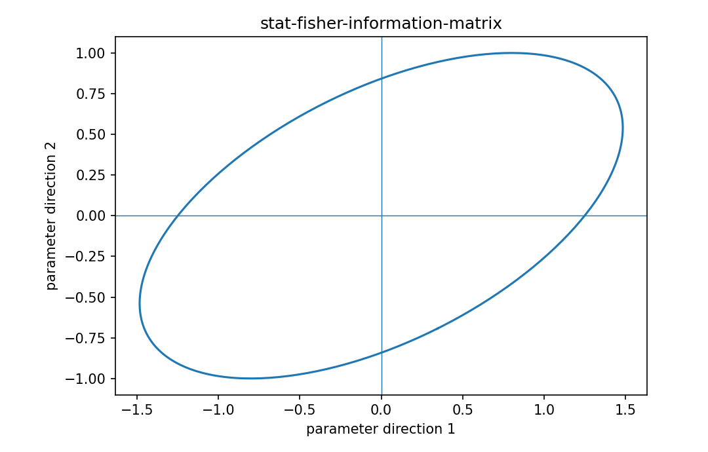

# Fisher情報行列

Fisher情報・統計推定

---

## 問い

複数parameterを同時推定するとき、dataが各方向について持つ局所情報量をどう行列化するか。

---

## 記号とshape

- `$\boldsymbol\theta`: parameter vector (p)
- `$\ell`: log-likelihood (scalar)
- `$\mathbf s=\nabla_\theta\ell`: score (p)
- `$\mathbf I`: Fisher information matrix (p\times p)

---

## 中心式

$$
\mathbf I(\boldsymbol\theta)=E\!\left[\mathbf s(\boldsymbol\theta)\mathbf s(\boldsymbol\theta)^{\mathsf T}\right]=-E\!\left[\nabla_{\boldsymbol\theta}^2\ell(\boldsymbol\theta)\right]
$$

---

## 導出

- log-likelihoodの一次微分をscore vector $\mathbf s$ と定義する。
- regularity condition下で $E[\mathbf s]=0$ なので、そのsecond momentはcovarianceになる。
- 微分と積分の交換を使うとscore outer productの期待値とnegative expected Hessianが一致する。

---

## 図

---

## 小さな例

Gaussian linear model $\mathbf y\sim N(\mathbf X\boldsymbol\beta,\sigma^2\mathbf I)$ では $\mathbf I(\boldsymbol\beta)=\sigma^{-2}\mathbf X^{\mathsf T}\mathbf X$。

---

## 何がわかるか

experimental design、Hotspot Matrix、inverse problem、MLE uncertaintyを同じ行列構造で結ぶ。

---

## 失敗条件

parameterが非識別、boundary上、regularity condition違反では通常のFisher/CRLB近似が崩れる。小固有値方向は情報不足を示す。

---

## 実装検算

score outer productのMonte Carlo平均とnegative Hessianの数値平均を同一modelで比較する。

---

## 式の読み方を固定する

Fisher情報行列では、likelihoodまたはestimating equationから得られる局所曲率・感度と、推定量のばらつきを区別する。$\boldsymbol\theta$ は parameter vector（p）、$\ell$ は log-likelihood（scalar）、$\mathbf s=\nabla_\theta\ell$ は score（p）、$\mathbf I$ は Fisher information matrix（p\times p）。中心式 `\mathbf I(\boldsymbol\theta)=E\!\left[\mathbf s(\boldsymbol\theta)\mathbf s(\boldsymbol\theta)^{\mathsf T}\right]=-E\!\left[\nabla_{\boldsymbol\theta}^2\ell(\boldsymbol\theta)\right]` の行列が大きい/小さいとはどのparameter方向についての話かをeigenvectorまで含めて読む。対角要素だけを見るとparameter間のtrade-offを失う。

---

## 極限・反例で検算

- 手計算例: Gaussian linear model $\mathbf y\sim N(\mathbf X\boldsymbol\beta,\sigma^2\mathbf I)$ では $\mathbf I(\boldsymbol\beta)=\sigma^{-2}\mathbf X^{\mathsf T}\mathbf X$。
- 失敗条件: parameterが非識別、boundary上、regularity condition違反では通常のFisher/CRLB近似が崩れる。小固有値方向は情報不足を示す。
- 実装検算: score outer productのMonte Carlo平均とnegative Hessianの数値平均を同一modelで比較する。

---

## 工学での位置づけ

experimental design、Hotspot Matrix、inverse problem、MLE uncertaintyを同じ行列構造で結ぶ。

中心式 `\mathbf I(\boldsymbol\theta)=E\!\left[\mathbf s(\boldsymbol\theta)\mathbf s(\boldsymbol\theta)^{\mathsf T}\right]=-E\!\left[\nabla_{\boldsymbol\theta}^2\ell(\boldsymbol\theta)\right]` のどの量が観測・未知parameter・weight・frequency成分に対応するかを区別する。

---

## 試験で書けるべきこと

- `Fisher情報行列` の記号とshapeを定義する
- `log-likelihoodの一次微分をscore vector $\mathbf s$ と定義する。` から中心式を導く
- `Gaussian linear model $\mathbf y\sim N(\mathbf X\boldsymbol\beta,\sigma^2\mathbf I)$ では $\mathbf I(\boldsymbol\beta)=\sigma^{-2}\mathbf X^{\mathsf T}\mathbf X$。` を最後まで追う
- `parameterが非識別、boundary上、regularity condition違反では通常のFisher/CRLB近似が崩れる。小固有値方向は情報不足を示す。` がなぜ問題か説明する

---

## 接続

Prerequisites: stat-likelihood-maximum-likelihood, prob-multivariate-normal-distribution, calc-gradient-directional-derivative, calc-hessian-second-order

[教科書](../../textbook/stat-fisher-information-matrix)
[10問の演習](../../exercises/stat-fisher-information-matrix)
