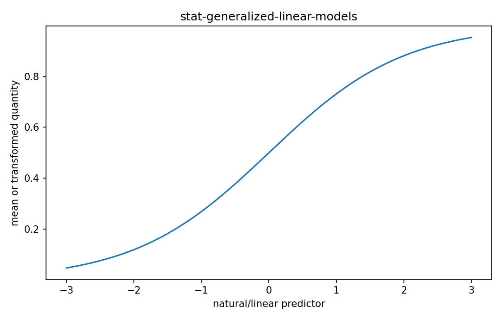

# Generalized linear models

Fisher情報・統計推定

---

## 問い

Gaussian以外のresponseを、linear predictorとlink functionでどう回帰するか。

---

## 記号とshape

- `$\mu_i=E[Y_i|x_i]`: conditional mean (scalar)
- `$g`: link function (mean-space to real)
- `$\eta_i`: linear predictor (scalar)
- `$\boldsymbol\beta`: coefficients (p)

---

## 中心式

$$
g(\mu_i)=\eta_i=\mathbf x_i^{\mathsf T}\boldsymbol\beta
$$

---

## 導出

- response distributionをexponential familyから選ぶ。
- mean μをreal-valued linear predictorへ写すlink gを選ぶ。
- likelihoodをβについて最大化し、IRLS/Newtonなどで解く。

---

## 図

---

## 小さな例

Bernoulli responseならlogit link $\log[p/(1-p)]=x^Tβ$、Poisson countならlog link $\log λ=x^Tβ$。

---

## 何がわかるか

count、binary、rateなど工学・生物計測responseの回帰。

---

## 失敗条件

linkとdistributionの組合せがdata生成機構に合わないとresidual structureやdispersionに異常が出る。

---

## 実装検算

deviance residualと予測mean-variance relationを確認し、Gaussian OLSとの差を比較する。

---

## 式の読み方を固定する

Generalized linear modelsでは、likelihoodまたはestimating equationから得られる局所曲率・感度と、推定量のばらつきを区別する。$\mu_i=E[Y_i|x_i]$ は conditional mean（scalar）、$g$ は link function（mean-space to real）、$\eta_i$ は linear predictor（scalar）、$\boldsymbol\beta$ は coefficients（p）。中心式 `g(\mu_i)=\eta_i=\mathbf x_i^{\mathsf T}\boldsymbol\beta` の行列が大きい/小さいとはどのparameter方向についての話かをeigenvectorまで含めて読む。対角要素だけを見るとparameter間のtrade-offを失う。

---

## 極限・反例で検算

- 手計算例: Bernoulli responseならlogit link $\log[p/(1-p)]=x^Tβ$、Poisson countならlog link $\log λ=x^Tβ$。
- 失敗条件: linkとdistributionの組合せがdata生成機構に合わないとresidual structureやdispersionに異常が出る。
- 実装検算: deviance residualと予測mean-variance relationを確認し、Gaussian OLSとの差を比較する。

---

## 工学での位置づけ

count、binary、rateなど工学・生物計測responseの回帰。

中心式 `g(\mu_i)=\eta_i=\mathbf x_i^{\mathsf T}\boldsymbol\beta` のどの量が観測・未知parameter・weight・frequency成分に対応するかを区別する。

---

## 試験で書けるべきこと

- `Generalized linear models` の記号とshapeを定義する
- `response distributionをexponential familyから選ぶ。` から中心式を導く
- `Bernoulli responseならlogit link $\log[p/(1-p)]=x^Tβ$、Poisson countならlog link $\log λ=x^Tβ$。` を最後まで追う
- `linkとdistributionの組合せがdata生成機構に合わないとresidual structureやdispersionに異常が出る。` がなぜ問題か説明する

---

## 接続

Prerequisites: stat-exponential-family, mat-ols-design-matrices

[教科書](../../textbook/stat-generalized-linear-models)
[10問の演習](../../exercises/stat-generalized-linear-models)
