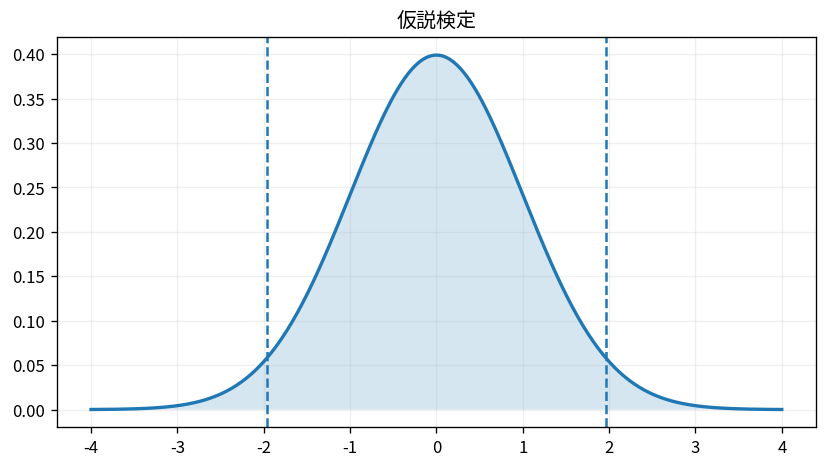

# 仮説検定

Course 03｜確率統計｜Topic 18/20

---
layout: center
---

## 今回の問い

## 到達目標

- 定義と代表式を、自分の言葉と記号で説明できる。
- 成立条件を確認し、手計算と結果を検算できる。

## 理解確認

- 定義・条件・計算結果を自分の言葉で説明できるか確認する。

仮説検定の代表式は、どの定義・仮定から、なぜその形になるのか。

---

## なぜ今これを学ぶのか

前Topic `stat-confidence-intervals` で得た概念を使い、ここでは 仮説検定 へ進む。

---

## 直感

仮説検定は帰無仮説の下で観測統計量がどれほど極端かを評価する。

---

## 図解

帰無分布上に観測統計量と棄却域を描く。 帰無仮説の下で統計量が取りうる分布を描き、観測値以上に極端な尾部面積がp-valueになる。観測値が尾へ行くほど、その尾部面積は小さくなる。

---

## 記号と代表式

- $H_0$：帰無仮説
- $H_1$：対立仮説
- $T$：検定統計量
- $T_{obs}$：観測データから得た値
- $p$-value：H0のもとで観測以上に極端な統計量が出る確率

$$
p\text{-value}=\mathbb{P}(T\ge T_{\mathrm{obs}}\mid H_0)
$$

---

## 導出 1

まず統計量Tを選び、$H_0$ のもとでの分布を導く。これが「極端」の尺度を与える。

---

## 導出 2

片側なら $p=P(T\ge T_{obs}|H_0)$ 等。両側では対立仮説に対応する両側tailを含める。

---

## 例題

H0:コインp=0.5、100回中65表。正規近似なら平均50、SD5なのでz=3。片側tailは約0.00135で、5%水準なら棄却。

---

## 条件を変えるとどうなるか

p=0.03は「H0が3%の確率で正しい」ではない。H0を仮定した条件付き確率 $P(data\;extreme|H0)$ であり、逆向きの $P(H0|data)$ ではない。

---

## よくある誤解

仮説検定では、式へ数値を代入するだけでは不十分である。p=0.03は「H0が3%の確率で正しい」ではない。H0を仮定した条件付き確率 $P(data\;extreme|H0)$ であり、逆向きの $P(H0|data)$ ではない。 という失敗例が示すように、式を使える条件と結論の範囲を区別する必要がある。

---

## 実装・計算上の注意

multiple testingでは偽陽性が累積する。検定方向、有意水準、停止規則をデータを見る前に定め、効果量・CIも併記する。

---

## 一段先へ

線形回帰の係数検定も、推定量の標本分布→標準化統計量→p-valueという同じ構造。次Topicで確率モデルとして回帰を扱う。

---

## 自分で説明できるか

- 「H0の下の参照分布を定める」を式を見ずに説明できるか
- 「有意水準と比較する」までの論理を一段ずつ再現できるか
- 仮説検定の条件を1つ外した反例を説明できるか

---
layout: center
---

## 教科書と演習

- [教科書](../../textbook/stat-hypothesis-testing)
- [10問の演習](../../exercises/stat-hypothesis-testing)
