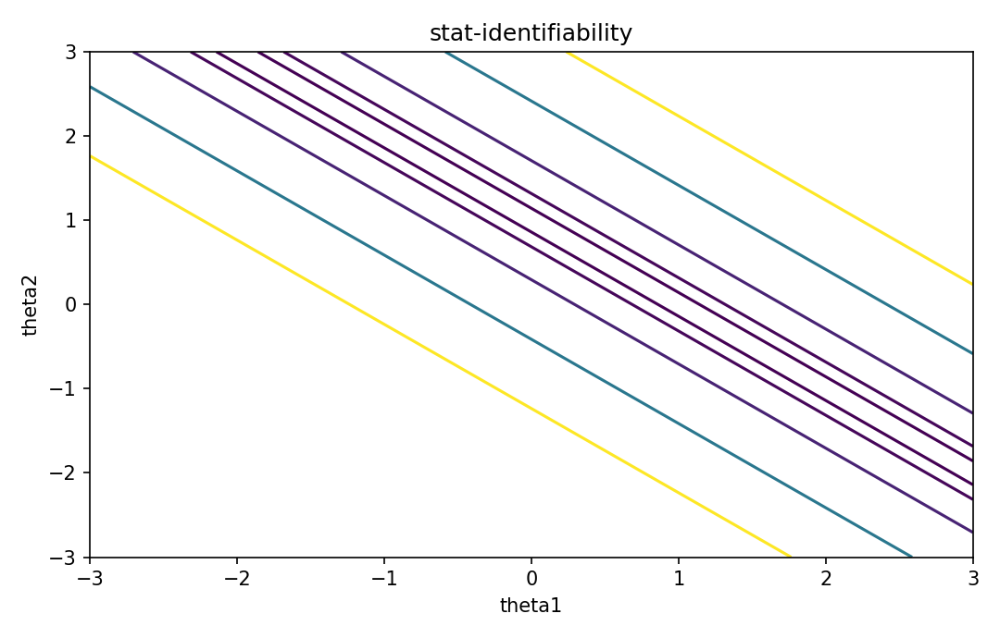

# Identifiability

Fisher情報・統計推定

---

## 問い

異なるparameterが同じ観測分布を作らないことを、どう定義・診断するか。

---

## 記号とshape

- `$\boldsymbol\theta`: parameter (p)
- `$p(y|theta)`: model distribution (density/pmf)

---

## 中心式

$$
p(\mathbf y\mid\boldsymbol\theta_1)=p(\mathbf y\mid\boldsymbol\theta_2)\ \forall\mathbf y\quad\Rightarrow\quad\boldsymbol\theta_1=\boldsymbol\theta_2
$$

---

## 導出

- parameter-to-distribution mapを考える。
- この写像がinjectiveならglobal identifiability。
- 局所的にはJacobian rankやFisher informationのrankが診断手掛かりになる。

---

## 図

---

## 小さな例

mixture modelではcomponent label交換で同じ分布になるため、そのままではlabelについて非識別。

---

## 何がわかるか

inverse problems、spectral unmixing、system identificationで「分けられるか」を事前に問う。

---

## 失敗条件

numerical optimizationが収束してもidentifiabilityは保証されない。flat ridge上の任意点へ止まることがある。

---

## 実装検算

parameter gridでprediction distanceを可視化し、異なるparameterが同じpredictionを作るridgeを探す。

---

## 式の読み方を固定する

Identifiabilityでは、likelihoodまたはestimating equationから得られる局所曲率・感度と、推定量のばらつきを区別する。$\boldsymbol\theta$ は parameter（p）、$p(y|theta)$ は model distribution（density/pmf）。中心式 `p(\mathbf y\mid\boldsymbol\theta_1)=p(\mathbf y\mid\boldsymbol\theta_2)\ \forall\mathbf y\quad\Rightarrow\quad\boldsymbol\theta_1=\boldsymbol\theta_2` の行列が大きい/小さいとはどのparameter方向についての話かをeigenvectorまで含めて読む。対角要素だけを見るとparameter間のtrade-offを失う。

---

## 極限・反例で検算

- 手計算例: mixture modelではcomponent label交換で同じ分布になるため、そのままではlabelについて非識別。
- 失敗条件: numerical optimizationが収束してもidentifiabilityは保証されない。flat ridge上の任意点へ止まることがある。
- 実装検算: parameter gridでprediction distanceを可視化し、異なるparameterが同じpredictionを作るridgeを探す。

---

## 工学での位置づけ

inverse problems、spectral unmixing、system identificationで「分けられるか」を事前に問う。

中心式 `p(\mathbf y\mid\boldsymbol\theta_1)=p(\mathbf y\mid\boldsymbol\theta_2)\ \forall\mathbf y\quad\Rightarrow\quad\boldsymbol\theta_1=\boldsymbol\theta_2` のどの量が観測・未知parameter・weight・frequency成分に対応するかを区別する。

---

## 試験で書けるべきこと

- `Identifiability` の記号とshapeを定義する
- `parameter-to-distribution mapを考える。` から中心式を導く
- `mixture modelではcomponent label交換で同じ分布になるため、そのままではlabelについて非識別。` を最後まで追う
- `numerical optimizationが収束してもidentifiabilityは保証されない。flat ridge上の任意点へ止まることがある。` がなぜ問題か説明する

---

## 接続

Prerequisites: stat-likelihood-maximum-likelihood, stat-model-misspecification

[教科書](../../textbook/stat-identifiability)
[10問の演習](../../exercises/stat-identifiability)
