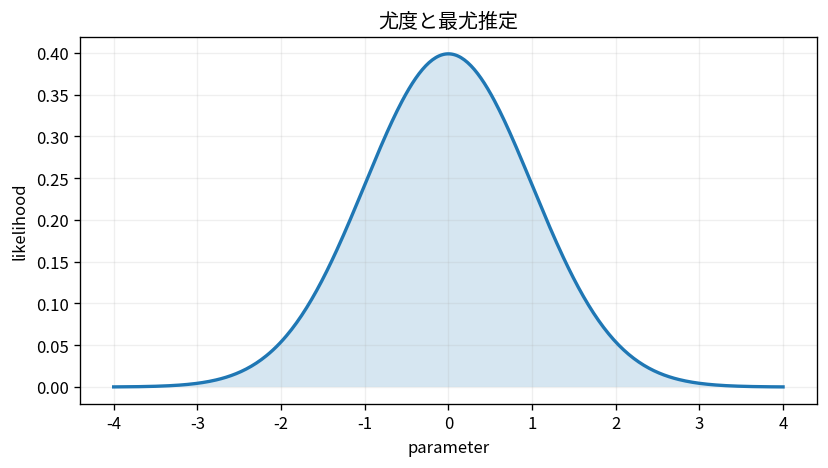

# 尤度と最尤推定

Course 03｜確率統計｜Topic 15/20

---
layout: center
---

## 今回の問い

## 到達目標

- 定義と代表式を、自分の言葉と記号で説明できる。
- 成立条件を確認し、手計算と結果を検算できる。

## 理解確認

- 定義・条件・計算結果を自分の言葉で説明できるか確認する。

尤度と最尤推定の代表式は、どの定義・仮定から、なぜその形になるのか。

---

## なぜ今これを学ぶのか

前Topic `stat-estimators-bias-variance-mse` で得た概念を使い、ここでは 尤度と最尤推定 へ進む。

---

## 直感

尤度は観測データを固定し、パラメータを動かしたときの説明力を見る関数。

---

## 図解

Bernoulli観測の成功回数からpの尤度曲線を描き、最大点を探す。 パラメータを横軸に固定してデータの確率を縦軸に描く。観測済みデータを固定してパラメータだけを動かす点が、確率分布そのものを描く場合との違いである。

---

## 記号と代表式

- $x_1,\ldots,x_n$：観測済みデータ
- $\theta$：未知母数
- $L(\theta)=p(x_1,\ldots,x_n\mid\theta)$：データを固定し母数の関数として読む尤度
- $\ell(\theta)=\log L(\theta)$：対数尤度

$$
\hat{\theta}_{\mathrm{MLE}}=\arg\max_{\theta}L(\theta)
$$

---

## 導出 1

データを観測後は $x_i$ を固定し、$p(\mathbf x\mid\theta)$ をθについて比較する。これがlikelihood。

---

## 導出 2

$L(\theta)=\prod_i p(x_i\mid\theta)$。logは単調増加なのでargmaxは変わらず、$\ell(\theta)=\sum_i\log p(x_i\mid\theta)$。

---

## 例題

Bernoulli観測で成功k回、失敗n-k回。$\ell(p)=k\log p+(n-k)\log(1-p)$。微分して $k/p-(n-k)/(1-p)=0$、整理すると $\hat p=k/n$。

---

## 条件を変えるとどうなるか

尤度 $L(\theta)$ はθの確率分布ではないため、θについて積分して1になる必要はない。「尤度0.8だからθの確率80%」とは読めない。

---

## よくある誤解

尤度と最尤推定では、式へ数値を代入するだけでは不十分である。尤度 $L(\theta)$ はθの確率分布ではないため、θについて積分して1になる必要はない。「尤度0.8だからθの確率80%」とは読めない。 という失敗例が示すように、式を使える条件と結論の範囲を区別する必要がある。

---

## 実装・計算上の注意

積の尤度はunderflowするためlog-likelihoodを使う。最適化ではgradientだけでなくbound・constraint・複数極値も確認する。

---

## 一段先へ

MLEに事前分布を掛けるとposteriorが得られ、posteriorのmodeを取ればMAP推定。次TopicでBayesian推論として区別する。

---

## 自分で説明できるか

- 「同時密度を母数の関数として読む」を式を見ずに説明できるか
- 「微分して最適条件を解く」までの論理を一段ずつ再現できるか
- 尤度と最尤推定の条件を1つ外した反例を説明できるか

---
layout: center
---

## 教科書と演習

- [教科書](../../textbook/stat-likelihood-maximum-likelihood)
- [10問の演習](../../exercises/stat-likelihood-maximum-likelihood)
