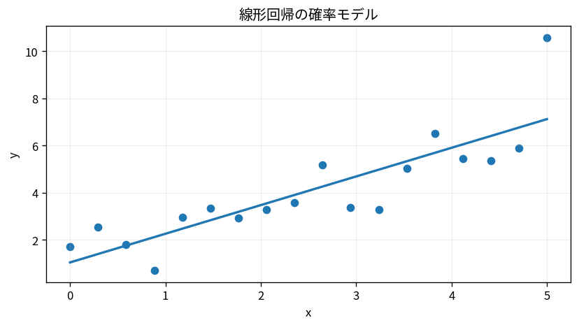

# 線形回帰の確率モデル

Course 03｜確率統計｜Topic 19/20

---
layout: center
---

## 今回の問い

## 到達目標

- 定義と代表式を、自分の言葉と記号で説明できる。
- 成立条件を確認し、手計算と結果を検算できる。

## 理解確認

- 定義・条件・計算結果を自分の言葉で説明できるか確認する。

線形回帰の確率モデルの代表式は、どの定義・仮定から、なぜその形になるのか。

---

## なぜ今これを学ぶのか

前Topic `stat-hypothesis-testing` で得た概念を使い、ここでは 線形回帰の確率モデル へ進む。

---

## 直感

回帰は入力から平均的な出力を説明・予測する関係をモデル化する。

---

## 図解

散布点、回帰線、残差を同時に描く。 点が観測値、線がモデル予測、点から線までの縦の差が残差である。二乗残差を合計する最小二乗では、大きな残差ほど強く目的関数へ効く。

---

## 記号と代表式

- $\mathbf y\in\mathbb R^n$：応答
- $\mathbf X\in\mathbb R^{n\times p}$：design matrix
- $\boldsymbol\beta\in\mathbb R^p$：回帰係数
- $\boldsymbol\varepsilon$：誤差ベクトル
- $\sigma^2$：誤差分散

$$
\mathbf{y}=\mathbf{X}\boldsymbol{\beta}+\boldsymbol{\varepsilon}
$$

---

## 導出 1

$E[\mathbf y|\mathbf X]=\mathbf X\beta$ と置く。各係数は他の列を固定した線形効果として読む。

---

## 導出 2

$\varepsilon_i\sim N(0,\sigma^2)$ 独立ならlog尤度は定数を除き $-\frac1{2\sigma^2}\|y-X\beta\|^2$。最大化はOLS最小化と同値。

---

## 例題

切片と1説明変数なら $y_i=\beta_0+\beta_1x_i+\varepsilon_i$。$\beta_1$ はxが1増えたとき条件付き平均がどれだけ変わるか。

---

## 条件を変えるとどうなるか

高い $R^2$ や有意な係数だけで因果関係は証明できない。交絡、selection、model misspecificationは確率モデル外の問題。

---

## よくある誤解

線形回帰の確率モデルでは、式へ数値を代入するだけでは不十分である。高い $R^2$ や有意な係数だけで因果関係は証明できない。交絡、selection、model misspecificationは確率モデル外の問題。 という失敗例が示すように、式を使える条件と結論の範囲を区別する必要がある。

---

## 実装・計算上の注意

逆行列を明示的に作らずQR/SVDでlstsqを解く。residual plot、leverage、heteroscedasticityを診断し、train/test目的なら推論と予測を区別する。

---

## 一段先へ

Course07でOLS, WLS, GLSを行列幾何と誤差共分散の観点から深掘りし、Course08で予測モデルとして正則化・validationを加える。

---

## 自分で説明できるか

- 「条件付き平均をモデル化する」を式を見ずに説明できるか
- 「推定と不確実性を分ける」までの論理を一段ずつ再現できるか
- 線形回帰の確率モデルの条件を1つ外した反例を説明できるか

---
layout: center
---

## 教科書と演習

- [教科書](../../textbook/stat-linear-regression-probabilistic-model)
- [10問の演習](../../exercises/stat-linear-regression-probabilistic-model)
