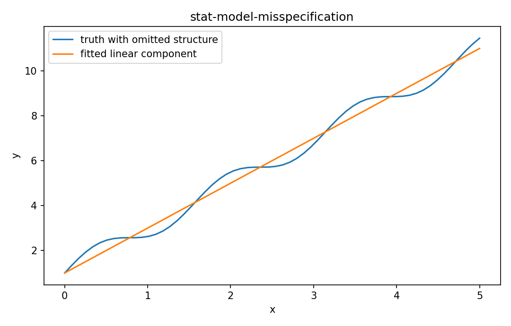

# Model misspecification

Fisher情報・統計推定

---

## 問い

真のdata-generating processが仮定model外にあるとき、推定誤差をvarianceだけでなくbiasとしてどう分離するか。

---

## 記号とshape

- `$\boldsymbol\delta`: systematic model mismatch (m)
- `$\boldsymbol\varepsilon`: zero-mean random noise (m)

---

## 中心式

$$
\hat{\boldsymbol\beta}-\boldsymbol\beta=(\mathbf X^{\mathsf T}\mathbf W\mathbf X)^{-1}\mathbf X^{\mathsf T}\mathbf W\boldsymbol\delta+(\mathbf X^{\mathsf T}\mathbf W\mathbf X)^{-1}\mathbf X^{\mathsf T}\mathbf W\boldsymbol\varepsilon
$$

---

## 導出

- observationを $\mathbf y=\mathbf X\boldsymbol\beta+\boldsymbol\delta+\boldsymbol\varepsilon$ と分解する。
- WLS solutionへ代入してlinear operatorを各項へ分配する。
- $\delta$ 項は系統bias、$\varepsilon$ 項はstochastic spreadとして別に解析できる。

---

## 図

---

## 小さな例

1 detectorだけ未モデル化offsetが1あると、そのoffsetがpseudoinverse/WLS operatorを通じ複数parameterへ漏れる。

---

## 何がわかるか

AF basis不足、sensor calibration error、omitted variable biasの理解に重要。

---

## 失敗条件

residualが小さくてもmodel errorがparameter spaceへ吸収される場合がある。good fitとunbiased estimationは同義ではない。

---

## 実装検算

既知のδをsimulationへ加え、推定mean shiftとnoise-only covarianceを別々に測定する。

---

## 式の読み方を固定する

Model misspecificationでは、likelihoodまたはestimating equationから得られる局所曲率・感度と、推定量のばらつきを区別する。$\boldsymbol\delta$ は systematic model mismatch（m）、$\boldsymbol\varepsilon$ は zero-mean random noise（m）。中心式 `\hat{\boldsymbol\beta}-\boldsymbol\beta=(\mathbf X^{\mathsf T}\mathbf W\mathbf X)^{-1}\mathbf X^{\mathsf T}\mathbf W\boldsymbol\delta+(\mathbf X^{\mathsf T}\mathbf W\mathbf X)^{-1}\mathbf X^{\mathsf T}\mathbf W\boldsymbol\varepsilon` の行列が大きい/小さいとはどのparameter方向についての話かをeigenvectorまで含めて読む。対角要素だけを見るとparameter間のtrade-offを失う。

---

## 極限・反例で検算

- 手計算例: 1 detectorだけ未モデル化offsetが1あると、そのoffsetがpseudoinverse/WLS operatorを通じ複数parameterへ漏れる。
- 失敗条件: residualが小さくてもmodel errorがparameter spaceへ吸収される場合がある。good fitとunbiased estimationは同義ではない。
- 実装検算: 既知のδをsimulationへ加え、推定mean shiftとnoise-only covarianceを別々に測定する。

---

## 工学での位置づけ

AF basis不足、sensor calibration error、omitted variable biasの理解に重要。

中心式 `\hat{\boldsymbol\beta}-\boldsymbol\beta=(\mathbf X^{\mathsf T}\mathbf W\mathbf X)^{-1}\mathbf X^{\mathsf T}\mathbf W\boldsymbol\delta+(\mathbf X^{\mathsf T}\mathbf W\mathbf X)^{-1}\mathbf X^{\mathsf T}\mathbf W\boldsymbol\varepsilon` のどの量が観測・未知parameter・weight・frequency成分に対応するかを区別する。

---

## 試験で書けるべきこと

- `Model misspecification` の記号とshapeを定義する
- `observationを $\mathbf y=\mathbf X\boldsymbol\beta+\boldsymbol\delta+\boldsymbol\varepsilon$ と分解する。` から中心式を導く
- `1 detectorだけ未モデル化offsetが1あると、そのoffsetがpseudoinverse/WLS operatorを通じ複数parameterへ漏れる。` を最後まで追う
- `residualが小さくてもmodel errorがparameter spaceへ吸収される場合がある。good fitとunbiased estimationは同義ではない。` がなぜ問題か説明する

---

## 接続

Prerequisites: stat-likelihood-maximum-likelihood, stat-estimator-covariance

[教科書](../../textbook/stat-model-misspecification)
[10問の演習](../../exercises/stat-model-misspecification)
